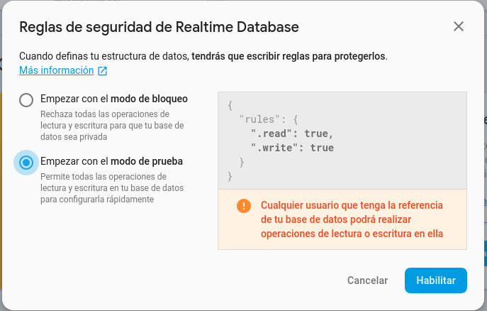

# 2 - Creació d'una aplicació

La Base de Dades, que hem quedat que poden ser un document únic JSON en el cas
de Realtime Database, i tot un conjunt en el cas de Cloud Firestore, està
associada a una aplicació. Crearem des de l'entorn de Firebase una nova
aplicació, la referència de la qual és la que utilitzarem en l'aplicació web o
aplicació mòbil. Així doncs, podem crear-nos unes quantes aplicacions
Firebase, i en cadascuna guardarem una Base de Dades. Ens farà falta
autenticar-nos amb un compte de Google. Utiilitzarem el compte corporatiu de
l'IES El Caminàs, és a dir **xxx@ieselcaminas.org**

El procés de creació el farem des de l'entorn de firebase:
[www.firebase.com](http://www.firebase.com).

El següent vídeo mostra el procés de creació d'una aplicació:

En les últimes versions de Firebase la primera vegada que s'accedeix a la Base
de Dades Firebase acabada de crear, pregunta per les **regles** (**rules**)
d'accés a aquesta. Inicialment triarem l'opció _**modo de prueba**_ , en el
qual tot el món pot accedir a les dades. Evidentment no es poden deixar
aquestes regles de forma definitiva, però per a començar a provar, està bé. De
fet, en l'última versió ho deixarà en mode de prova durant un mes. De tota
manera, si ho vulguérem allargar, aniríem a la configuració dels **rules**

Llicenciat sota la  [Llicència Creative Commons Reconeixement NoComercial
SenseObraDerivada 4.0](http://creativecommons.org/licenses/by-nc-nd/4.0/)

