# 3 - Realtime Database (RD)

Encara que la finalitat és utilitzar-lo des del nostre entorn de programació,
més concretament Android, sempre ens anirà bé "tocar" les dades directament
des d'un entorn propi.

<iframe src="https://slides.com/aliciasalvador/t7_firebase_inserirdades/embed" width="576" height="420" title="Copy of T7_Firebase_InserirDades" scrolling="no" frameborder="0" webkitallowfullscreen mozallowfullscreen allowfullscreen></iframe>

L'entorn que ens ofereix **Firebase** serà suficient. Podrem visualitzar les
dades que tenim introduïdes en totes les nostres aplicacions, i també editar-
les: introduir, modificar i esborrar.

Recordem que podrem utilitzar 2 versions:

  * **Realtime Database**
  * **Cloud Firestore**

Comencem per **Realtime Database**

## 3.1 RD: Utilització des de l'entorn de Firebase

Farem especial menció al fet que el que guardem és un document JSON. Fins i
tot ens el podrem baixar (exportar) o pujar un document nou (importar). Això
sí, l'operació d'importació destrueix les dades anteriors, mostra de que només
podem guardar un document JSON.

Aques és el contingut del fitxer **Empleats.json** que s'introdueix en el
vídeo. Està formatat per a una fàcil lectura, però en realitat no importaria
que estiguera tot seguit.

    {  
    "empresa": {  
        "empleat": [  
        {  
            "num": 1,  
            "nom": "Andreu",  
            "departament": 10,  
            "edat": 32,  
            "sou": 1000  
        },  
        {  
            "num": 2,  
            "nom": "Bernat",  
            "departament": 20,  
            "edat": 28,  
            "sou": 1200  
        },  
        {  
            "num": 3,  
            "nom": "Clàudia",  
            "departament": 10,  
            "edat": 26,  
            "sou": 1100  
        },  
        {  
            "num": 4,  
            "nom": "Damià",  
            "departament": 10,  
            "edat": 40,  
            "sou": 1500  
        }  
       ]  
     }  
    }

Ja heu vist que en importar **Empleats.json** s'han perdut les altres dades.
Poseu una altra vegada la parella clau-valor **a1** (per exemple amb el valor
**Hola**) ja que per ser molt senzilla l'estructura la utilitzarem en alguns
exemples. Així ens queda l'estructura per als posteriors exemples:

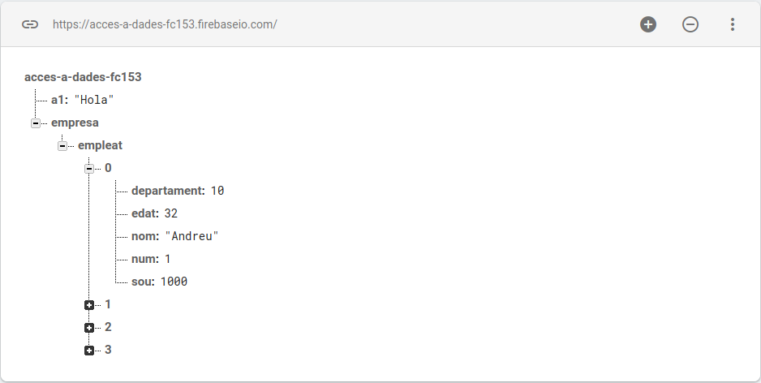

## 3.2 RD: Utilització des de IntelliJ

El nostre objectiu final d'accedir a Firebase serà des d'Android. Mirarem
primer l'accés des de IntelliJ, que és l'entorn que utilitzem en el present
mòdul. Passar després a Android serà una cosa senzilla.

Per als exemples i exercicis d'aquesta part, ens crearem un projecte anomenat
**Tema7** , amb els paquets **exemples_realtimedatabase** ,
**exemples_cloudfirestore** , **exemples_cloudstorage** i **exercicis**.

### 3.2.1 RD-IntelliJ: Connexió des de Kotlin

**Drivers necessaris**{.azul}

L'accés des de IntelliJ a Firebase no és senzill. És més complicat que accedir
des d'Android, en contra del que cabria esperar.

Concretament ens haurem de baixar molts **.jar**. En canvi en Android ho
tindrem tot disponible, ja que els drivers estan incorporats.

Són tants els drivers que ens construirem una llibreria per a poder
incorporar-los després còmodament als nostres projectes. Ens els podem baixar
des del següent enllaç: <https://jar-
download.com/artifacts/com.google.firebase>

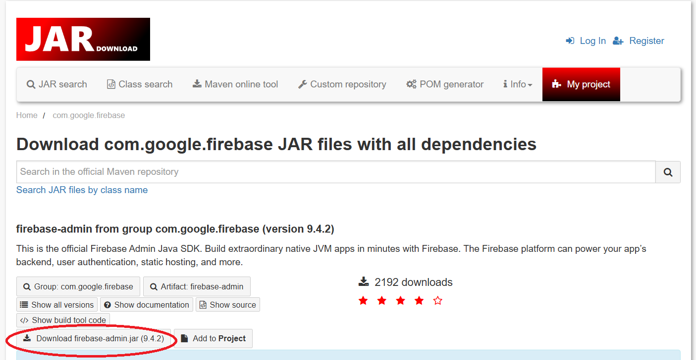

Una vegada baixat i descomprimit el contingut en una carpeta, construiu-vos
una llibreria anomenada **Firebase** que incorpore tots els **jar**. El
següent vídeo mostra com fer-ho:

**Configuració**{.azul}

El primer que hem de fer és preparar el nostre projecte per a que puga accedir
a l'aplicació que hem creat en Firebase. En l'entron de IntelliJ ens baixarem
un fitxer json on estarà la clau per a accedir a la nostra aplicació. Hem
d'anar a la configuració del projecte:

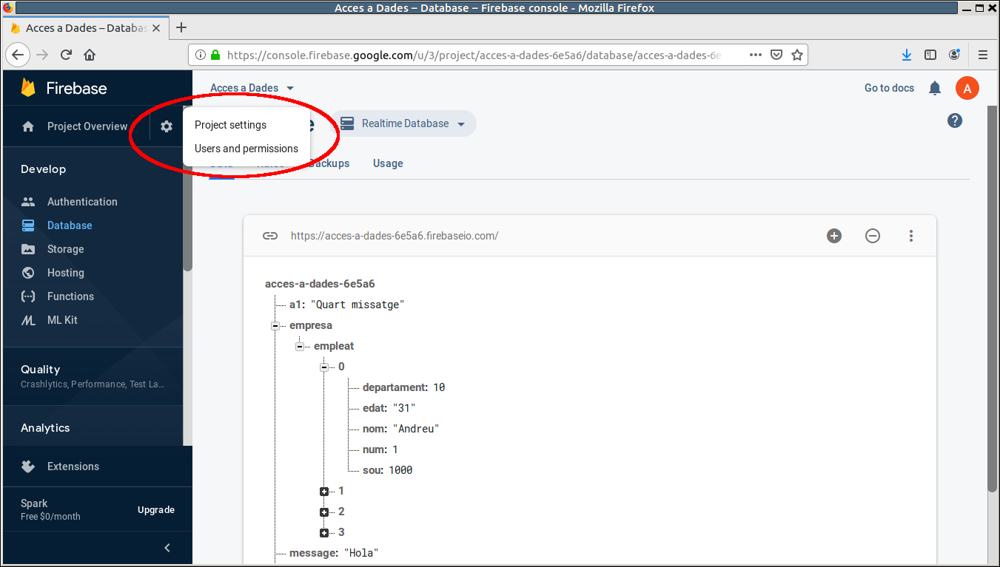

I dins de la configuració anar a la pestanya **Cuentas de servicio**(**Service
Accounts**). Ahí veurem uns exemples d'utilització (a nosaltres ens interessa
**Java**), i baix de tot un botó per a **Generar una nova clau privada** :

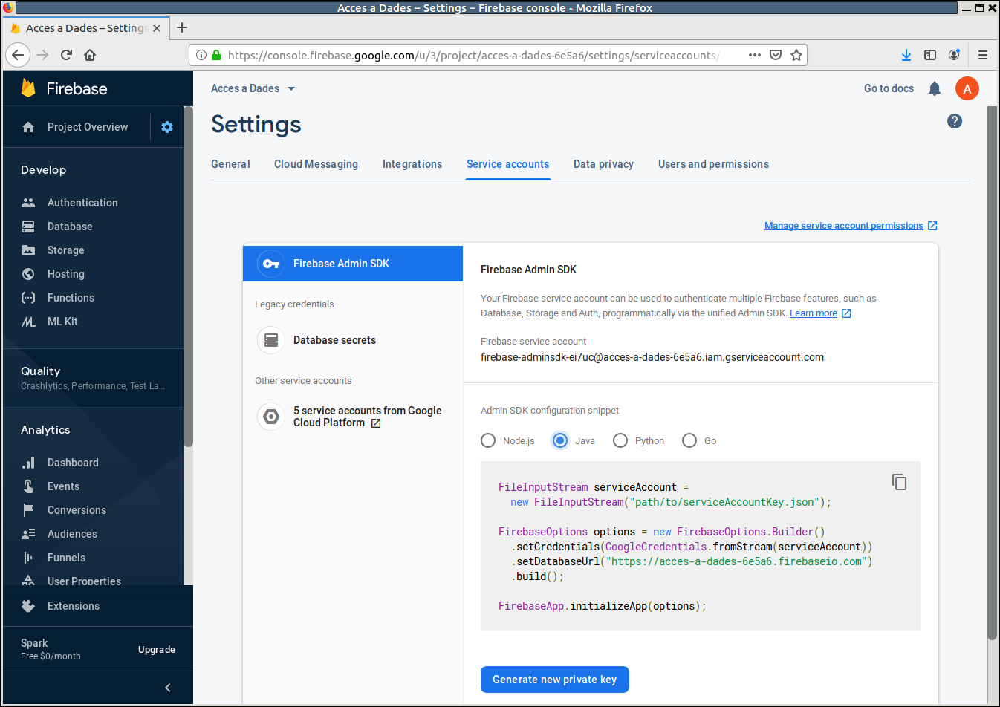

Ens baixarà un fitxer **json** que **haurem de guardar** a l'arrel del
projecte. Després, com deia l'exemple, col·loquem el següent per a un accés
correcte:

    
    
    FileInputStream serviceAccount =
      new FileInputStream("path/to/serviceAccountKey.json");
    
    FirebaseOptions options = new FirebaseOptions.Builder()
      .setCredentials(GoogleCredentials.fromStream(serviceAccount))
      .setDatabaseUrl("https://acces-a-dades-6e5a6.firebaseio.com")
      .build();
    
    FirebaseApp.initializeApp(options);

**No us oblideu de substituir el nom del fitxer json**. També heu de tenir en
compte que **la URL de la base de dades serà diferent per a cadascú de
nosaltres**.

Ho tenim escrit en **Java** , i per tant haurem de fer la transformació a
**Kotlin**. i quedarà així (ho he particularitzat al meu projecte, però
recordeu que heu de canviar el nom del fitxer json i la URL pels vostres):

    
    
    	val serviceAccount = FileInputStream("acces-a-dades-6e5a6-firebase-adminsdk-ei7uc-fcf7da56aa.json")
    
    	val options = FirebaseOptions.Builder()
    		.setCredentials(GoogleCredentials.fromStream(serviceAccount))
    		.setDatabaseUrl("https://acces-a-dades-6e5a6.firebaseio.com").build()
    
    	FirebaseApp.initializeApp(options)

**Referència a la Base de Dades i a les dades concretes a les quals volem
accedir**{.azul}

Ens haurem de crear un objecte **FirebaseDatabase** , que serà una referència
a tota la Base de Dades:

    
    
    val database = FirebaseDatabase.getInstance()

A partir d'ella podríem fer referència a una parella clau-valor que estiga a
l'arrel, com quan havíem creat **a1**( però recordeu que ara no existeix):

    
    
    val refA1 = database.getReference("a1")

També podríem fer referència a una parella clau-valor que no estiga en l'arrel
de la Base de Dades. Senzillament posaríem la ruta des de l'arrel. Per
exemple, per a accedir al nom del primer empleat de l'empresa que tenim
guardat, ho faríem així:

    
    
    val empleat1 = database.getReference("empresa/empleat/0/nom")

En els casos anteriors hem optat per agafar parelles clau-valor, bé a l'arrel
o més cap a dins de l'estructura JSON. Però en definitiva és una parella clau-
valor.

També podem optar per agafar l'estructura JSON i treballar amb ella, com vam
fer en el Tema 3, quan vam treballar amb l'estructura JSON.

    
    
    val empresa = database.getReference("empresa")

D'aquesta manera, en la qual agafem tota l'estructura, tindrem dues maneres de
treballar posteriorment per a accedir més avall en l'estructura:

  * Passar-lo a objectes i arrays de JSON, i treballar com vam fer en el Tema 3. Molt còmode, sobretot quan es tracta d'operacions de lectura
  * Treballar directament amb mètodes de Firebase que ens permeten accedir bé a tots els fills d'una estructura, bé a un fill en concret

Ho mostrarem en els exemples posteriors.

### 3.2.2 RD-IntelliJ: Accés a les dades

**Guardar dades**{.azul}

Disposem del mètode **setValue()** de la referència a la dada a la que volem
accedir. Accepta 2 paràmetres:

  * El primer és el valor que volem introduir.
  * El segon és un listener per a poder sincronitzar. Ens farà falta sincronitzar únicament en els programes mode text senzills que fem. Quan fem els **gràfics** no ens farà falta, i posarem **null**

Si per exemple vulguérem guardar en la variable **a1** , de forma senzilla ho
faríem així (ens funcionaria en els gràfics):

    
    
    refA1.setValue("Valor per a a1", null);

En l'operació de guardar si la parella clau-valor on es va a guardar existia,
doncs modificarà el valor. I si no existia, la crearà.

En el cas que vulguem guardar no en l'arrel, sinó més avall en l'estructura
JSON, disposem del mètode **child()** , que ens permet anar a un determinat
fill, a l'estil de la segona manera descrita en el subpunt anterior. Per
exemple si vulguérem canviar l'edat del primer empleat, l'estructura per a
arribar seria:**empresa -- > empleat --> 0 --> edat**

    
    
    empresa.child("empleat").child("0").child("edat").setValue("33", null);

Si no existia abans qualsevol dels nodes de l'estructura, el crearà. Fins i
tot, si no existira abans de la sentència anterior **empresa**, doncs crearia
**empresa**, i dins d'ell **empleat**, i dins d'ell **0**, i dins d'ell
**edat**, amb el valor 33.

També podríem guardar tot un objecte, i es convertirà en estructura JSON, però
ens ho deixem per a més avant.

Però com havíem dit abans, s'ha de sincronitzar amb Firebase, des del programa
Java ens hem d'esperar a aquesta sincronització, si no no ens funcionarà. En
el segon paràmetre ens posem un **listener**. Aquest exemple ja està complet.
Guardeu-lo amb el nom **Exemple_7_3_1_FirebaseRD_Guardar.kt**

    
    
    import java.io.FileInputStream
    import com.google.firebase.FirebaseOptions
    import com.google.auth.oauth2.GoogleCredentials
    import com.google.firebase.FirebaseApp
    import com.google.firebase.database.FirebaseDatabase
    import java.util.concurrent.CountDownLatch
    import com.google.firebase.database.DatabaseReference
    import com.google.firebase.database.DatabaseError
    
    fun main() {
    	val serviceAccount = FileInputStream("acces-a-dades-6e5a6-firebase-adminsdk-ei7uc-fcf7da56aa.json")
    
    	val options = FirebaseOptions.builder()
    		.setCredentials(GoogleCredentials.fromStream(serviceAccount))
    		.setDatabaseUrl("https://acces-a-dades-6e5a6.firebaseio.com").build()
    
    	FirebaseApp.initializeApp(options)
    
    	val empresa = FirebaseDatabase.getInstance().getReference("empresa")
    
    	val done = CountDownLatch (1)
    	
    	empresa.child("empleat").child("0").child("edat").setValue("33",
    		object : DatabaseReference.CompletionListener {
                override fun onComplete(p0: DatabaseError?, p1: DatabaseReference) {
                    done.countDown()
    			}
    	})
    	done.await()
    }

Recordeu que heu de canviar el **nom del fitxer json** i la **URL** per les
vostres.

I aquest és el resultat d'executar-lo. A la dreta podem veure com s'està
modificant la dada que preteníem:

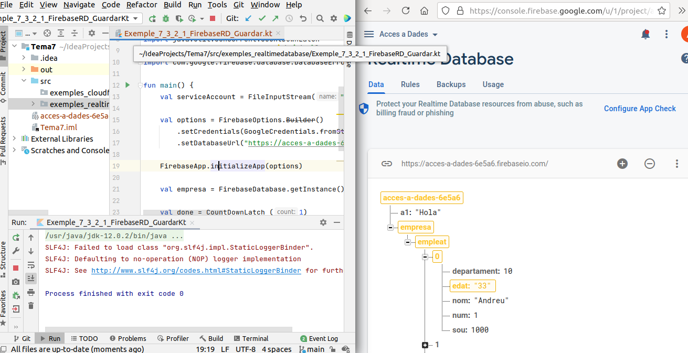

Però com comentàvem, en el cas de les aplicacions gràfiques resulta més
senzill, ja que no haurem d'esperar expressament a la sincronització, sinó que
l'aplicació es queda en marxa, i per tant no hi haurà problema.

Ho practicarem en un exemple nou, on arribarem a construir un Xat, i ens
servirà per a practicar totes les coses que us volem mostrar en Realtme
Database de Firebase.

Aquest és l'esquelet del programa. Guardeu-lo amb el nom
**Exemple_7_3_2_FirebaseRD_CrearXat.kt** :

    
    
    import java.awt.EventQueue
    import javax.swing.JFrame
    import javax.swing.JLabel
    import javax.swing.JTextArea
    import javax.swing.JButton
    import javax.swing.JTextField
    import java.awt.BorderLayout
    import javax.swing.JPanel
    import java.awt.FlowLayout
    import java.awt.Color
    import javax.swing.JScrollPane
    import java.io.FileInputStream
    
    import com.google.firebase.FirebaseOptions
    import com.google.auth.oauth2.GoogleCredentials
    import com.google.firebase.FirebaseApp
    import com.google.firebase.database.*
    
    class CrearXat : JFrame() {
    
        val etUltimMissatge= JLabel("Últim missatge: ")
        val ultimMissatge= JLabel()
    
        val etiqueta = JLabel("Missatges:")
        val area = JTextArea()
    
        val etIntroduccioMissatge = JLabel("Introdueix missatge:")
        val enviar = JButton("Enviar")
        val missatge = JTextField(15)
    
        // en iniciar posem un contenidor per als elements anteriors
        init {
            defaultCloseOperation = JFrame.EXIT_ON_CLOSE
            setBounds(100, 100, 450, 300)
            setLayout(BorderLayout())
    
            // contenidor per als elements
            //Hi haurà títol. Panell de dalt: últim missatge. Panell de baix: per a introduir missatge. Panell central: tot el xat
    
            val panell1 = JPanel(FlowLayout())
            panell1.add(etUltimMissatge)
            panell1.add(ultimMissatge)
            getContentPane().add(panell1, BorderLayout.NORTH)
    
            val panell2 = JPanel(BorderLayout())
            panell2.add(etiqueta, BorderLayout.NORTH)
            area.setForeground(Color.blue)
            area.setEnabled(false)
            val scroll = JScrollPane(area)
            panell2.add(scroll, BorderLayout.CENTER)
            getContentPane().add(panell2, BorderLayout.CENTER)
    
            val panell3 = JPanel(FlowLayout())
            panell3.add(etIntroduccioMissatge)
            panell3.add(missatge)
            panell3.add(enviar)
            getContentPane().add(panell3, BorderLayout.SOUTH)
    
            setVisible(true)
            enviar.addActionListener{enviar()}
    
            val serviceAccount = FileInputStream("acces-a-dades-6e5a6-firebase-adminsdk-ei7uc-fcf7da56aa.json")
    
            val options = FirebaseOptions.builder()
                .setCredentials(GoogleCredentials.fromStream(serviceAccount))
                .setDatabaseUrl("https://acces-a-dades-6e5a6.firebaseio.com").build()
    
            FirebaseApp.initializeApp(options)
    
            // Exemple de listener de lectura única addListenerForSingleValue()
            // Per a posar el títol. Sobre nomXat
    
            // Exemple de listener de lectura contínua addValueEventListener()
            // Per a posar l'últim missatge registrat. Sobre a1
    
            // Exemple de listener d'una llista addChildEventListener()
            // Per a posar tota la llista de missatges. Sobre xat
    
        }
    
        // Exemple de guardar dades sense haver d'esperar per ser una aplicació gràfica
        // Per a guardar dades. Sobre a1, i despŕes sobre la llista xat
        fun enviar(){
    
        }
    
    }
    
    fun main(args: Array<String>) {
        EventQueue.invokeLater {
            CrearXat().isVisible = true
        }
    }

Recordeu que heu de canviar el **nom del fitxer json** i la **URL** per les
vostres. Ho podeu copiar de l'exemple anterior``

Observeu que ja tenim col·locades en l'anterior programa les dades de
connexió:

    
    
    		val serviceAccount = FileInputStream("acces-a-dades-6e5a6-firebase-adminsdk-ei7uc-fcf7da56aa.json")
    
    		val options = FirebaseOptions.Builder()
    				.setCredentials(GoogleCredentials.fromStream(serviceAccount))
    				.setDatabaseUrl("https://acces-a-dades-6e5a6.firebaseio.com").build()
    
    		FirebaseApp.initializeApp(options)
    

I torne a insistir en què heu de **canviar la referència al fitxer JSON i la
URL**.

Per a guardar les dades, en aquest exemple de moment guardarem en la clau de
Firebase **a1** en el moment de apretar el botó de baix d'**Enviar**. No farà
falta muntar cap listener per veure si ja hem acabat, ja que el programa
continua en marxa.

    
    
    	// Exemple de guardar dades sense haver d'esperar per ser una aplicació gràfica
    	// Per a guardar dades. Sobre a1, i despŕes sobre la llista xat
    	fun enviar(){
    			val refA1 = FirebaseDatabase.getInstance().getReference("a1")
    			refA1.setValue(missatge.getText(), null)
    	}

Observeu que ara queda molt senzilla la sentència de guardar, i no ha fet
falta ficar cap listener en el segon paràmetre, sinó **null** , per estar en
una aplicació gràfica:

    
    
    refA1.setValue(missatge.getText(), null)

El resultat seria aquest, on es veu la modificació de la dada que volíem:

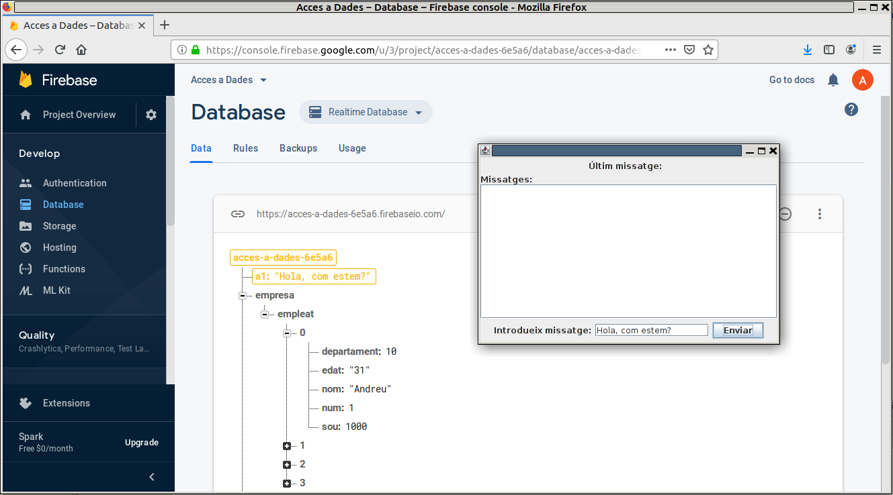

**Recuperar dades**{.azul}

La lectura de dades és més complicada que l'escriptura. És en bona part per
culpa de la "sincronització" de les dades que obtenim. Per això no existeix un
mètode tan senzill com el **getValue()**. La lectura s'ha de muntar sempre amb
**Listeners** , que es queden escoltant si hi ha alguna actualització de la
dada registrada. Recordeu que és de la dada registrada, no de tota la Base de
Dades.

Podem muntar dos tipus de Listeners, però el seu funcionament serà similar

  * Els que només escolten per a llegir les dades al principi, i no esperaran per a posteriors canvis en les dades (i per tant no consumiran tants recursos): **addListenerForSingleValueEvent()**
  * Els que es queden escoltant tota l'estona: **addValueEventListener()**

En ambdos casos obtenim com a paràmetre un **Data****Snapshot** (còpia) de la
dada registrada. I d'aquest tipus, **DataSnapshot** , sí que tenim el mètode
**getValue()** per a accedir a la dada. Ambdós tipus de Listeners tenen un
tractament absolutament similar, únicament amb la diferència abans esmentada
que el segon està sempre escoltant, i el primer només escolta una vegada al
principi.

El mètode **getValue()** admet un paràmetre que serà la classe del tipus que
volem obtenir. Podem posar les següents:

  * **String.class**, i aleshores el que obtenim s'interpretarà com un String
  * **Double.class**, i s'interpretarà com un número real de doble precisió
  * **Boolean.class**, i s'interptretaràcom un valor booleà
  * També es poden posar classes per a obtenir tot un objecte (Map) i per a una llista (List). Fins i tot es podria arribar a posar una classe definida per nosaltres. Però amb els anteriors nosaltres en tindrem prou.

**addListenerForSingleValue()**{.verde}

En aquest primer exemple anem a agafar una única vegada la dada que ens
interessa, i per tant utilitzarem **addListenerForSingleValueEvent()**. Ens
servirà per a posar el títol de l'aplicació, i ho farem consultant la clau
**nomXat** que haurà d'estar creada prèviament des del mateix entorn de
Firebase.

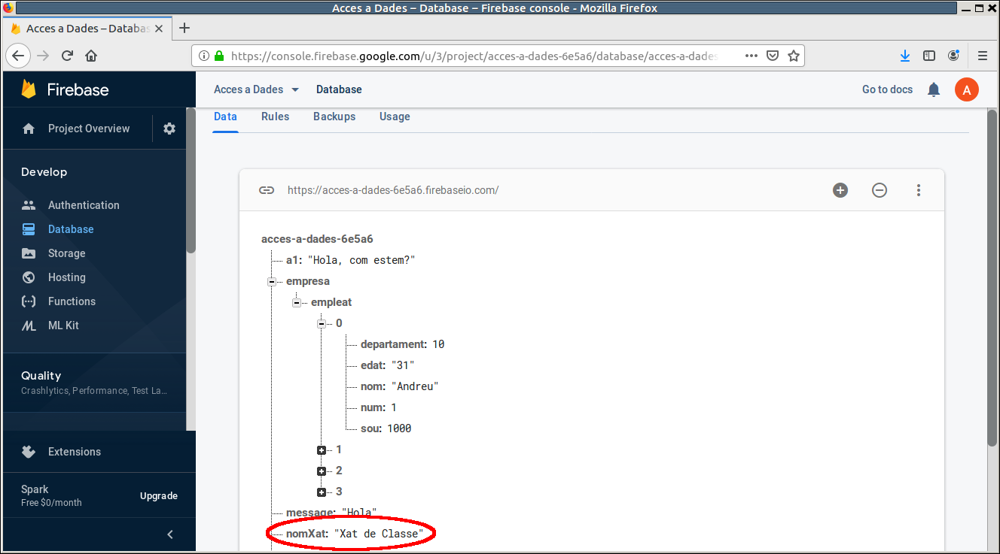

Modificarem el fragment de programa marcat pel comentari, i el que fem és
esperar per a llegir només una vegada.****

    
    
    		// Exemple de listener de lectura única addListenerForSingleValue()
    		// Per a posar el títol. Sobre nomXat
    		val nomXat = FirebaseDatabase.getInstance().getReference("nomXat")
    
    		nomXat.addListenerForSingleValueEvent(object : ValueEventListener {
    			override
    			fun onDataChange(dataSnapshot: DataSnapshot) {
    				setTitle(dataSnapshot.getValue().toString())
    			}
    
    			override
    			fun onCancelled(error: DatabaseError) {
    			}
    		})
    

Aquest és el resultat, i quan l'executeu observareu que tarda un poc en
mostrar el títol. És perquè ho està llegint de Firebase.

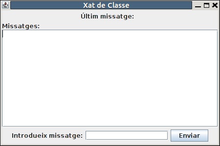

**addValueEventListener()**{.verde}

Anem a veure ara un exemple per a l'altre mètode, el
**addValueEventListener()** , que és el que es queda escoltant tota la estona

Concretarem el que farem és escoltar tota la estona per si es produeix algun
canvi en la clau **a1**. Si es produeix aquest canvi, modificarà el valor del
JLabel **ultimMissatge** que està dalt.

També afegirem el missatge al JTextArea, per a que tinga apariència de xat,
encara que després ho modificarem per a millorar-ho. Ho hem de col·locar on
està marcat pel comentari

    
    
    		// Exemple de listener de lectura contínua addValueEventListener()
    		// Per a posar l'últim missatge registrat. Sobre a1
    		val ultim = FirebaseDatabase.getInstance().getReference("a1")
    
    		ultim.addValueEventListener(object : ValueEventListener {
    			override
    			fun onDataChange(dataSnapshot: DataSnapshot) {
    				ultimMissatge.setText(dataSnapshot.getValue().toString())
    				area.append(dataSnapshot.getValue().toString() + "\n")         // aquesta línia després la llevarem
    			}
    
    			override
    			fun onCancelled(error: DatabaseError ) {
    			}
    		})
    

L'execució serà com la de la pantalla de dalt a l'esquerra. Però si es
produeix algun canvi (com es mostra en la pantalla de la dreta), aquest canvi
es reflectirà automàticament tant en el JLabel de dalt com en el TextArea, tal
i com es mostra en la imatge de baix a l'esquerra:

| 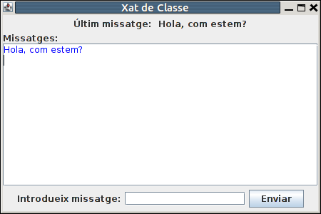 | 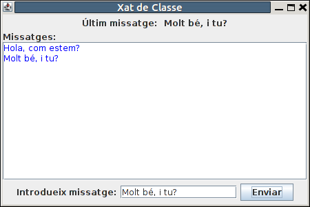  |
|---|---|

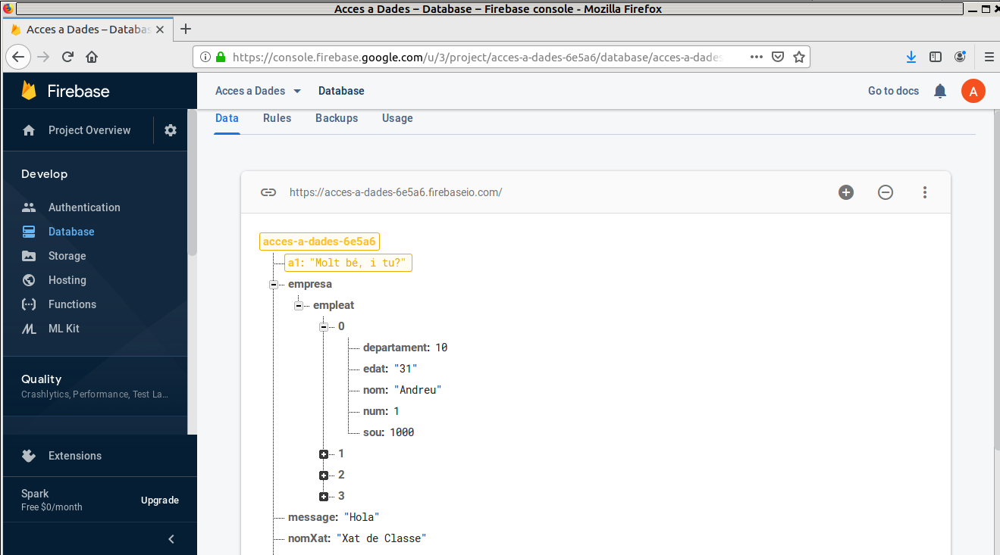   

En canvi, una vegada està en marxa el programeta del xat, per més que canviem
**nomXat** , que es traslladava al títol de la finestra, aquest títol ja **no
canviarà** perquè recordem que es feia una única lectura

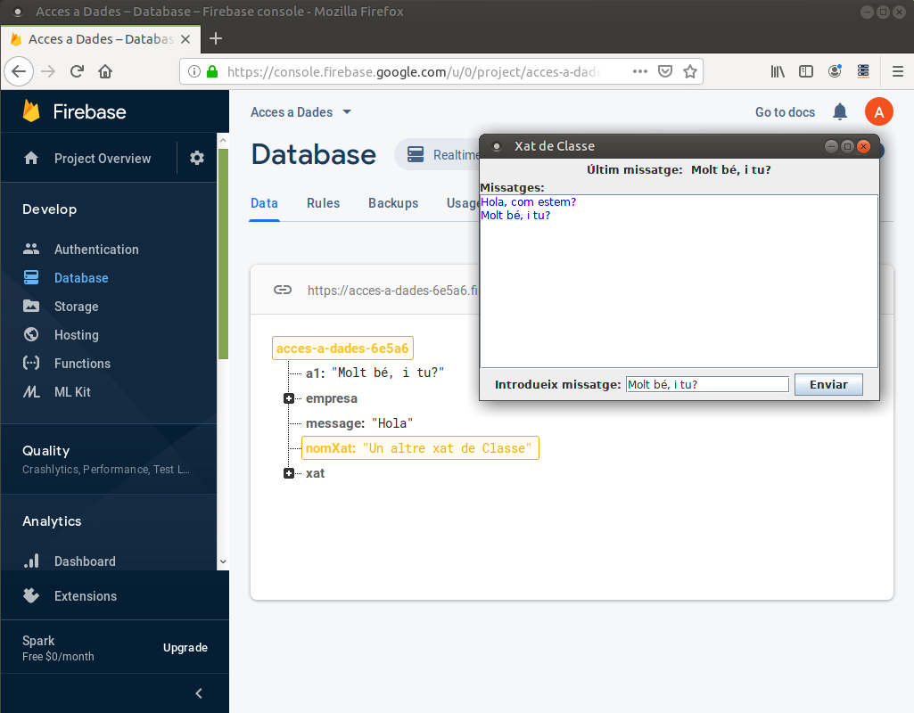

Com veieu ha estat molt fàcil construir una espècie de xat. Ara millorarem
aquest xat.

**Tractament de llistes**{.azul}

Per a explicar millor el tractament de llistes, crearem una altra referència a
una clau que representarà una llista de missatges. Cada missatge constarà d'un
nom i un contingut, i així vuerem també el tractament d'objectes.

El primer que ens haurem de definir és la referència a aquesta nova clau, que
l'anomenarem **xat** (no està creada encara en la Base de Dades).

    
    
    val xat = FirebaseDatabase.getInstance().getReference("xat")

Anar afegint elements a la llista, ho podem fer a mà, posant nosaltres
l'índex, ja que hem vist que la manera de representar en Firebase una llista
són fills únicament amb clau, que seria el subíndex.

Per tant una manera d'afegir el primer missatge del xat, seria amb l'índex 0.
Posem aquest codi quan apretem el botó (no hem llevat de moment el fet de
guardar en **a1** , per a que mentre fem les proves es veja tot el xat):

    
    
    	// Exemple de guardar dades sense haver d'esperar per ser una aplicació gràfica
    	// Per a guardar dades. Sobre a1, i despŕes sobre la llista xat
    	fun enviar() {
    		val refA1 = FirebaseDatabase.getInstance().getReference("a1")
    		refA1.setValue(missatge.getText(), null)
    		val xat = FirebaseDatabase.getInstance().getReference("xat")
    		xat.child("0").child("nom").setValue("Usuari1", null)
    		xat.child("0").child("contingut").setValue(missatge.getText(), null)
    	}
    

Quan apretem s'actualitzarà la Base de Dades d'aquesta manera:

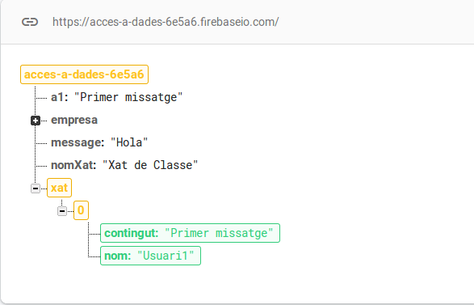

Però aquesta manera d'introduir en la llista acaba per ser molt poc pràctica.
Si ara anàrem a introduir un segon missatge (nom i contingut) li hauríem de
posar com a índex 1. No és viable.

Podríem dur 2 polítiques per a gestionar els índex:

  * Podríem portar un comptador per a saber quin índex toca inserir en cada moment, cosa també molt poc pràctica perquè si l'aplicació està instal·lada en més d'un dispositiu, podria haver col·lisió en el número d'índex.
  * Podríem mirar quin és l'últim índex introduït, per a incrementar-lo en una unitat. Però açò suposa llegir de la Base de Dades, i com hem vist abans suposarà muntar un Listener, segurament dels d'un únic ús. Per tant se'ns complic la cosa. Es pot fer, però no és còmode.

Per a estalviar-nos aquesta feina, Firebase ens proporciona un métode per a
afegir un nou element a una llista, el mètode **push()**. Introdueix un nou
element a la llista, i li posa com a índex un numero generat de manera que no
es repetirà mai. L'única preocupació que hem de tenir és guardar aquest índex
(amb **getKey()**), per a poder posar-lo com a clau.

    
    
    	// Exemple de guardar dades sense haver d'esperar per ser una aplicació gràfica
    	// Per a guardar dades. Sobre a1, i despŕes sobre la llista xat
    	fun enviar() {
    		val refA1 = FirebaseDatabase.getInstance().getReference("a1")
    		refA1.setValue(missatge.getText(), null)
    		val xat = FirebaseDatabase.getInstance().getReference("xat")
    		val clau = xat.push().getKey()
    		xat.child(clau).child("nom").setValue("Usuari1", null)
    		xat.child(clau).child("contingut").setValue(missatge.getText(), null)
    	}
    

I el resultat és aquest:

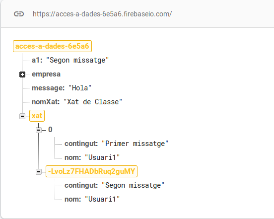

Com veiem és una cadena molt llarga que no és repetirà mai.

Anem a fer una tercera inserció d'un missatge, però ara ho completarem més, i
solucionarem de pas algun problemeta que podíem haver tingut.

Crearem una classe anomenada **Missatge** , que inclourà les propietats
**nom** i **contingut**. Crearem un objecte **Missatge** amb uns nous valors,
i veurem que el podem guardar perfectament. Per a aquest exemple segurament no
valdria la pena l'esforç, però es pot veure la utilitat per a objectes més
complexos.

Primer definim la classe. El millor és que el guardem com una classe nova, és
a dir com a **Missatge.kt******:

    
    
    class Missatge(var nom: String, var contingut: String)

Per a guardar, col·locaríem aquestes sentències entre les accions del clic del
botó, com en les altres ocasions. Observeu com ara ni tan sols ens fa falta
guardar en una variable el **getKey()** , ja que es fa tot només en una
operació:

    
    
    	// Exemple de guardar dades sense haver d'esperar per ser una aplicació gràfica
    	// Per a guardar dades. Sobre a1, i despŕes sobre la llista xat
    	fun enviar() {
    		val refA1 = FirebaseDatabase.getInstance().getReference("a1")
    		refA1.setValue(missatge.getText(), null)
    		val xat = FirebaseDatabase.getInstance().getReference("xat")
    		val m = Missatge("Usuari1", missatge.getText())
    		xat.push().setValue(m, null)
    	}
    

El resultat seria el mateix que en l'ocasió anterior:

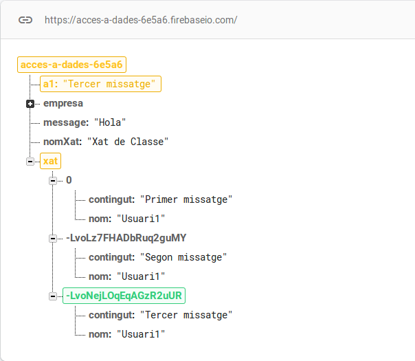

Ara només ens falta el tractament de lectura de les llistes.

**addChildEventListener()**{.verde}

Podríem muntar un Listener com en les altres ocasions, però ara disposarem
d'uns altres Listeners que se'ns acoplen millor ja que s'activen quan hi ha
modificacions en algun element de la llista. En l'exemple només utilitzarem el
de creació d'un nou element, però com veurem també podríem utilitzar els
moments de supressió o modificació d'elements.

Es tracta del Listener **ChildEventListener**, i hem d'utilitzar el mètode
**addChildEventListener()** sobre la llista. Voldrà la implementació dels
mètodes: **onChildAdded()**, **onChildChanged()**, **onChildRemoved()** i
**onChildMoved()**, a banda de **onCancelled()**. Però com comentàvem ara
només utilitzarem la de creació d'un nou element, i senzillament el mostrarem
en el TextView.

Al **dataSnapshot** arriba únicament l'element introduït, modificat o
esborrat, no tota la llista. Per tant és molt còmode. També arriba el nom de
l'element anterior com a segon paràmetre, per si hem de fer algun tractament.
És important fixar-nos en que aquest segon paràmetre l'hem de definir com a
**String?** (amb la interrogant per a contemplar el null). Si no posem la
interrogant, no es comportarà bé la primera vegada.

Açò ens substituirà l'escriptura que féiem abans del TextArea (a mi m'havia
quedat en la línia 95, vosaltres la tindreu aproximadament per ahí). Per tant
llevem aquesta línia:

    
    
        area.append(dataSnapshot.getValue().toString() + "\n");  // aquesta línia després la llevarem

I posem el següent on queda marcat pel comentari. Així ens quedarà un xat més
"professional"

    
    
    		// Exemple de listener d'una llista addChildEventListener()
    		// Per a posar tota la llista de missatges. Sobre xat
    		val xat = FirebaseDatabase.getInstance().getReference("xat")
    
    		xat.addChildEventListener(object : ChildEventListener {
    				override
    				fun onChildAdded(dataSnapshot: DataSnapshot, s: String?) {
    					area.append(dataSnapshot.child("nom").getValue().toString() + ": "
    								+ dataSnapshot.child("contingut").getValue().toString() + "\n"
    					)
    				}
    
    				override
    				fun onChildChanged(dataSnapshot: DataSnapshot, s: String?) {
    				}
    
    				override
    				fun onChildRemoved(dataSnapshot: DataSnapshot) {
    				}
    
    				override
    				fun onChildMoved(dataSnapshot: DataSnapshot, s: String?) {
    				}
    
    				override
    				fun onCancelled(databaseError: DatabaseError) {
    				}
    			}
    		)

Si executem aquest programa, tenint només en el clic del botó l'addició d'un
element a la llista i aquest Listener anterior, veurem que inicialment ens
apareixeran tots els elements de la llista. Això és perquè considera que
inicialment s'afegeix cadascun dels elements de la llista, i en el mateix
ordre en que estan definits. En aquest imatge hem aprofitat per afegir un
quart missatge:

### 3.2.3 RD-IntelliJ: Tot l'exemple

**Tot l'exemple**{.azul}

Anem a posar tot l'exemple que arreplega tot l'anterior.

Primer la classe **Missatge.java** :

    
    
    class Missatge(var nom: String, var contingut: String)

Ara el programa, que havíem quedat de guardar-lo en el fitxer
**Exemple_7_3_2_2_FirebaseRD_CrearXat.kt** :

    
    
    import java.awt.EventQueue
    import javax.swing.JFrame
    import javax.swing.JLabel
    import javax.swing.JTextArea
    import javax.swing.JButton
    import javax.swing.JTextField
    import java.awt.BorderLayout
    import javax.swing.JPanel
    import java.awt.FlowLayout
    import java.awt.Color
    import javax.swing.JScrollPane
    import java.io.FileInputStream
    
    import com.google.firebase.FirebaseOptions
    import com.google.auth.oauth2.GoogleCredentials
    import com.google.firebase.FirebaseApp
    import com.google.firebase.database.*
    
    class CrearXat : JFrame() {
    
        val etUltimMissatge= JLabel("Últim missatge: ")
        val ultimMissatge= JLabel()
    
        val etiqueta = JLabel("Missatges:")
        val area = JTextArea()
    
        val etIntroduccioMissatge = JLabel("Introdueix missatge:")
        val enviar = JButton("Enviar")
        val missatge = JTextField(15)
    
        // en iniciar posem un contenidor per als elements anteriors
        init {
            defaultCloseOperation = JFrame.EXIT_ON_CLOSE
            setBounds(100, 100, 450, 300)
            setLayout(BorderLayout())
    
            // contenidor per als elements
            //Hi haurà títol. Panell de dalt: últim missatge. Panell de baix: per a introduir missatge. Panell central: tot el xat
    
            val panell1 = JPanel(FlowLayout())
            panell1.add(etUltimMissatge)
            panell1.add(ultimMissatge)
            getContentPane().add(panell1, BorderLayout.NORTH)
    
            val panell2 = JPanel(BorderLayout())
            panell2.add(etiqueta, BorderLayout.NORTH)
            area.setForeground(Color.blue)
            area.setEnabled(false)
            val scroll = JScrollPane(area)
            panell2.add(scroll, BorderLayout.CENTER)
            getContentPane().add(panell2, BorderLayout.CENTER)
    
            val panell3 = JPanel(FlowLayout())
            panell3.add(etIntroduccioMissatge)
            panell3.add(missatge)
            panell3.add(enviar)
            getContentPane().add(panell3, BorderLayout.SOUTH)
    
            setVisible(true)
            enviar.addActionListener{enviar()}
    
            val serviceAccount = FileInputStream("acces-a-dades-6e5a6-firebase-adminsdk-ei7uc-fcf7da56aa.json")
    
            val options = FirebaseOptions.builder()
                .setCredentials(GoogleCredentials.fromStream(serviceAccount))
                .setDatabaseUrl("https://acces-a-dades-6e5a6.firebaseio.com").build()
    
            FirebaseApp.initializeApp(options)
    
            // Exemple de listener de lectura única addListenerForSingleValue()
            // Per a posar el títol. Sobre nomXat
            val nomXat = FirebaseDatabase.getInstance().getReference("nomXat")
    
            nomXat.addListenerForSingleValueEvent(object : ValueEventListener {
                override
                fun onDataChange(dataSnapshot: DataSnapshot) {
                    setTitle(dataSnapshot.getValue().toString())
                }
    
                override
                fun onCancelled(error: DatabaseError) {
                }
            })
    
            // Exemple de listener de lectura contínua addValueEventListener()
            // Per a posar l'últim missatge registrat. Sobre a1
            val ultim = FirebaseDatabase.getInstance().getReference("a1")
    
            ultim.addValueEventListener(object : ValueEventListener {
                override
                fun onDataChange(dataSnapshot: DataSnapshot) {
                    ultimMissatge.setText(dataSnapshot.getValue().toString())
                }
    
                override
                fun onCancelled(error: DatabaseError ) {
                }
            })
    
            // Exemple de listener d'una llista addChildEventListener()
            // Per a posar tota la llista de missatges. Sobre xat
            val xat = FirebaseDatabase.getInstance().getReference("xat")
    
            xat.addChildEventListener(object : ChildEventListener {
                override
                fun onChildAdded(dataSnapshot: DataSnapshot, s: String?) {
                    area.append(dataSnapshot.child("nom").getValue().toString() + ": "
                            + dataSnapshot.child("contingut").getValue().toString() + "\n"
                    )
                }
    
                override
                fun onChildChanged(dataSnapshot: DataSnapshot, s: String?) {
                }
    
                override
                fun onChildRemoved(dataSnapshot: DataSnapshot) {
                }
    
                override
                fun onChildMoved(dataSnapshot: DataSnapshot, s: String?) {
                }
    
                override
                fun onCancelled(databaseError: DatabaseError) {
                }
            }
            )
        }
    
        // Exemple de guardar dades sense haver d'esperar per ser una aplicació gràfica
        // Per a guardar dades. Sobre a1, i despŕes sobre la llista xat
        fun enviar() {
            val refA1 = FirebaseDatabase.getInstance().getReference("a1")
            refA1.setValue(missatge.getText(), null)
            val xat = FirebaseDatabase.getInstance().getReference("xat")
            val m = Missatge("Usuari1", missatge.getText())
            xat.push().setValue(m, null)
        }
    }
    
    fun main(args: Array<String>) {
        EventQueue.invokeLater {
            CrearXat().isVisible = true
        }
    }

**Xat compartit**{.azul}

Per a fer-lo més divertit, podríem connectar-nos tots a la mateixa Base de
Dades de Realtime Database. Tenim un usuari per a poder fer proves.

Si voleu connectar-vos des de la consola, aquestes són les dades

* Compte de Google: **ad.ieselcaminas@gmail.com**
* Contrasenya: **ieselcaminas_ad**
* Aplicació: **xat-ad**

En l'aplicació l'únic que haureu de fer és incorporar el fitxer json on està
la configuració i la clau privada de la connexió. El fitxer s'anomena **xat-
ad-9f901-firebase-adminsdk-f1vja-ee7dc206de.json**, i el teniu com un recurs
en l'aula virtual. La URL d'accés a aquesta Base de Dades és: [**https://xat-
ad-9f901-default-rtdb.europe-west1.firebasedatabase.app/**](https://xat-
ad-9f901-default-rtdb.europe-west1.firebasedatabase.app/)

Únicament canviant aquestes 2 coses de la connexió, veureu que estem
compartint tots el mateix xat.

<!--
## 3.3 RD: Utilització des d'Android

En el mòdul d'Accés a Dades ens estem plantejant sempre accedir a les dades
des de Java i/o Kotlin des d'un entorn de programació com IntelliJ per a fer
aplicacions d'escriptori. Tanmateix, és en Android on moltes vegades tindrà
més aplicació, com és el cas d'accés a Firebase. Per això ho inclourem en
aquest tema, en compte de deixar-lo per a un annex.

Podrem comprovar com Android Studio ens fa més còmoda la connexió amb
Firebase, ja que té un assistent que ens facilita molt le coses.

### 3.3.1 RD-Android: Conexió des d'Android

L'accés és extraordinàriament fàcil gràcies als assistents que ens proporciona
el propi Android Studio.

Per a poder provar-lo ens crearem un projecte d'Android anomenat per exemple
**Tema7_FirebaseRD**. Utilitzarem Kotlin, com sempre.

Al final de tot teniu un vídeo que repassa tots els passos per a poder
connectar des de la nostra aplicació d'Android. L'exemple serà molt senzill,
pràcticament ambA continuació els repassem i expliquem un a un. Són els que
ens marca l'assistent, que haurem d'invocar sobre el nostre projecte ja creat,
i que es crida des de **Tools->Firebase->Realtime Database**:

**Connectar l'aplicació a Firebase**{.azul}

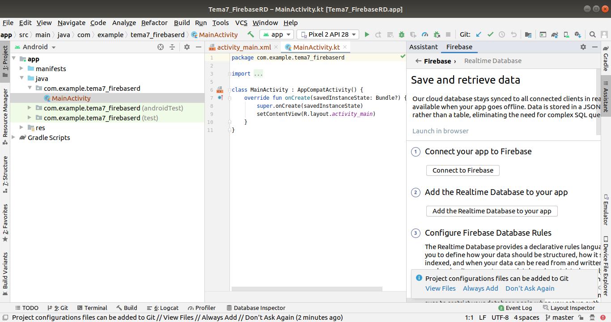

!!!note "Nota Importante"
    Podria donar-se el cas, depenent de la versió d'Android Studio (i altres
    coses, com que el projecte tinga errors i/o avisos) que done un error en
    apretar el botó de Connect to Firebase. I és que sembla que és molt delicat
    aquest assistent, i si hi ha qualsevol warning o error no deixa continuar:

    

    Per a solucionar-lo, a banda de revisar si tenim algun error o avís,
    senzillament afegim al final del fitxer **gradle.properties:**

        
        
        android.suppressUnsupportedCompileSdk=32

En apretar el botó de **Connect to Firebase**, si no estàvem connectats amb el
compte de Google al Firebase se'ns obrirà finestra d'un navegador per a
connectar. Podria donar-se el cas que ens diguera que Android Studio vol
accedir a les dades de la Base de Dades. Òbviament ho haurem de permetre:

Una vegada autenticats en Firebase, des de l'entorn d'Android Studio ens
ofereix la possibilitat de crear una aplicació nova (una Base de Dades nova) o
utilitzar alguna de les que ja tenim. Utilitzarem la que ens ha servit de
prova fins el moment:

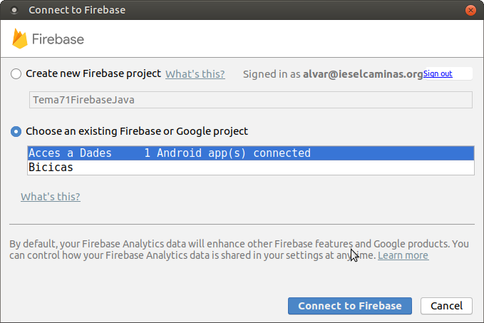

Quan haja connectat substituirà el botó **Connect to Firebase** , per una
etiqueta que dirà **connected** , en verd.

**Afegir la Base de Dades a la nostra aplicació**{.azul}

En aquest segon pas, quan apretem el botó **Add the Realtime Database in your
app** , ens dirà els canvis que farà per a incorporar les coses necessàries
per a poder connectar.

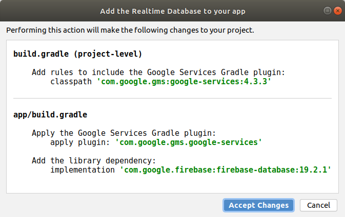

Com veieu es tracta d'incorporar les llibreries necessàries de Firebase. En el
vídeo del final es mostren imatges amb les dades incorporades.

Igual que abans, substituirà el botó **Add the Realtime Database in your app**
, per una etiqueta que dirà **Dependencies set up correctly**{.verde} , en verd. És
una bona guia per saber en quin punt estem.

**Permetre l'accés als usuaris, si es precís canviant les regles d'accés a la
Base de Dades**{.azul}

En versions anteriors de Firebase, per defecte les Bases de Dades
(aplicacions) de Firebase estaven configurades per a que es connecten
únicament usuaris autenticats. Això serà molt convenient en el futur, quan des
del mòdul PMDM proveu l'autenticació d'usuaris. Però en l'última versió ens
pregunta quan fem el primer accés si volem que es connecten usuaris
autenticats, o si permetem que es connecte tot el món.

Sempre ho podrem modificar, i això es fa des de la Consola de Firebase de la
Base de Dades, en la pestanya **Rules**. En el mòdul d'Accés a Dades permetrem
l'accés a tot el món posant les dues propietats a true. Sabreu que ho heu
posat de forma correcta quan els dos _trues_ us apareguen en roig

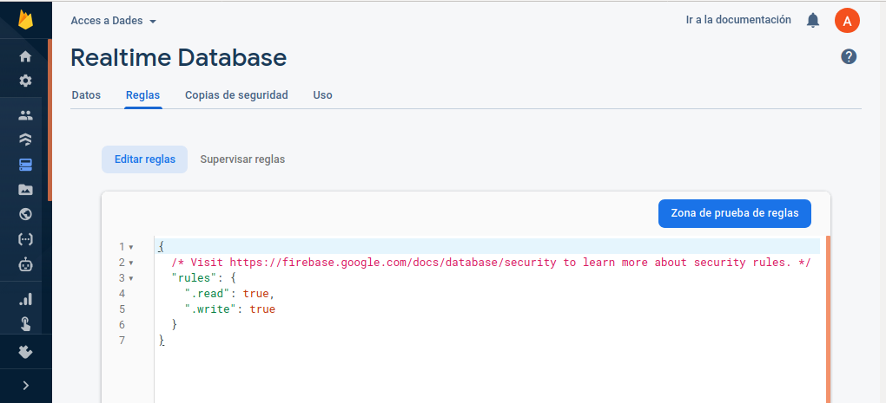

**Copiar les sentències per a escriure i per a llegir**{.azul}

Ens diu un exemple de les sentències a copiar per a poder guardar una
informació a la Base de Dades i també per a detectar un canvi en la Base de
Dades i poder obtenir el nou valor. Encara que tinguem un projecte en Kotlin,
les sentències d'exemple seran de Java, però que en copiar-les les traduiria a
Kotlin.

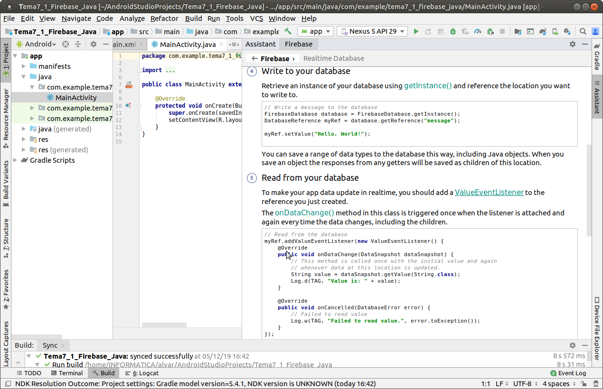

Marcarà alguns errors però que se solucionen important les classes (**Alt-
Enter**), i algun altre fàcil de corregir

També marcarà un altre error de que no existeix la variable **TAG**. La creem
al principi i ja està. El programa quedarà així

    
    
    import androidx.appcompat.app.AppCompatActivity
    import android.os.Bundle
    import android.util.Log
    import com.google.firebase.database.DataSnapshot
    import com.google.firebase.database.DatabaseError
    import com.google.firebase.database.ValueEventListener
    import com.google.firebase.database.ktx.database
    import com.google.firebase.ktx.Firebase
    
    class MainActivity : AppCompatActivity() {
        private val TAG = "MyActivity"
        override fun onCreate(savedInstanceState: Bundle?) {
            super.onCreate(savedInstanceState)
            setContentView(R.layout.activity_main)
    
            // Write a message to the database
            val database = Firebase.database
            val myRef = database.getReference("message")
    
            myRef.setValue("Hello, World!")
    
            // Read from the database
            myRef.addValueEventListener(object: ValueEventListener {
    
                override fun onDataChange(snapshot: DataSnapshot) {
                    // This method is called once with the initial value and again
                    // whenever data at this location is updated.
                    val value = snapshot.getValue()
                    Log.d(TAG, "Value is: " + value)
                }
    
                override fun onCancelled(error: DatabaseError) {
                    Log.w(TAG, "Failed to read value.", error.toException())
                }
    
            })
        }
    }

!!!note "Nota"
    En la versió d'Android Studio 2021.3.1.17 (o potser per la versió actual de
    Firebase), ha donat el següent error:

    

    Senzillament s'ha solucionat canviat en el **buid.gradle** del projecte la
    dependència google services de la 4.3.10 a la **4.3.14**

        
        
        dependencies {
                classpath 'com.google.gms:google-services:4.3.14'
            }

Quan executem el programa, crearà la clau **message** amb el valor **Hello,
World!** :

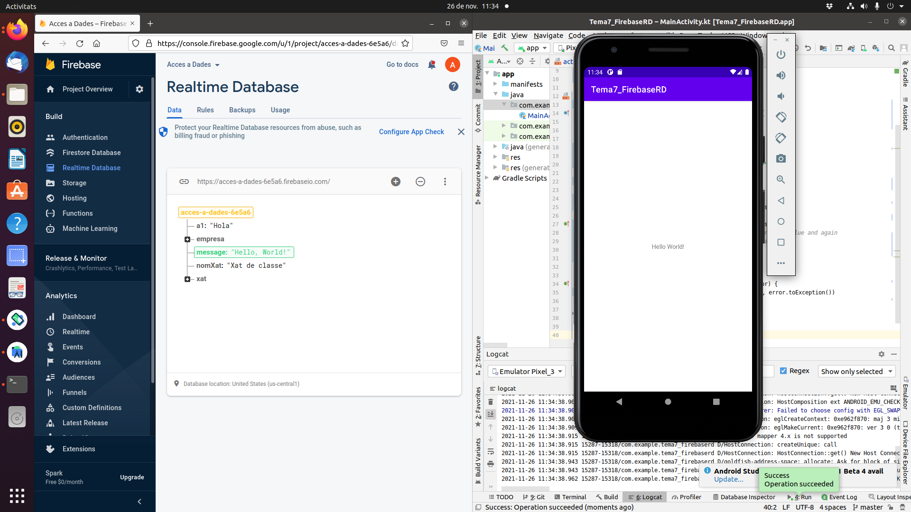

I si modifiquem aquesta clau des de la consola, quasi immediatament veurem en
els log de Debug com hem arreplegat el valor, gràcies al Listener:

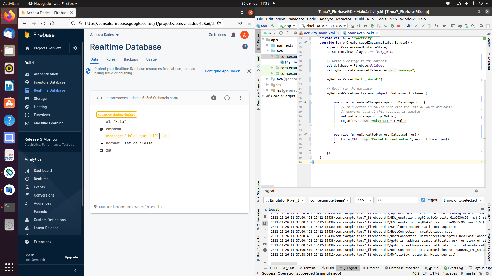

En el següent vídeo es veu tot el procés des del principi:

<iframe src="https://slides.com/aliciasalvador/t7_firebaserd_android/embed" width="576" height="420" title="Copy of T7_FirebaseRD_Android" scrolling="no" frameborder="0" webkitallowfullscreen mozallowfullscreen allowfullscreen></iframe>

### 3.3.2 RD-Android: Accés a les dades

Una vegada vist un exemple, en el qual hem guardat dades i també les hem
recuperades i hem vist els canvis en temps real, anem a veure més exemples de
com accedir a les dades.

En l'exemple anterior hem accedit a una parella clau-valor situada en l'arrel
de la Base de Dades.

Anem a veure alguns exemples de com accedir dins de l'estructura JSON guardada
en Firebase. Com el que voldrem serà mostrar més informació, incorporarem dos
**TextView** per a mostrar més coses còmodament, i un **EditText** i un
**Button** per a poder introduir informacions.

Aquesta serà ara l'estructura del **activity_main.xml** :

    
    
    <?xml version="1.0" encoding="utf-8"?>  
    <androidx.constraintlayout.widget.ConstraintLayout xmlns:android="http://schemas.android.com/apk/res/android"  
        xmlns:app="http://schemas.android.com/apk/res-auto"  
        xmlns:tools="http://schemas.android.com/tools"  
        android:layout_width="match_parent"  
        android:layout_height="match_parent"  
        tools:context=".MainActivity">  
      
        <TextView  
            android:id="@+id/ultim"  
            android:layout_width="382dp"  
            android:layout_height="39dp"  
            android:layout_alignParentTop="true"  
            android:layout_alignParentRight="true"  
            android:text=""  
            app:layout_constraintEnd_toEndOf="parent"  
            app:layout_constraintStart_toStartOf="parent"  
            app:layout_constraintTop_toTopOf="parent" />  
      
        <TextView  
            android:id="@+id/area"  
            android:layout_width="0dp"  
            android:layout_height="0dp"  
            android:text=""  
            app:layout_constraintBottom_toTopOf="@+id/text"  
            app:layout_constraintEnd_toEndOf="parent"  
            app:layout_constraintStart_toStartOf="parent"  
            app:layout_constraintTop_toBottomOf="@+id/ultim"  
            app:layout_constraintVertical_bias="0.261" />  
      
        <EditText  
            android:id="@+id/text"  
            android:layout_width="317dp"  
            android:layout_height="47dp"  
            android:layout_alignParentTop="true"  
            android:layout_centerHorizontal="true"  
            app:layout_constraintBottom_toBottomOf="parent"  
            app:layout_constraintEnd_toStartOf="@+id/boto"  
            app:layout_constraintHorizontal_bias="0.0"  
            app:layout_constraintStart_toStartOf="parent"  
            app:layout_constraintTop_toTopOf="@+id/ultim"  
            app:layout_constraintVertical_bias="1.0" />  
      
        <Button  
            android:id="@+id/boto"  
            android:layout_width="wrap_content"  
            android:layout_height="wrap_content"  
            android:layout_below="@+id/text"  
            android:layout_centerHorizontal="true"  
            android:text="Enviar"  
            app:layout_constraintBottom_toBottomOf="parent"  
            app:layout_constraintEnd_toEndOf="parent"  
            app:layout_constraintHorizontal_bias="0.993"  
            app:layout_constraintStart_toStartOf="parent" />  
      
    </androidx.constraintlayout.widget.ConstraintLayout>

Així les parts que tindrem, i que ens servirà per a mostrar cadascuna de les
coses que volem, de forma similar a la de IntelliJ, seran:

  * El títol de l'aplicació, que el modificarem amb un **addListenerForSingleValueEvent()**
  * El TextView de dalt, anomenat **ultim** , que el modifiquem per mig d'un **addValueEventListener()**
  * El TextView central que ocupa quasi tota la pantalla, anomenat **area** , que el modificarem amb la modificació de la llista **addChildEventListener()**
  * El EditText de baix, anomenat **text** , i el botó, que servirà per a afegir un nou element del xat

Aquest és l'esquelet del progama:

    
    
    import androidx.appcompat.app.AppCompatActivity
    import android.os.Bundle  
    
    import kotlinx.android.synthetic.main.activity_main.*  
    
    import com.google.firebase.database.FirebaseDatabase
    import com.google.firebase.database.DatabaseError
    import com.google.firebase.database.DataSnapshot
    import com.google.firebase.database.ValueEventListener
    
    class MainActivity : AppCompatActivity() {
    
        override fun onCreate(savedInstanceState: Bundle?) {
            super.onCreate(savedInstanceState)
            setContentView(R.layout.activity_main)
    
            boto.text = "Enviar"
            
            // Referències a la Base de Dades i a les variables a1, nomXat i xat
    
            // Exemple de guardar dades. Primer sobre a1, i despŕes sobre la llista xat
    	
            // Exemple de listener de lectura única addListenerForSingleValueEvent()
            // Per a posar el títol. Sobre nomXat
    	
            // Exemple de listener de lectura contínua addValueEventListener()
            // Per a posar l'últim missatge registrat. Sobre a1
    	
            // Exemple de listener d'una llista addChildEventListener()
            // Per a posar tota la llista de missatges. Sobre xat
    
        }
    }

!!!note "Nota"
    Recordeu que per a que ens reconega tots els elements del layout, al principi
    del **build.gradle** de l'aplicació heu d'afegir la següent línia :
        
        id 'kotlin-android-extensions'

**Referència a la Base de Dades i a les dades concretes a les quals volem
accedir**{.azul}

Podem fer referència de forma individual a cadascuna de les "variables"
guardades, és a dir a cadascuna de les parelles clau-valor:

    
    
            // Referències a la Base de Dades i a les variables a1, nomXat i xat
            val database = FirebaseDatabase.getInstance()
            val refA1 = database.getReference("a1")
            val nomXat = database.getReference("nomXat")
            val xat = database.getReference("xat")
    

**Guardar dades**{.azul}

L'operació de guardar és més senzilla que la de recuperar. Disposem del mètode
**setValue()** de la referència a la dada a la que volem accedir. Si la
parella clau-valor on es va a guardar ja existia, doncs modificarà el valor. I
si no existia, la crearà.

En el nostre exemple guardarem en el moment d'apretar el botó. Inicialment ho
farem sobre **a1** , encara que quan vegem les llistes ho canviarem

    
    
            // Exemple de guardar dades. Primes sobre a1, i despŕes sobre la llista xat
            boto.setOnClickListener {
                refA1.setValue(text.text.toString())
                text.setText("")
            }
    

**Recuperar dades**{.azul}

Recordem que podem muntar dos tipus de Listeners, però el seu funcionament
serà similar

  * Els que escolten només una vegada al principi: **addListenerForSingleValueEvent()**
  * Els que es queden escoltant tota l'estona: **addValueEventListener()******

En ambdós casos obtenim com a paràmetre un **Data****Snapshot** (còpia) de la
dada registrada. I d'aquest tipus, **DataSnapshot** , sí que tenim el mètode
**getValue()** per a accedir a la dada. Ambdós tipus de Listeners tenen un
tractament absolutament similar, únicament amb la diferència abans esmentada
que el primer està sempre escoltant, i el segon només escolta una vegada al
principi.

El mètode **getValue()** admet un paràmetre que serà la classe del tipus que
volem obtenir. Podem posar les següents:

  * **String.class** , i aleshores el que obtenim s'interpretarà com un String
  * **Double.class** , i s'interpretarà com un número real de doble precisió
  * **Boolean.class** , i s'interptretarà com un valor booleà.
  * També es poden posar classes per a obtenir tot un objecte (Map) i per a una llista (List). Fins i tot es podria arribar a posar una classe definida per nosaltres. Però amb els anteriors nosaltres en tindrem prou

Mirem la manera d'utilitzar una i altra. Ho apliquem a dues referències
diferents, per a que pugueu comprovar que una sempre té efecte, mentre que
l'altra només té efecte la primera vegada, i si després es modifiquen les
dades, l'aplicació no s'enterarà.

## addListenerForSingleValueEvent()

En aquest primer exemple anem a agafar una única vegada la dada que ens
interessa, i per tant utilitzarem **addListenerForSingleValueEvent()**. Ens
servirà per a posar el títol de l'aplicació, i ho farem consultant la clau
**nomXat** , que la tindrem creada des de la pregunta 3.2.2 de la part de
**IntelliJ** :

    
    
            // Exemple de listener de lectura única addListenerForSingleValue()
            // Per a posar el títol. Sobre nomXat
            nomXat.addListenerForSingleValueEvent(object : ValueEventListener {
                override fun onDataChange(dataSnapshot: DataSnapshot) {
                    val value = dataSnapshot.getValue(String::class.java)
                    setTitle(value)
                }
    
                override fun onCancelled(error: DatabaseError) {
                }
            })
    

## **addValueEventListener()**

És la que sempre està escoltant. Per tant qualsevol modificació en la Base de
Dades es veurà reflectit, és a dir, canviarà el contingut del**TextView
ultim**

    
    
    		// Exemple de listener de lectura contínua addValueEventListener()
    		// Per a posar l'últim missatge registrat. Sobre a1
            refA1.addValueEventListener(object : ValueEventListener {
                override fun onDataChange(dataSnapshot: DataSnapshot) {
                    val value = dataSnapshot.getValue(String::class.java)
                    ultim.setText(value)
                }
    
                override fun onCancelled(error: DatabaseError) {
                }
            })
    

**Tractament de llistes**{.azul}

Ja vam veure en la pregunta 3.2.2 de la part de **IntelliJ** que la manera més
pràtica d'inserir elements en una llista, per a no haver de dur un manteniment
dels índex, era amb el mètode **push()** , i que per a no tenir efectes no
desitjats era millor posar tot l'element d'una vegada. Així, si hem de posar
el nom de l'usuari que farà l'entrada del xat i el contingut del missatge,
millor crear un objecte que ho continga tot, i col·locar en la llista aquest
objecte.

Crearem per tant una classe anomenada **Missatge** , que inclourà les
propietats **nom** i **contingut**. Crearem un objecte **Missatge** amb uns
nous valors, i veurem que el podem guardar perfectament.

Primer definim la classe. El millor és que el guardem com una classe nova, és
a dir com a **Missatge.kt******:

    
    
    class Missatge(val nom: String, val contingut: String)

Per a **guardar** , col·locaríem aquestes sentències entre les accions del
OnClik del botó, substituint les sentències que modificaven **a1** , perquè
ara afegirem a la llista **xat** :

    
    
            // Exemple de guardar dades. Primer sobre a1, i despŕes sobre la llista xat
            boto.setOnClickListener {
                refA1.setValue(text.text.toString())
                xat.push().setValue(Missatge("Usuari1",text.text.toString()))
                text.setText("")
            }	
    

Ara només ens falta el tractament de **lectura** de les llistes.

Utilitzarem el Listener **ChildEventListener** , i hem d'utilitzar el mètode
**addChildEventListener()** sobre la llista. Voldrà la implementació dels
mètodes: **onChildAdded()** , **onChildChanged()** , **onChildRemoved()** i
**onChildMoved()** , però nosaltres només utilitzarem **onChildAdded()**

Al **dataSnapshot** arriba únicament l'element introduït, modificat o
esborrat, no tota la llista. Per tant és molt còmode. També arriba una
referència a l'element anterior com a segon paràmetre, per si hem de fer algun
tractament, cosa que en aquest exemple no ens fa falta:

    
    
            // Exemple de listener d'una llista addChildEventListener()
            // Per a posar tota la llista de missatges. Sobre xat
            xat.addChildEventListener(object : ChildEventListener {
                override fun onChildAdded(dataSnapshot: DataSnapshot, s: String?) {
                    area.append(
                        dataSnapshot.child("nom").getValue(String::class.java) + ": " + dataSnapshot.child("contingut").getValue(String::class.java) + "\n"                    );
                }
                override fun onChildChanged(dataSnapshot: DataSnapshot, s: String?) {
                }
                override fun onChildRemoved(dataSnapshot: DataSnapshot) {
                }
                override fun onChildMoved(dataSnapshot: DataSnapshot, s: String?) {
                }
                override fun onCancelled(databaseError: DatabaseError) {
                }
            })
    

Aquest seria el resultat:

### 3.3.3 RD-Android: Tot l'exemple

**Tot l'exemple**{.azul}

Anem a posar tot l'exemple que arreplega tot l'anterior.

La classe **Missatge** :

    
    
    class Missatge(val nom: String, val contingut: String) {}

I el programa seria aquest:

    
    
    import androidx.appcompat.app.AppCompatActivity
    import android.os.Bundle
    import com.google.firebase.database.*
    import kotlinx.android.synthetic.main.activity_main.*
    
    class MainActivity : AppCompatActivity() {
    
        override fun onCreate(savedInstanceState: Bundle?) {
            super.onCreate(savedInstanceState)
            setContentView(R.layout.activity_main)
    
            boto.text = "Enviar"
    
            // Referències a la Base de Dades i a les variables a1, nomXat i xat
            val database = FirebaseDatabase.getInstance()
            val refA1 = database.getReference("a1")
            val nomXat = database.getReference("nomXat")
            val xat = database.getReference("xat")
    
            // Exemple de guardar dades. Primer sobre a1, i despŕes sobre la llista xat
            boto.setOnClickListener {
                refA1.setValue(text.text.toString())
                xat.push().setValue(Missatge("Usuari1", text.text.toString()))
                text.setText("")
            }
            // Exemple de listener de lectura única addListenerForSingleValue()
            // Per a posar el títol. Sobre nomXat
            nomXat.addListenerForSingleValueEvent(object : ValueEventListener {
                override fun onDataChange(dataSnapshot: DataSnapshot) {
                    val value = dataSnapshot.getValue(String::class.java)
                    setTitle(value)
                }
    
                override fun onCancelled(error: DatabaseError) {
                }
            })
    
            // Exemple de listener de lectura contínua addValueEventListener()
            // Per a posar l'últim missatge registrat. Sobre a1
            refA1.addValueEventListener(object : ValueEventListener {
                override fun onDataChange(dataSnapshot: DataSnapshot) {
                    val value = dataSnapshot.getValue(String::class.java)
                    ultim.setText(value)
                }
    
                override fun onCancelled(error: DatabaseError) {
                }
            })
    
            // Exemple de listener d'una llista addChildEventListener()
            // Per a posar tota la llista de missatges. Sobre xat
            xat.addChildEventListener(object : ChildEventListener {
                override fun onChildAdded(dataSnapshot: DataSnapshot, s: String?) {
                    area.append(
                        dataSnapshot.child("nom").getValue(String::class.java) + ": " + dataSnapshot.child("contingut").getValue(String::class.java) + "\n"                    );
                }
                override fun onChildChanged(dataSnapshot: DataSnapshot, s: String?) {
                }
                override fun onChildRemoved(dataSnapshot: DataSnapshot) {
                }
                override fun onChildMoved(dataSnapshot: DataSnapshot, s: String?) {
                }
                override fun onCancelled(databaseError: DatabaseError) {
                }
            })
    
        }
    }
    

I el resultat seria aquest:

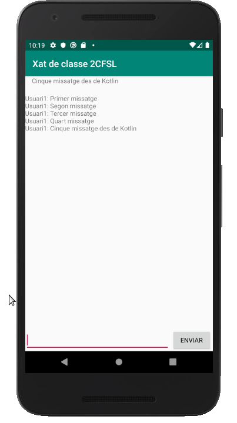

-->

Llicenciat sota la  [Llicència Creative Commons Reconeixement NoComercial
SenseObraDerivada 4.0](http://creativecommons.org/licenses/by-nc-nd/4.0/)

