# 4 - Cloud Firestore (CF)

**Cloud Firestore** és l'evolució de Realtime Database, on podrem guardar més
d'un document. Els documents aniran organitzats en col·leccions. Ja podem
parlar d'una vertadera Base de Dades documental.

Google recomana la utilització de Cloud Firestore en compte de Realtime
Database. Potser fins i tot en un futur deixen de proveir aquesta última. Però
no seria cap problema perquè tot el que podem guardar en Realtime Database ho
podrem guardar en Cloud Firestore, sense que se'ns complique l'organització de
les dades. I l'accés és igual de fàcil.

De vegades Firebase l'anomena **Firestore Database** o **Cloud Firestore**

## 4.1 CF: Utilització des de l'entorn de Firebase

Amb el **Cloud Firestore** ja podrem guardar més d'un document, i aniran
agrupats en **col·leccions** de documents. En el següent vídeo anem a insistir
en aquest aspecte dels documents, ja que és el més novedós.

Hem de fer la consideració de que encara que treballem sobre la mateixa Base
de Dades de Firebase, **des de Cloud Firestore no podrem accedir a les dades
de Realtime Database, i a l'inrevés**.

<iframe src="https://slides.com/aliciasalvador/t7_cloud_firestore/embed" width="576" height="420" title="Copy of T7_Cloud_Firestore" scrolling="no" frameborder="0" webkitallowfullscreen mozallowfullscreen allowfullscreen></iframe>

Aquesta és l'estructura de dades que ens hem guardat en l'exemple:

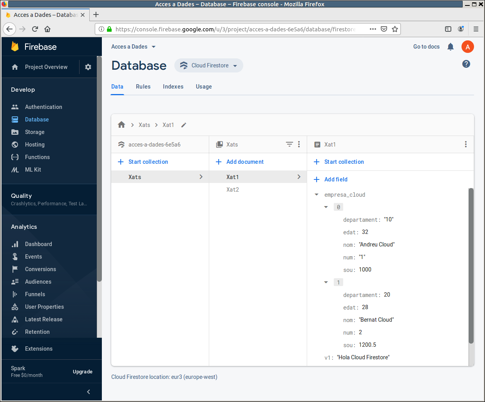

Observeu també que dins d'un document d'una col·lecció es pot començar una
col·lecció i dins d'ella crear documents, etc. De manera que ho podem fer
recursiu, i s'enriqueixen molt les possibilitats de disseny de la nostra Base
de Dades. Anem a aprofundir en aquesta possibilitat de les subcol·leccions per
a redissenyar les dades del nostre exemple del xat.

**Subcol·leccions**{.azul}

Com es veia en l'última imatge, es poden crear subcol·leccions en un document,
i aquestes col·leccions contenir a la seua vegada tots els documents que
calga.

Aleshores ens redissenyarem el xat construït en la part de **Realtime
Database**. En aquell moment vam posar tots els missatges del xat en un
llista. Ens anava molt bé, perquè després posàvem un listener sobre la clau
del xat que detectava tots els elements nous: el **addChildEventListener()**.

Tanmateix en el **Cloud Firestore** no tindrem el listener anterior. El que sí
que disposarem és d'un listener que detecte els nous documents sobre una
col·lecció. Aleshores anem a muntar cada missatge del xat com un nou document,
que de moment només tindrà nom d'usuari i contingut de missatge.

<iframe src="https://slides.com/aliciasalvador/t7_cloud_firestore_subcoleccions-da6632/embed" width="576" height="420" title="Copy of T7_Cloud_Firestore_Subcoleccions" scrolling="no" frameborder="0" webkitallowfullscreen mozallowfullscreen allowfullscreen></iframe>

Per tant, després de l'anterior tenim una col·lecció anomenada **Xats** , dins
de la qual hi ha un document anomenat **XatProva** , dins del qual hi ha un
camp anomenat **nomXat** i una col·lecció anomenada **missatges** , dins del
qual hi ha dos documents, un d'ells amb nom **0** i un altre amb nom generat
per Cloud Firestore

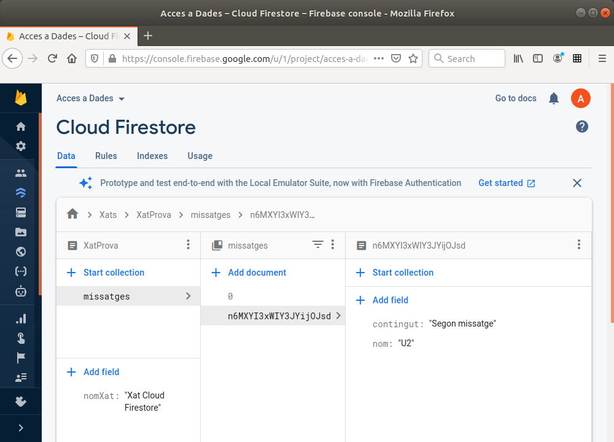

## 4.2 CF: Utilització des de IntelliJ

**Exemple**{.azul}

Practicarem tot el que ve a continuació sobre un programa gràfic.

Aquest és el seu esquelet. Guardeu-lo en un fitxer anomenat
**Exemple_7_4_1_FirebaseCF_CrearXatCloud****.kt** :

    
    
    import java.awt.EventQueue
    import javax.swing.JFrame
    import javax.swing.JLabel
    import javax.swing.JTextArea
    import javax.swing.JButton
    import javax.swing.JTextField
    import javax.swing.JPanel
    import java.awt.BorderLayout
    import java.awt.FlowLayout
    import java.awt.GridLayout
    import java.awt.Color
    import javax.swing.JScrollPane
    import java.io.FileInputStream
    
    import com.google.api.core.ApiFuture
    import com.google.auth.oauth2.GoogleCredentials
    import com.google.cloud.firestore.DocumentChange
    import com.google.cloud.firestore.DocumentReference
    import com.google.cloud.firestore.DocumentSnapshot
    import com.google.cloud.firestore.EventListener
    import com.google.cloud.firestore.Firestore
    import com.google.cloud.firestore.FirestoreException
    import com.google.firebase.FirebaseApp
    import com.google.firebase.FirebaseOptions
    import com.google.firebase.cloud.FirestoreClient
    
    class CrearXat : JFrame() {
    
    	val etUsuari = JLabel("Nom Usuari:")
    	val usuari = JTextField(25)
    
    	val etUltimMissatge = JLabel("Últim missatge: ")
    	val ultimMissatge = JLabel()
    
    	val etiqueta = JLabel("Missatges:")
    	val area = JTextArea()
    
    	val etIntroduccioMissatge = JLabel("Introdueix missatge:")
    	val enviar = JButton("Enviar")
    	val missatge = JTextField(15)
    
    	// en iniciar posem un contenidor per als elements anteriors
    	init {
    		defaultCloseOperation = JFrame.EXIT_ON_CLOSE
    		setBounds(100, 100, 450, 300)
    		setLayout(BorderLayout())
    		// contenidor per als elements
    		//Hi haurà títol. Panell de dalt: últim missatge. Panell de baix: per a introduir missatge. Panell central: tot el xat
    
    		val panell11 = JPanel(FlowLayout())
    		panell11.add(etUsuari)
    		panell11.add(usuari)
    		val panell12 = JPanel(FlowLayout())
    		panell12.add(etUltimMissatge)
    		panell12.add(ultimMissatge)
    		val panell1 = JPanel(GridLayout(2, 1))
    		panell1.add(panell11)
    		panell1.add(panell12)
    		getContentPane().add(panell1, BorderLayout.NORTH)
    
    		val panell2 = JPanel(BorderLayout())
    		panell2.add(etiqueta, BorderLayout.NORTH)
    		area.setForeground(Color.blue)
    		area.setEditable(false)
    		val scroll = JScrollPane(area)
    		panell2.add(scroll, BorderLayout.CENTER)
    		getContentPane().add(panell2, BorderLayout.CENTER)
    
    		val panell3 = JPanel(FlowLayout())
    		panell3.add(etIntroduccioMissatge)
    		panell3.add(missatge)
    		panell3.add(enviar)
    		getContentPane().add(panell3, BorderLayout.SOUTH)
    
    		setVisible(true)
    		enviar.addActionListener { enviar() }
    
    		val serviceAccount = FileInputStream("acces-a-dades-6e5a6-firebase-adminsdk-ei7uc-fcf7da56aa.json")
    
    		val options = FirebaseOptions.builder()
    			.setCredentials(GoogleCredentials.fromStream(serviceAccount))
    			.build()
    
    		FirebaseApp.initializeApp(options)
    
    		// Exemple de lectura única: senzillament sobre un ApiFuture i sobre ell get()
    		// Per a posar el títol. Sobre /Xats/XatProva/nomXat
    
    		// Exemple de listener de lectura contínua addSnapshotListener()
    		// Per a posar l'últim missatge registrat. Sobre /Xats/XatProva/ultimUsuari i /Xats/XatProva/ultimMissatge DocumentSnapshot FirestoreException
    
    		// Exemple de listener de lectura contínua addSnapshotListener() sobre una col·lecció
    		// Per a posar tota la llista de missatges. Sobre /Xats/XatProva/missatges
    
    	}
    
    	// Exemple de guardar dades en Cloud Firestore
    	// Per a guardar dades. Sobre /Xats/XatProva i després sobre /Xats/Xat1
    	fun enviar() {
    		
    	}
    }
    
    fun main(args: Array<String>) {
    	EventQueue.invokeLater {
    		CrearXat().isVisible = true
    	}
    }

I aquest és el seu aspecte:

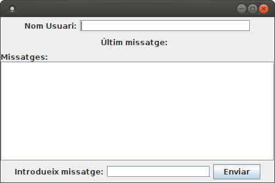

### 4.2.1 CF-IntelliJ: Connexió des de Kotlin

**Drivers necessaris**{.azul}

Els drivers necessaris són els mateixos que vam baixar-nos per al cas de
**Realtime Database**. Millor dit, estan inclosos en la llibreria que ens vam
muntar, per tant aquesta feina la vam fer en el punt **3.2.1**

**Configuració**{.azul}

Ara serà lleugerament més que en el cas de **Realtime Database** vist en el
punt **3.2.1**., ja que no caldrà especificar la URL de la Base de Dades, amb
la referència al fitxer json serà suficient.

Recordeu que ens vam baixar un fitxer **json** amb la clau privada que vam
guardar a l'arrel del projecte (i del qual és molt convenient guardar còpia).
Després, com deia l'exemple, col·loquem el següent per a un accés correcte, on
no posem el **.setDatebaseURL()** :

    
    
    		val serviceAccount = FileInputStream("acces-a-dades-6e5a6-firebase-adminsdk-ei7uc-fcf7da56aa.json")
    
    		val options = FirebaseOptions.Builder()
    			.setCredentials(GoogleCredentials.fromStream(serviceAccount))
    			.build()
    
    		FirebaseApp.initializeApp(options)
    

**No us oblideu de substituir el nom del fitxer json**.

**Referència a la Base de Dades i a les dades concretes a les quals volem
accedir**{.azul}

Ara la referència a la Base de Dades de **Cloud Firestore** canviarà:

    
    
    val database = FirestoreClient.getFirestore()

Com que la informació està organitzada en col·leccions i dins d'ella en
documents, podrem accedir primer a les col·leccions i dins d'elles a
documents. A continuació teniu la referència pas a pas:

    
    
    val col = database.collection("Xats")
    val docXatProva = col.document("XatProva")

Encara que evidentment ho podíem haver fet en una única línia:

    
    
    val docXatProva = database.collection("Xats").document("XatProva")

No ens plantejarem posar referències a elements de dins d'un document, sinó
que de moment accedirem a tot el conjunt del document.

Recordeu que **Realtime Database** , com era un únic document JSON, allà anava
tot i obligatòriament havíem de poder tenir una referència a un únic element.
Com en **Cloud Firestore** ho podem organitzar en col·leccions i documents,
cadascun d'ells el podem dissenyar millor i que continga únicament les dades
estrictes. Aleshores ens anirà bé accedir a tot el document.

### 4.2.2 CF-IntelliJ: Accés a les dades

**Guardar dades**{.azul}

Com acabem de comentar, accedim a tot un document dins d'una col·lecció.

Per a guardar dades, ens podem plantejar 3 operacions d'escriptura sobre el
document:

  * Sobreescriure'l tot: ho farem amb el mètode **set()**
  * Esborrar-lo tot: amb el mètode **delete()**
  * Modificar-lo: amb el mètode **update()**

Excepte per esborrar, per a les altres operacions ens fa falta saber
l'estructura del document. Per això tant mètode **set()** com el mètode
**update()** accepten com a paràmetre no una única dada, sinó una estructura
que puga arribar a reflectir el document. Acceptaran com a paràmetre un **Map
<String, Object>**, on podrem col·locar les claus i els valors de tots els
membres del document. Cada valor pot ser dels tipus que vam practicar en el
punt anterior: string, number, boolean, array, map, ...

La manera de col·locar un element en una estructura **Map <>** és amb el
mètode **put()** , que acceptarà dos paràmetres: la clau i el valor.

En el següent exemple. quan s'apreta el botó d'enviar (baix a la dreta) es
guardarà el contingut del quadre de text **usuari** que està dalt i el de
**missatge** que està baix. Però observeu que estem utilitzant el mètode
**set()** i per tant matxacaríem el que ja teníem construït (el nom del xat i
potser també la subcol·lecció de missatges). **Per tant US ACONSELLE QUE NO
EXECUTEU EL QUE VE A CONTINUACIÓ**{.rojo}

    
    
    	// Exemple de guardar dades en Cloud Firestore
    	// Per a guardar dades. Sobre /Xats/XatProva i després sobre /Xats/Xat1
    	fun enviar() {
    		val database = FirestoreClient.getFirestore()
    		val docXatProva = database.collection("Xats").document("XatProva")
    
    		val dades = HashMap<String, Any>()
    		dades.put("ultimUsuari", usuari.getText())
    		dades.put("ultimMissatge", missatge.getText())
    
    		docXatProva.set(dades)
    	}

Aquest seria el resultat, creant-se el document amb les 2 clau-valor, i havent
matxacat el que hi havia, que era el nom del xat. Afortunadament no s'ha
carregat la col·lecció missatges, però no ens podem fiar

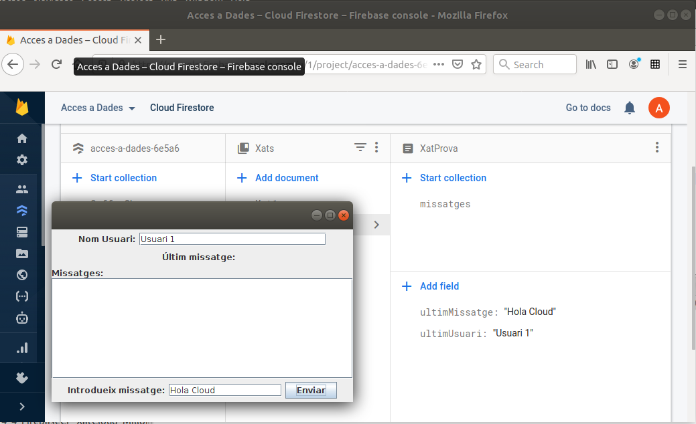

En realitat els mètodes **set()** , **delete()** i **update()** tornen un
valor, que és un **ApiFuture<WriteResult\>**, que permet averiguar com ha anat
l'actualització de les dades. D'aquest **ApiFuture<\>** podem obtenir el
moment en què s'ha confirmat l'actualització, i es podria aprofitar per a
tractar-lo per si dóna algun error.

Ampliem l'exemple anterior en què utilitzàvem el **set()** per a comprovar el
que comentem, senzillament mostrant el moment en què s'ha actualitzat, i poder
comprovar que és un **ApiFuture <WriteResult\>** . **US ACONSELLE QUE NO
EXECUTEU EL QUE VE A CONTINUACIÓ**{.rojo}

    
    
    	// Exemple de guardar dades en Cloud Firestore
    	// Per a guardar dades. Sobre /Xats/XatProva i després sobre /Xats/Xat1
    	fun enviar() {
    		val database = FirestoreClient.getFirestore()
    		val docXatProva = database.collection("Xats").document("XatProva")
    
    		val dades = HashMap<String, Any>()
    		dades.put("ultimUsuari", usuari.getText())
    		dades.put("ultimMissatge", missatge.getText())
    
    		val result = docXatProva.set(dades)
    		println("Data d'actualització: " + result.get().getUpdateTime())
    	}
    

Si veiem la consola d'eixida d'**IntelliJ** veurem després dels warnings de
sempre, al final en negre com ha imprés el moment de la confirmació.

En els exemples anterior, en cas d'haver-se executat hauran matxacat el
document **XatProva** i això era per haver utilitzat el mètode **set()**.

Anem a canviar-lo pel mètode **update()** , en què senzillament afegirà (i si
és necessari matxacarà) les dades que proporcionem, però mantindrà les altres.
**AQUEST EXEMPLE SÍ QUE EL PODEU FER**

    
    
    	// Exemple de guardar dades en Cloud Firestore
    	// Per a guardar dades. Sobre /Xats/XatProva i després sobre /Xats/Xat1
    	fun enviar() {
    		val database = FirestoreClient.getFirestore()
    		val docXatProva = database.collection("Xats").document("XatProva")
    
    		val dades = HashMap<String, Any>()
    		dades.put("ultimUsuari", usuari.getText())
    		dades.put("ultimMissatge", missatge.getText())
    
    		docXatProva.update(dades)
    	}

conservarem tant el camp **nomXat** com la col·lecció **missatges**
      
    

**Recuperar dades**{.azul}

Com en el cas del Realtime Database, ens plantegem dos casos:

  * Una única lectura
  * Un listener que es quede escoltant per si hi ha canvis

Com comprovarem, queda més senzilla la lectura única en el cas de Cloud
Firestore.

**Lectura única**{.verde}

Per a fer una lectura única utilitzarem el mètode **get()** sobre una
referència al document que volem llegir. El resultat ens ve en un **ApiFuture
<DocumentSnapshot>**, que com es veu és una còpia de les dades en una
interface **ApiFutute** , indicant que la tindrem disponible en un futur.
Sobre aquesta farem **get()** per a obtenir aquesta còpia (serà un objecte). I
sobre ella podrem fer:

  * **getData()** per a obtenir tot el document en un **Map <String,Object>**
  * **getId()** per a obtenir el nom del document
  * **get(_nomClau_) **per a obtenir directament el valor d'una clau del document
  * **getString(_nomClau_) **per a obtenir el valor de la clau en forma de string
  * **getDouble(_nomClau_) **per a obtenir el valor de la clau en forma de double
  * **getDate(_nomClau_)** per a obtenir el valor de la clau en forma de date
  * ...

L'exemple d'única lectura el farem per a posar el títol de l'aplicació, com en
l'exemple del Realtime Database. Prèviament, des de la consola de Firebase ja
havíem creat la parella clau-valor: **nomXat: Xat Cloud** **Firestore** , dins
del document **XatProva**. Si pels exemples anteriors (els que havia marcat en
roig que no us aconsellava fer) heu perdut aquesta parella, és el moment de
crear-la de nou:

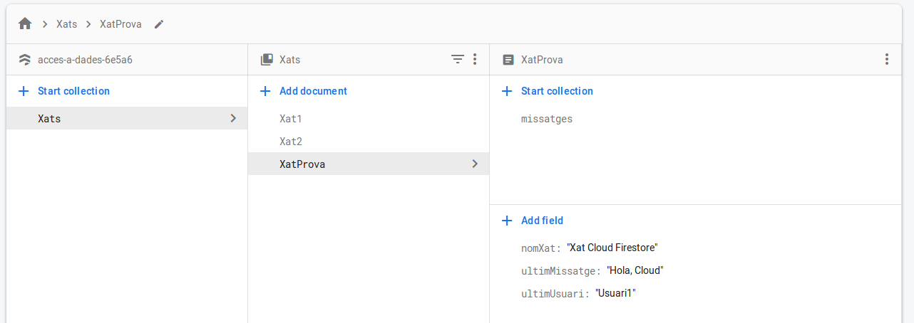

Ara sí que haurem d'anar amb compte en el moment de guardar les dades. Si
utilitzem el mètode **set()** matxacarem el document anterior (amb el nom del
xat). Per tant, a partir d'ara ens convindrà utilitzar el mètode **update()**.
Ho tornarem a especificar en el moment de fer aquesta escriptura.

I aquestes seran les sentències per a posar el títol de l'aplicació:

    
    
    		// Exemple de lectura única: senzillament sobre un ApiFuture i sobre ell get()
    		// Per a posar el títol. Sobre /Xats/XatProva/nomXat
    		val database = FirestoreClient.getFirestore()
    		val docRef = database.collection("Xats").document("XatProva")
    		val future = docRef.get()
    		val nomXat = future.get().getString("nomXat")
    		this.setTitle(nomXat)
    

I ací tenim el resultat, on es veu el títol agafat de Cloud Firestore:

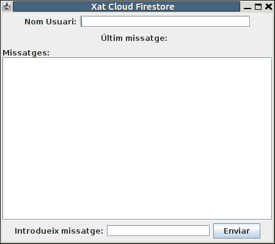

**Listener que es queda escoltant: addSnapshotListener()**{.verde}

De forma paral·lela al Realtime Database, si volem rebre una notificació de
quan hi haja un canvi en el document que ens interessa, sobre una referència a
aquest document ens muntarem un listener, en aquest cas amb el mètode
**addSnapshotListener()**. Al mètode **onEvent()** que s'ha de sobreescriure
arribarà un paràmetre de tipus **DocumentSnapshot** , que serà una còpia del
document. Com en el cas anterior podrem fer sobre ell un **getData()** per a
obtenir tot el document, **getString(_nomClau_) **per a obtenir el valor de la
clau com un string, etc.

En el nostre exemple, de moment l'utilitzem tant per a posar l'últim missatge
com per a anar omplint l'àrea central amb el xat. Però com havíem comentat
abans, hem de cuidar de no matxacar tot el document per a no perdre el títol
del xat. Per tant, l'acció que farem en apretar el botó per a enviar el
missatge no serà **set()** sinó **update().** Per si de cas havíeu fet els
exemples que us havia aconsellat que no féreu, ací teniu una altra vegada el
codi correcte:

    
    
    	// Exemple de guardar dades en Cloud Firestore
    	// Per a guardar dades. Sobre /Xats/XatProva i després sobre /Xats/Xat1
    	fun enviar() {
    		val database = FirestoreClient.getFirestore()
    		val docXatProva = database.collection("Xats").document("XatProva")
    
    		val dades = HashMap<String, Any>()
    		dades.put("ultimUsuari", usuari.getText())
    		dades.put("ultimMissatge", missatge.getText())
    
    		docXatProva.update(dades)
    	}

I ara sí el **addSnapshotListener()** :

    
    
    		// Exemple de listener de lectura contínua addSnapshotListener()
    		// Per a posar l'últim missatge registrat. Sobre /Xats/XatProva/ultimUsuari i /Xats/XatProva/ultimMissatge DocumentSnapshot FirestoreException
    		docRef.addSnapshotListener { snapshot, e ->
    			if (e != null) {
    				System.err.println("Listen failed: " + e)
    				return@addSnapshotListener
    			}
    
    			if (snapshot != null && snapshot.exists()) {
    				ultimMissatge.setText(snapshot.getString("ultimMissatge"))
    				area.append(snapshot.getString("ultimUsuari") + ": " + snapshot.getString("ultimMissatge") + "\n")
    			} else {
    				println("Current data: null")
    			}
    		}

En aquest exemple tenim el tractament de possibles errors, com que no
s'accedeix al document, o aquest és nul.

Observeu com la primera lectura també la fa, del que hi haja guardat en un
principi. En la imatge es mostra el moment d'afegir un segon missatge:

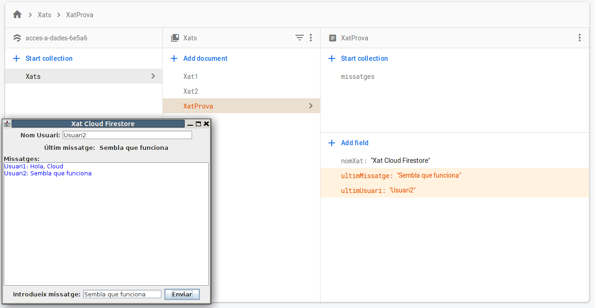

**Guardar documents**{.azul}

Ja havíem comentat en la pregunta 4.1 que per l'estructura de les dades a la
qual ens convida **Cloud Firestore** , en compte de guardar els missatges (i
l'usuari) en una llista, ho faríem en documents dins d'una subcol·lecció.

Per tant ens és necessària l'operació d'afegir un document a una col·lecció.
Això en un principi ho aconseguiríem amb el mètode **set()** sobre un document
nou de la col·lecció:

    
    
    database.collection("nomCol").document("nomDoc").set(dades)

però això ens obligaria a posar un nom a cada document. Ja havíem vist que
Cloud Firestore era capaç de generar un nom de document que no es puga
repetir. Des de Kotlin s'aconsegueix amb el mètode **add()** :

    
    
    database.collection("nomCol").add(dades)

però que en el nostre cas, per ser una subcol·lecció és un poc més llarg

    
    
    database.collection("Xats").document("XatProva").collection("missatges").add(dades)

L'estructura de les dades la podem fer amb un **Map <String,Object>**, i
posar-li en el nostre cas l'usuari i el missatge. D'aquesta manera ens
quedaria ara el procediment en **apretar el botó d'enviar el missatge** , on a
banda del que teníem abans per a modificar **ultimMissatge** i **ultimUsuari**
, ara afegirem el document nou.``

    
    
    	// Exemple de guardar dades en Cloud Firestore
    	// Per a guardar dades. Sobre /Xats/XatProva i després sobre /Xats/Xat1
    	fun enviar() {
    		val database = FirestoreClient.getFirestore()
    		val docXatProva = database.collection("Xats").document("XatProva")
    
    		val dades = HashMap<String, Any>()
    		dades.put("ultimUsuari", usuari.getText())
    		dades.put("ultimMissatge", missatge.getText())
    
    		docXatProva.update(dades)
    
    		val dades2 = HashMap<String, Any>()
    		dades2.put("nom", usuari.getText())
    		dades2.put("contingut", missatge.getText())
    
    		database.collection("Xats").document("XatProva").collection("missatges").add(dades2)
    	}  
    

I aquest és el resultat

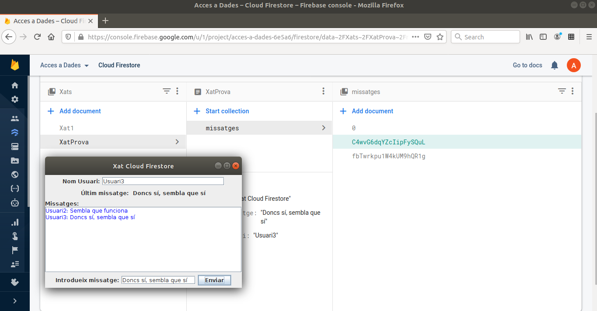

Per cert, un detall que haurem de tenir en compte més avant: com que el número
de document és aleoatori, no té per què ser l'últim. Ho haurem de tenir en
compte quan vulguem traure els missatges per ordre cronològic.

Però sí que podem veure com el contingut del nou document és el que volíem:

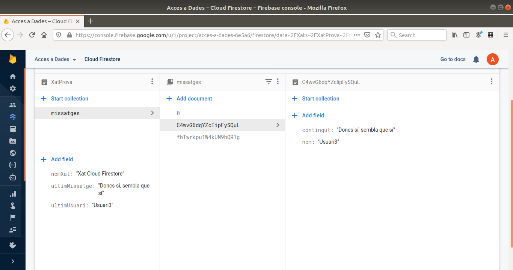

**Recuperar documents modificats**{.azul}

Ja només ens queda detectar els canvis en els documents de la col·lecció, per
a afegir a l'àrea central els documents afegits. També és un
**addSnapshotListener()** , però ara l'apliquem a una col·lecció (no a un
document). El resultat és que d'una forma molt còmoda podrem detectar els
documents afegits, els modificats i fins i tot els esborrats.

En el nostre exemple només ens interessa el cas de **document afegit** , que
serà un nou missatge en el xat, i el que farem serà afegir a **area** (el
JTextArea on visualitzem tota a conversa). Per tant ens **sobrarà** la línia
**area.append(...)** que estarà al voltant de la línia 106, en la qual afegíem
a **area** depenent del canvi en **ultimMissatge**

Ací tenim el fragment de programa que ens ho permetrà. Hem deixat els casos de
**document modificat** i **document esborrat** per a una millor documentació,
encara que en el nostre exemple no ho utilitzem.

    
    
    		// Exemple de listener de lectura contínua addSnapshotListener() sobre una col·lecció
    		// Per a posar tota la llista de missatges. Sobre /Xats/XatProva/missatges
    		database.collection("Xats").document("XatProva").collection("missatges").addSnapshotListener { snapshots, e ->
    			if (e != null) {
    				System.err.println("Listen failed: " + e)
    				return@addSnapshotListener
    			}
    
    			for (dc in snapshots!!.getDocumentChanges()) {
    				when (dc.getType()) {
    					DocumentChange.Type.ADDED ->
    						area.append(dc.getDocument().getString("nom") + ": " + dc.getDocument().getString("contingut") + "\n")
    
    					DocumentChange.Type.MODIFIED ->
    						println("Missatge modificat: " + dc.getDocument().getData());
    
    					DocumentChange.Type.REMOVED ->
    						println("Missatge esborrat: " + dc.getDocument().getData());
    				}
    			}
    		}

I en aquesta imatge es veu com en un principi es veuen els 3 documents que ja
existien (2 creats en la pregunta 4.1, i 1 immediatament abans). També
s'afegeix un altre missatge per veure que es visualitza perfectament

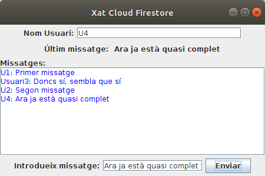

És de destacar que ara la còpia de les dades, el snapshot, és en realitat un
**QuerySnapshot**. I és que nosaltres no hem fet cap consulta sobre els
documents de la col·lecció, però és possible fer-la. Per exemple es podria
seleccionar per mig d'una query tots els documents en què l'usuari és un
determinat. Aleshores detectaríem els documents afegits, modificats o
esborrats d'aquest usuari. Ho faríem en el moment de declarar el
**addSnapshotListener()** :

    
    
    database.collection("Xats").document("XatProva").collection("missatges").whereEqualTo("usuari","Usuari2").addSnapshotListener {

O també podríem ordenar els documents per algun camp. **Açò en realitat és
necessari per a poder ordenar els missatges, ja que el nom del document auto-
generat per Cloud Firestore no és consecutiu, sinó aleatori** , i per tant com
ja hem vist un document nou pot tenir un nom anterior a alguns dels existents.
Ho arreglarem fàcilment posant un camp més amb la data i ordenant per aquest
camp amb **orderBy()** (que aniria en el lloc del **whereEqualTo()** de la
sentència anterior).

### 4.2.3 CF-IntelliJ: Tot l'exemple

Aquest és el programa, que recordeu que li havíem posat el nom de
**Exemple_7_4_2_FirebaseCF_CrearXatCloud.kt** :

    
    
    import java.awt.EventQueue
    import javax.swing.JFrame
    import javax.swing.JLabel
    import javax.swing.JTextArea
    import javax.swing.JButton
    import javax.swing.JTextField
    import javax.swing.JPanel
    import java.awt.BorderLayout
    import java.awt.FlowLayout
    import java.awt.GridLayout
    import java.awt.Color
    import javax.swing.JScrollPane
    import java.io.FileInputStream
    
    import com.google.api.core.ApiFuture
    import com.google.auth.oauth2.GoogleCredentials
    import com.google.cloud.firestore.DocumentChange
    import com.google.cloud.firestore.DocumentReference
    import com.google.cloud.firestore.DocumentSnapshot
    import com.google.cloud.firestore.EventListener
    import com.google.cloud.firestore.Firestore
    import com.google.cloud.firestore.FirestoreException
    import com.google.firebase.FirebaseApp
    import com.google.firebase.FirebaseOptions
    import com.google.firebase.cloud.FirestoreClient
    
    class CrearXatCloud : JFrame() {
    
    	val etUsuari = JLabel("Nom Usuari:")
    	val usuari = JTextField(25)
    
    	val etUltimMissatge = JLabel("Últim missatge: ")
    	val ultimMissatge = JLabel()
    
    	val etiqueta = JLabel("Missatges:")
    	val area = JTextArea()
    
    	val etIntroduccioMissatge = JLabel("Introdueix missatge:")
    	val enviar = JButton("Enviar")
    	val missatge = JTextField(15)
    
    	// en iniciar posem un contenidor per als elements anteriors
    	init {
    		defaultCloseOperation = JFrame.EXIT_ON_CLOSE
    		setBounds(100, 100, 450, 300)
    		setLayout(BorderLayout())
    		// contenidor per als elements
    		//Hi haurà títol. Panell de dalt: últim missatge. Panell de baix: per a introduir missatge. Panell central: tot el xat
    
    		val panell11 = JPanel(FlowLayout())
    		panell11.add(etUsuari)
    		panell11.add(usuari)
    		val panell12 = JPanel(FlowLayout())
    		panell12.add(etUltimMissatge)
    		panell12.add(ultimMissatge)
    		val panell1 = JPanel(GridLayout(2, 1))
    		panell1.add(panell11)
    		panell1.add(panell12)
    		getContentPane().add(panell1, BorderLayout.NORTH)
    
    		val panell2 = JPanel(BorderLayout())
    		panell2.add(etiqueta, BorderLayout.NORTH)
    		area.setForeground(Color.blue)
    		area.setEditable(false)
    		val scroll = JScrollPane(area)
    		panell2.add(scroll, BorderLayout.CENTER)
    		getContentPane().add(panell2, BorderLayout.CENTER)
    
    		val panell3 = JPanel(FlowLayout())
    		panell3.add(etIntroduccioMissatge)
    		panell3.add(missatge)
    		panell3.add(enviar)
    		getContentPane().add(panell3, BorderLayout.SOUTH)
    
    		setVisible(true)
    		enviar.addActionListener { enviar() }
    
    		val serviceAccount = FileInputStream("acces-a-dades-6e5a6-firebase-adminsdk-ei7uc-fcf7da56aa.json")
    
    		val options = FirebaseOptions.builder()
    			.setCredentials(GoogleCredentials.fromStream(serviceAccount))
    			.build()
    
    		FirebaseApp.initializeApp(options)
    
    		// Exemple de lectura única: senzillament sobre un ApiFuture i sobre ell get()
    		// Per a posar el títol. Sobre /Xats/XatProva/nomXat
    		val database = FirestoreClient.getFirestore()
    		val docRef = database.collection("Xats").document("XatProva")
    		val future = docRef.get()
    		val nomXat = future.get().getString("nomXat")
    		this.setTitle(nomXat)
    
    		// Exemple de listener de lectura contínua addSnapshotListener()
    		// Per a posar l'últim missatge registrat. Sobre /Xats/XatProva/ultimUsuari i /Xats/XatProva/ultimMissatge DocumentSnapshot FirestoreException
    		docRef.addSnapshotListener { snapshot, e ->
    			if (e != null) {
    				System.err.println("Listen failed: " + e)
    				return@addSnapshotListener
    			}
    
    			if (snapshot != null && snapshot.exists()) {
    				ultimMissatge.setText(snapshot.getString("ultimMissatge"))
    				//area.append(snapshot.getString("ultimUsuari") + ": " + snapshot.getString("ultimMissatge") + "\n")
    			} else {
    				println("Current data: null")
    			}
    		}
    		
    		// Exemple de listener de lectura contínua addSnapshotListener() sobre una col·lecció
    		// Per a posar tota la llista de missatges. Sobre /Xats/XatProva/missatges
    		database.collection("Xats").document("XatProva").collection("missatges").addSnapshotListener { snapshots, e ->
    			if (e != null) {
    				System.err.println("Listen failed: " + e)
    				return@addSnapshotListener
    			}
    
    			for (dc in snapshots!!.getDocumentChanges()) {
    				when (dc.getType()) {
    					DocumentChange.Type.ADDED ->
    						area.append(dc.getDocument().getString("nom") + ": " + dc.getDocument().getString("contingut") + "\n")
    
    					DocumentChange.Type.MODIFIED ->
    						println("Missatge modificat: " + dc.getDocument().getData());
    
    					DocumentChange.Type.REMOVED ->
    						println("Missatge esborrat: " + dc.getDocument().getData());
    				}
    			}
    		}
    	}
    
    
    	// Exemple de guardar dades en Cloud Firestore
    	// Per a guardar dades. Sobre /Xats/XatProva i després sobre /Xats/Xat1
    	fun enviar() {
    		val database = FirestoreClient.getFirestore()
    		val docXatProva = database.collection("Xats").document("XatProva")
    
    		val dades = HashMap<String, Any>()
    		dades.put("ultimUsuari", usuari.getText())
    		dades.put("ultimMissatge", missatge.getText())
    
    		docXatProva.update(dades)
    
    		val dades2 = HashMap<String, Any>()
    		dades2.put("nom", usuari.getText())
    		dades2.put("contingut", missatge.getText())
    
    		database.collection("Xats").document("XatProva").collection("missatges").add(dades2)
    	}
    }
    
    fun main(args: Array<String>) {
    	EventQueue.invokeLater {
    		CrearXatCloud().isVisible = true
    	}
    }

### 4.2.4 CF-IntelliJ: Exemple ampliat

Anem a ampliar l'exemple anterior, fent algunes modificacions i millores:

  * Tindrem la classe **Missatge** amb les propietat **nom** i **contingut** (expressament diferents dels noms utilitzats en l'exemple anterior per poder comprovar que aquestes modificacions funcionen i milloren l'exemple). Posarem també la **data** (com un **timestamp** de Firebase que es correspon amb un **Date** de Java i Kotlin) per a poder ordenar els missatges cronològicament
  * Llevem les coses que no s'utilitzen estrictament en aquest exemple
  * No definirem la referència a la Base de Dades en cada utilització. Únicament una vegada al principi, després de la connexió.
  * Posem un **JComboBox** per a poder triar entre més d'un xat. Per a no modificar les coses ja fetes, posarem la creació dels listeners en un mètode anomenat **inicialitzar()** , ja que ara els listeners dependran del xat triat. I haurem d'anar amb compte també de parar els listeners, ja creats. És a dir, si primer triem un xat, tindrem els listeners que apunten a ell. Si després triem un altre xat i creem els listeners una altra vegada per a que apunten al lloc correcte, els tindrem per duplicat. Hauríem de parar els primers listeners

Aquesta és la classe **Missatge**

    
    
    class Missatge(var nom: String, var data: Date, var contingut: String)

Aquest és el programa. Per comoditat hem posat la classe **Missatge** dins. Si
l'heu definida en un fitxer independent, haureu d'esborrar la definició en
aquest programa.

No es visualitzaran els missatge que no tinguen la data incorporada.

Guardeu-lo amb el nom **Exemple_7_4_2****_FirebaseCF_XatCloud_Millorat.kt** :

    
    
    import java.awt.EventQueue
    import javax.swing.JFrame
    import javax.swing.JLabel
    import javax.swing.JTextArea
    import javax.swing.JButton
    import javax.swing.JTextField
    import javax.swing.JPanel
    import javax.swing.JComboBox
    import java.awt.BorderLayout
    import java.awt.FlowLayout
    import java.awt.GridLayout
    import java.awt.Color
    import javax.swing.JScrollPane
    import java.io.FileInputStream
    
    import com.google.auth.oauth2.GoogleCredentials
    import com.google.cloud.firestore.DocumentReference
    import com.google.cloud.firestore.Firestore
    import com.google.firebase.FirebaseApp
    import com.google.firebase.FirebaseOptions
    import com.google.firebase.cloud.FirestoreClient
    import com.google.cloud.firestore.ListenerRegistration
    import java.text.SimpleDateFormat
    import java.util.Date
    
    class Missatge(var nom: String, var data: Date, var contingut: String)
    
    class XatCloudMillorat : JFrame() {
    
        val etComboXats = JLabel("Llista de tots els xats disponibles:")
        val comboXats = JComboBox<String>()
    
        val etUsuari = JLabel("Nom Usuari:")
        val usuari = JTextField(25)
    
        val etUltimMissatge = JLabel("Últim missatge: ")
        val ultimMissatge = JLabel()
    
        val etiqueta = JLabel("Missatges:")
        val area = JTextArea()
    
        val etIntroduccioMissatge = JLabel("Introdueix missatge:")
        val enviar = JButton("Enviar")
        val missatge = JTextField(15)
    
        var database: Firestore? = null
        var docRef: DocumentReference? = null
    
        var listenerUltimMissatge: ListenerRegistration? = null
        var listenerMissatges: ListenerRegistration? = null
    
        // en iniciar posem un contenidor per als elements anteriors
        init {
            defaultCloseOperation = JFrame.EXIT_ON_CLOSE
            setBounds(100, 100, 550, 400)
            setLayout(BorderLayout())
            // contenidor per als elements
            //Hi haurà títol. Panell de dalt: últim missatge. Panell de baix: per a introduir missatge. Panell central: tot el xat
    
            val panell10 = JPanel(FlowLayout())
            panell10.add(etComboXats)
            panell10.add(comboXats)
            val panell11 = JPanel(FlowLayout())
            panell11.add(etUsuari)
            panell11.add(usuari)
            val panell12 = JPanel(FlowLayout())
            panell12.add(etUltimMissatge)
            panell12.add(ultimMissatge)
            val panell1 = JPanel(GridLayout(3, 1))
            panell1.add(panell10)
            panell1.add(panell11)
            panell1.add(panell12)
            getContentPane().add(panell1, BorderLayout.NORTH)
    
            val panell2 = JPanel(BorderLayout())
            panell2.add(etiqueta, BorderLayout.NORTH)
            area.setForeground(Color.blue)
            area.setEditable(false)
            val scroll = JScrollPane(area)
            panell2.add(scroll, BorderLayout.CENTER)
            getContentPane().add(panell2, BorderLayout.CENTER)
    
            val panell3 = JPanel(FlowLayout())
            panell3.add(etIntroduccioMissatge)
            panell3.add(missatge)
            panell3.add(enviar)
            getContentPane().add(panell3, BorderLayout.SOUTH)
    
            setVisible(true)
            comboXats.addActionListener() { inicialitzarXat() }
            enviar.addActionListener { enviar() }
    
            val serviceAccount = FileInputStream("acces-a-dades-6e5a6-firebase-adminsdk-ei7uc-fcf7da56aa.json")
    
            val options = FirebaseOptions.builder()
                .setCredentials(GoogleCredentials.fromStream(serviceAccount))
                .build()
    
            FirebaseApp.initializeApp(options)
    
            database = FirestoreClient.getFirestore()
    
            // Exemple de llegir tots els documents d'una col·lecció
            // Per a triar el xat
            val documents = database?.collection("Xats")?.get()?.get()?.getDocuments()
            for (document in documents!!) {
                comboXats.addItem(document.getId())
            }
            comboXats.setSelectedIndex(0)
        }
    
        fun inicialitzarXat() {
            docRef = database?.collection("Xats")?.document(comboXats.getSelectedItem().toString())
            area.setText("")
    
            // Exemple de lectura única: senzillament sobre un ApiFuture i sobre ell get()
            // Per a posar el títol. Sobre /Xats/XatProva/nomXat
            val nomXat = docRef?.get()?.get()?.getString("nomXat")
            this.setTitle(nomXat)
    
            // Exemple de listener de lectura contínua addSnapshotListener()
            // Per a posar l'últim missatge registrat. Sobre /Xats/XatProva/ultimUsuari i /Xats/XatProva/ultimMissatge
            // Si estava en marxa, el parem abans de tornar-lo a llançar
            if (listenerUltimMissatge != null)
                listenerUltimMissatge!!.remove()
    
            listenerUltimMissatge = docRef?.addSnapshotListener { snapshot, e ->
                ultimMissatge.setText(snapshot?.getString("ultimMissatge"))
            }
    
            // Exemple de listener de lectura contínua addSnapshotListener() sobre una col·lecció
            // Per a posar tota la llista de missatges. Sobre /Xats/XatProva/missatges
            // Si estava en marxa, el parem abans de tornar-lo a llançar
            if (listenerMissatges != null)
                listenerMissatges!!.remove()
    
            listenerMissatges = docRef?.collection("missatges")?.orderBy("data")?.addSnapshotListener { snapshots, e ->
                for (dc in snapshots!!.getDocumentChanges()) {
                    val dData = dc.getDocument().getDate("data")
                    val d = SimpleDateFormat("dd-MM-yyyy HH:mm").format(dData)
                    area.append(
                        dc.getDocument().getString("nom") + " (" + d + "): " + dc.getDocument().getString("contingut") + "\n"
                    )
                }
            }
        }
        
        // Exemple de guardar dades en Cloud Firestore
        // Per a guardar dades. Sobre /Xats/XatProva i després sobre /Xats/Xat1
        fun enviar() {
            val database = FirestoreClient.getFirestore()
            val docXat = database.collection("Xats").document(comboXats.getSelectedItem().toString())
    
            val dades = HashMap<String, Any>()
            dades.put("ultimUsuari", usuari.getText())
            dades.put("ultimMissatge", missatge.getText())
    
            docXat.update(dades)
    
            val dades2 = HashMap<String, Any>()
            dades2.put("nom", usuari.getText())
            dades2.put("contingut", missatge.getText())
    
            val m = Missatge(usuari.getText(), Date(), missatge.getText())
            docXat.collection("missatges").add(m)
        }
    
    }
    
    fun main(args: Array<String>) {
        EventQueue.invokeLater {
            XatCloudMillorat().isVisible = true
        }
    }

` `

I aquest és un exemple d'utilització. Es pot veure el JComboBox per a triar
els diferents xats    

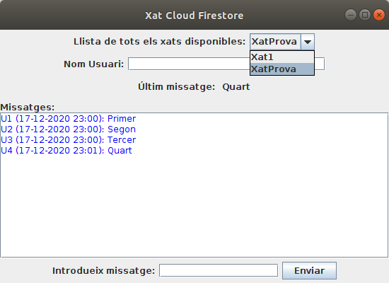
<!--
## 4.3 CF: Utilització des d'Android

De forma absolutament paral·lela a com quan vam veure el Realtime Database per
a Android, ara toca el torn d'accedir al **Cloud Firestore** de Firebase des
d'Android. Com veurem, per a fer la connexió ens deixarem ajudar també per
l'assistent.

El projecte s'anomenarà **Tema7_FirebaseCF**.

!!!note "Nota important""
    Per a accedir a **Cloud Firestore** i que no ens falle el programa, haurem de
    posar en el **build.gradle** de l'**aplicació**, dins de **android** i dins
    de **defaultConfig** el següent:****
            
         multiDexEnabled true

    Si no ho fem així ens pot donar el següent error:

    **Cannot fit requested classes in a single dex file (# methods: 80444 >
    65536)**{.rojo}

    I com sempre, per a que reconega els elements que tenim en els layout, haurem
    de posar al principi:
        
        
        id 'kotlin-android-extensions'

El activity_main.xml serà:

    
    
    <?xml version="1.0" encoding="utf-8"?>  
    <androidx.constraintlayout.widget.ConstraintLayout xmlns:android="http://schemas.android.com/apk/res/android"  
        xmlns:app="http://schemas.android.com/apk/res-auto"  
        xmlns:tools="http://schemas.android.com/tools"  
        android:layout_width="match_parent"  
        android:layout_height="match_parent"  
        tools:context=".MainActivity">  
      
        <Spinner  
            android:id="@+id/comboXats"  
            android:layout_width="0dp"  
            android:layout_height="wrap_content"  
            app:layout_constraintEnd_toEndOf="parent"  
            app:layout_constraintStart_toStartOf="parent"  
            app:layout_constraintTop_toTopOf="parent" />  
      
        <EditText  
            android:id="@+id/usuari"  
            android:layout_width="0dp"  
            android:layout_height="wrap_content"  
            android:text=""  
            app:layout_constraintEnd_toEndOf="parent"  
            app:layout_constraintStart_toStartOf="parent"  
            app:layout_constraintTop_toBottomOf="@+id/comboXats"  
            android:background="#dddddd"/>  
      
      
        <TextView  
            android:id="@+id/ultim"  
            android:layout_width="0dp"  
            android:layout_height="wrap_content"  
            android:text=""  
            app:layout_constraintEnd_toEndOf="parent"  
            app:layout_constraintHorizontal_bias="0.0"  
            app:layout_constraintStart_toStartOf="parent"  
            app:layout_constraintTop_toBottomOf="@+id/usuari"  
            android:background="#aaaaaa"/>  
      
        <EditText  
            android:id="@+id/text"  
            android:layout_width="317dp"  
            android:layout_height="44dp"  
            android:ems="10"  
            android:text=""  
            app:layout_constraintBottom_toBottomOf="parent"  
            app:layout_constraintStart_toStartOf="parent"  
            android:background="#dddddd"/>  
      
        <Button  
            android:id="@+id/boto"  
            android:layout_width="wrap_content"  
            android:layout_height="44dp"  
            android:text="Button"  
            app:layout_constraintBottom_toBottomOf="parent"  
            app:layout_constraintEnd_toEndOf="parent"  
            app:layout_constraintStart_toEndOf="@+id/text"  
            />  
      
        <TextView  
            android:id="@+id/area"  
            android:layout_width="0dp"  
            android:layout_height="0dp"  
            android:text=""  
            app:layout_constraintBottom_toTopOf="@+id/text"  
            app:layout_constraintEnd_toEndOf="parent"  
            app:layout_constraintStart_toStartOf="parent"  
            app:layout_constraintTop_toBottomOf="@+id/ultim" />  
      
    </androidx.constraintlayout.widget.ConstraintLayout>

Els components que hem col·locat són:

  * Un **EditText** per al nom d'**usuari** (amb fons gris claret)
  * Un **TextView**, anomenat **ultim**, per a visualitzar l'últim missatge, que es coordinarà amb **/Xats/XatProva/ultimMissatge** (amb fons gris més fosc)
  * Un **EditText** anomenat **text**, on posarem els missatges que volem enviar (amb fons gris claret, baix de tot)
  * Un **Button**, anomenat **boto**, que quan l'apretem és quan s'enviarà el missatge.
  * Un **TextView**, anomenat **area**, on anirà tot el xat (amb fons blanc)
  * Un **Spinner**, per a poder seleccionar el xat entre uns quants xats (dalt de tot)

I aquest seria l' "esquelet" del programa:

    
    
    import androidx.appcompat.app.AppCompatActivity
    import android.os.Bundle
    import android.widget.*
    import java.text.SimpleDateFormat
    import java.util.*
    
    import kotlinx.android.synthetic.main.activity_main.*
    
    class MainActivity : AppCompatActivity() {
    
        override fun onCreate(savedInstanceState: Bundle?) {
    
            super.onCreate(savedInstanceState)
            setContentView(R.layout.activity_main)
    
            boto.text = "Enviar"
            val pantPrincipal = this
    
            // Referències a la Base de Dades i als documents
    
            // Exemple de llegir tots els documents d'una col·lecció
            // Per a triar el xat
    
            // Exemple de lectura única: AddOnSuccessListener()
            // Per a posar el títol. Sobre /Xats/XatProva/nomXat
    
            // Exemple de listener de lectura contínua addSnapshotListener() sobre un document
            // Per a posar l'últim missatge registrat. Sobre /Xats/XatProva/ultimMissatge
    
            // Exemple de listener de lectura contínua addSnapshotListener() sobre una col·lecció
            // Per a posar tota la llista de missatges. Sobre /Xats/XatProva/missatges
    
            // Per a guardar dades
            // Primer sobre /Xats/XatProva/ultimUsuari i /Xats/XatProva/ultimMissatge
            // Després també com a documents en la col·lecció /Xats/XatProva/missatges
        }
    }

### 4.3.1 CF-Android: Connexió

L'accés és extraordinàriament fàcil gràcies als assistents que ens proporciona
el propi Android Studio.

Anem a veure els passos per a poder connectar des de la nostra aplicació
d'Android, i els explicarem un a un. Són els que ens marca l'assistent, que
haurem d'invocar sobre el nostre projecte ja creat, i que es crida des de
**Tools - > Firebase -> Cloud Firestore**. En l'última versió d'Android
Studio ens permet trir el codi d'exemple directament en KOTLIN, i així ens
estalviem la traducció de Java a Kotlin

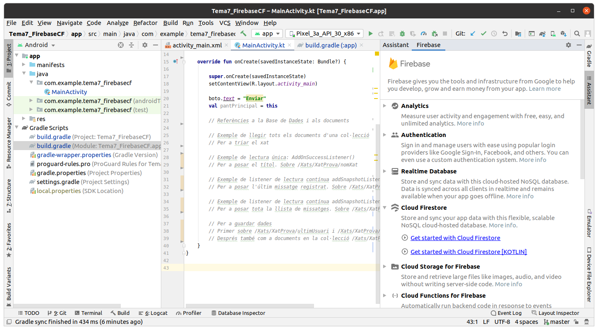

**Connectar l'aplicació a Firebase Cloud Firestore**{.azul}

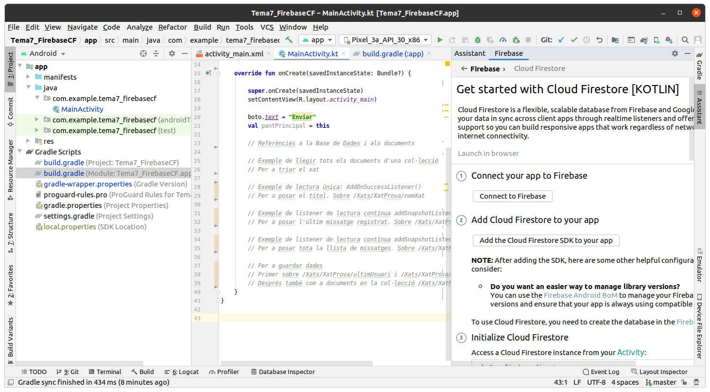

!!!note "NOTA IMPORTANT"

    Podria donar-se el cas, depenent de la versió d'Android Studio (i altres
    coses, com que el projecte tinga errors i/o avisos) que done un error en
    apretar el botó de Connect to Firebase. I és que sembla que és molt delicat
    aquest assistent, i si hi ha qualsevol warning o error no deixa continuar:

    

    Per a solucionar-lo, a banda de revisar si tenim algun error o avís,
    senzillament afegim al final del fitxer **gradle.properties:**
    
    
        android.suppressUnsupportedCompileSdk=32

En apretar el botó de **Connect to Firebase**, si no estàvem connectats amb el
compte de Google al Firebase se'ns obrirà finestra d'un navegador per a
connectar. Podria donar-se el cas que ens diguera que Android Studio vol
accedir a les dades de la Base de Dades. Òbviament ho haurem de permetre:

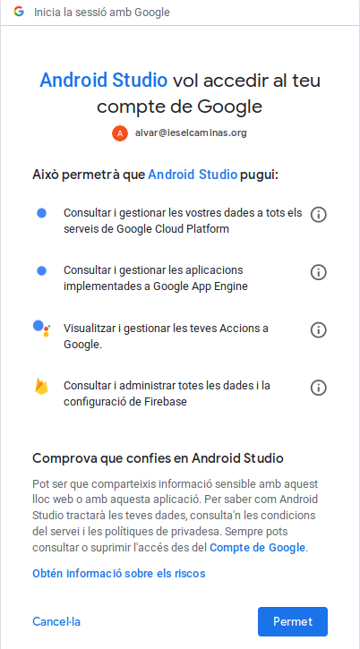

Una vegada autenticats en Firebase, des de l'entorn d'Android Studio ens
ofereix la possibilitat de crear una aplicació nova (una Base de Dades nova) o
utilitzar alguna de les que ja tenim. Utilitzarem la que ens ha servit de
prova fins el moment:

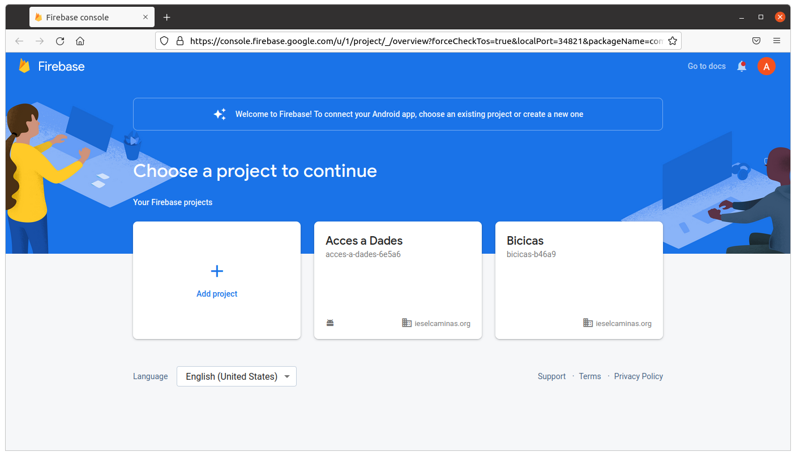

Quan haja connectat substituirà el botó **Connect to Firebase**, per una
etiqueta que dirà **connected** , en verd.

**Afegir la Base de Dades a la nostra aplicació**{.azul}

En aquest segon pas, quan apretem el botó **Add the Cloud Firestore SDK to
your app** , ens dirà els canvis que farà per a incorporar les coses
necessàries per a poder connectar.

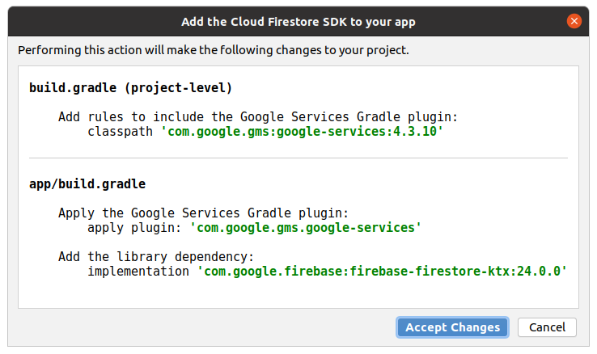

Com veieu es tracta d'incorporar les llibreries necessàries de Firebase.

Igual que abans, substituirà el botó **Add the Cloud Firestore SDK in your
app** , per una etiqueta que dirà **Dependencies set up correctly**, en verd.
És una bona guia per saber en quin punt estem.

**Permetre l'accés als usuaris, si es precís canviant les regles d'accés a la
Base de Dades**{.azul}

Com que Runtime Database i Cloud Firestore, encara que sembla que estan
compartint la Base de Dades, en realitat no es pot accedir d'una a l'altra,
igual ens passarà amb les **regles d'accés** (**Rules**). Segurament ho
tindrem bé, perquè ja ho havíem controlat en la part d'**IntelliJ**, però
encara així és convenient pegar-li una miradeta. Recordeu que és des de
la**consola de Firebase**, entrant al **Cloud Firestore**, i anant a la
pestanya **Rules**

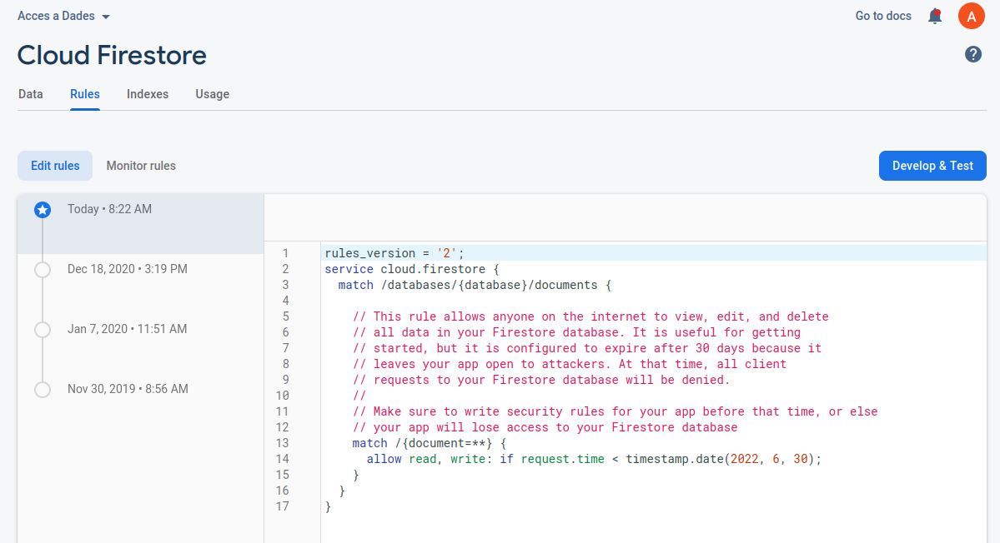

Observeu que en aquest exemple he posat que es pot connectar qualsevol fins al
30-12-2020. Inicialment dóna un mes, però si no voleu tenir problemes, ho
podeu allargar canviant la data.

**Inicialitzar Cloud Firestore**{.azul}

És només una sentència per a inicialitzar la referència a la BD de Cloud
Firestore, i és de tipus FirebaseFirestore.

Després de copiar-la, només ens faltarà importar **Firebase** i després
**firestore** amb **Alt-Intro**.

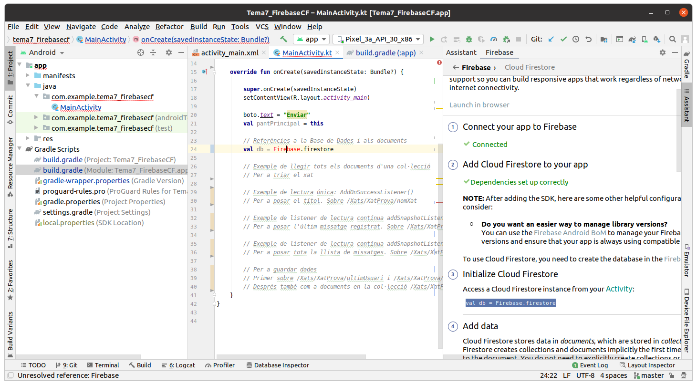

Ara ja podríem executar el programa per veure si de moment van bé les coses.

En el moment de fer aquestos apunts salta el següent error:

que com es veu és molt fàcil d'arreglar: senzillament és pujar el
**minSdkVersion** de 16 a 19 en el **build.gradle** de la app

**Copiar les sentències per a escriure i per a llegir (millor dit per a detectar
els canvis en temps real)**{.azul}

Ens diu un exemple de les sentències a copiar per a poder poder fer referència
a la Base de Dades, per a guardar una informació a la Base de Dades i també
per a detectar un canvi en la Base de Dades i poder obtenir el nou valor. No
les posarem en aquest exemple, ja que suposaria una estructura de dades
completament diferent a la que volem, i que no ens interessa. Ho veurem tot en
el proper punt.

### 4.3.2 CF-Android: Accés a les dades

**Referència a la Base de Dades i a les dades concretes a les quals volem
accedir**{.azul}

La referència a la Base de Dades l'havíem completada en el punt anterior, però
la tornem a posar ací per més comoditat.

Podrem fer referència a cada **col·lecció** i/o a cada **document** de cada
col·lecció

    
    
            // Referències a la Base de Dades i als documents
            val db = Firebase.firestore
            val docRef = db.collection("Xats").document("XatProva")

**Guardar dades**{.azul}

Per a guardar dades, ens podem plantejar 3 operacions d'escriptura sobre el
document:

  * Sobreescriure'l tot: ho farem amb el mètode **set()**
  * Esborrar-lo tot: amb el mètode **delete()**
  * Modificar-lo: amb el mètode **update()**

Excepte per esborrar, per a les altres operacions ens fa falta saber
l'estructura del document. Per això tant mètode **set()** com el mètode
**update()** accepten com a paràmetre no una única dada, sinó una estructura
que puga arribar a reflectir el document. Acceptaran com a paràmetre un **Map
<String, Object\>**, on podrem col·locar les claus i els valors de tots els
membres del document. Cada valor pot ser dels tipus que vam practicar en el
punt anterior: string, number, boolean, array, map, ...

La manera de col·locar un element en una estructura **Map <\>** és amb el
mètode **put()**, que acceptarà dos paràmetres: la clau i el valor.

En el nostre exemple guardarem en el moment d'apretar el botó. Inicialment ho
farem sobre **/Xats/XatProva/ultimUsuari** i **/Xats/XatProva/ultimMissatge**
, encara que després ho canviarem. I com vam comentar en l'apartat
d'**IntelliJ** , ens convé el mètode **update** , per a no esborrar la resta
del document (per exemple el camp **nomXat**)

    
    
            // Per a guardar dades
            // Primer sobre /Xats/XatProva/ultimUsuari i /Xats/XatProva/ultimMissatge
            // Després també com a documents en la col·lecció /Xats/XatProva/missatges
            boto.setOnClickListener {
                val dades = HashMap<String, Any>()
                dades["ultimUsuari"] = usuari.text.toString()
                dades["ultimMissatge"] = text.text.toString()
                docRef.update(dades)
    
                text.setText("")
            }
    

**Recuperar dades**{.azul}

També ens plantejarem els dos casos que ja ens vam plantejar en Realtime
Database:

  * Una única lectura
  * Un listener que es quede escoltant per si hi ha canvis

**Listener de lectura única: addOnSuccessListener()**{.verde}

Ara des de Android, per a fer la lectura única també ens plantejarem un
listener, que quedarà més sòlid i així poder actuar quan estiguem segurs que
la dada ha arribat.

En realitat tenim més d'un listener per a comprovar com ha anat una lectura:

  * **addOnSuccessListener()** s'activarà quan la tasca de lectura finalitza de forma exitosa
  * **addOnFailureListener()** s'activarà quan la tasca de lectura NO ha finalitzat bé
  * **addOnCompleteListener()** s'activarà quan la tasca de lectura ha finalitzat, de forma exitosa o no. El més normal serà comprovar dins d'ell si ha anat bé

Per simplificar, en aquest moment només tractarem el primer dels 3, ja que ens
assegura que la lectura ha anat bé. Quan això haja passat, ens arribarà al
paràmetre (de tipus **DocumentSnapshot**) una còpia de les dades i sobre ell
podrem utilitzar:

  * **getData()** per a obtenir tot el document en un **Map <String,Object>**
  * **getId()** per a obtenir el nom del document
  * **get(_nomClau_) **per a obtenir directament el valor d'una clau del document
  * **getString(_nomClau_) **per a obtenir el valor de la clau en forma de string
  * **getDouble(_nomClau_) **per a obtenir el valor de la clau en forma de double
  * ...

L'exemple d'única lectura el farem per a posar el títol de l'aplicació, com en
l'exemple del Realtime Database.

    
    
            // Exemple de lectura única: AddOnSuccessListener()
            // Per a posar el títol. Sobre /Xats/XatProva/nomXat
            docRef.get().addOnSuccessListener { documentSnapshot ->
                setTitle(documentSnapshot.getString("nomXat"))
            }
    

**Listener que es queda escoltant: addSnapshotListener()**{.verde}

De forma paral·lela al Realtime Database, si volem rebre una notificació de
quan hi haja un canvi en el document que ens interessa, sobre una referència a
aquest document ens muntarem un listener, en aquest cas amb el mètode
**addSnapshotListener()**. Al mètode **onEvent()** que s'ha de sobreescriure
arribarà un paràmetre de tipus **DocumentSnapshot** , que serà una còpia del
document. Com en el cas anterior podrem fer sobre ell un **getData()** per a
obtenir tot el document, **getString(_nomClau_) **per a obtenir el valor de la
clau com un string, etc.

En el nostre exemple, de moment l'utilitzem tant per a posar l'últim missatge
com per a anar omplit l'àrea central amb el xat.

    
    
            // Exemple de listener de lectura contínua addSnapshotListener() sobre un document
            // Per a posar l'últim missatge registrat. Sobre /Xats/XatProva/ultimMissatge
             docRef.addSnapshotListener { documentSnapshot, e ->
                 ultim.text = documentSnapshot!!.getString("ultimMissatge")
                 area.append(documentSnapshot!!.getString("ultimUsuari") + ": " + documentSnapshot!!.getString("ultimMissatge") + "\n")
             }
    

El més desitjable seria tractar els errors, cosa que no hem fet en aquest
moment per simplicitat.

**Guardar documents**{.azul}

Ja sabem que l'estructura és de col·leccions i documents, i que dins d'un
document puc guardar col·leccions, en les quals hi haurà documents, ... amb
una estructura que pot ser recursiva, convida a organitzar d'aquesta manera la
informació: en compte d'utilitzar llistes (que també es pot però no són tan
pràctiques), millor organitzar-ho en forma de subcol·leccions i documents.
Anem a repetir el ja fet en el moment d'**IntelliJ** , acoplant-lo a Android.

Per tant ens és necessària l'operació d'afegir un document a una col·lecció.
Això en un principi ho aconseguiríem amb el mètode **set()** sobre un document
nou de la col·lecció:

    
    
    database.collection("nomCol").document("nomDoc").set(dades)

però això ens obligaria a posar un nom a cada document. Ja havíem vist que
Cloud Firestore era capaç de generar un nom de document que no es puga
repetir. Des de Java s'aconsegueix amb el mètode **add()** :

    
    
    db.collection("nomCol").add(dades)

però que en el nostre cas, per ser una subcol·lecció és un poc més llarg

    
    
    db.collection("Xats").document("XatProva").collection("missatges").add(dades)

L'estructura de les dades la podem fer amb un **Map <string,Any>**, i posar-li
en el nostre cas l'usuari i el missatge. D'aquesta manera ens quedaria ara el
procediment en apretar el botó d'enviar el missatge, on a banda del que teníem
abans per a modificar **ultimMissatge** i **ultimUsuari** , ara afegirem el
document nou. Ens haurem de definir la classe **Missatge** , que de moment
només té les propietats **nom** i **contingut** :

    
    
    class Missatge(var nom: String, var contingut: String)

I el codi quan apretem el botó de moment quedarà així:

    
    
            // Per a guardar dades
            // Primer sobre /Xats/XatProva/ultimUsuari i /Xats/XatProva/ultimMissatge
            // Després també com a documents en la col·lecció /Xats/XatProva/missatges
            boto.setOnClickListener {
                val dades = HashMap<String, Any>()
                dades["ultimUsuari"] = usuari.text.toString()
                dades["ultimMissatge"] = text.text.toString()
                docRef.update(dades)
    
                val m = Missatge(usuari.text.toString(), text.text.toString())
                db.collection("Xats").document("XatProva").collection("missatges").add(m)
                text.setText("")
            }
    

**Recuperar documents modificats**{.azul}

Ja només ens queda detectar els canvis en els documents de la col·lecció, per
a afegir a l'àrea central els documents afegits. També és un
**addSnapshotListener()** , però ara l'apliquem a una col·lecció (no a un
document). El resultat és que d'una forma molt còmoda podrem detectar els
documents afegits, els modificats i fins i tot els esborrats.

Ací tenim el fragment de programa que ens ho permetrà. En aquest exemple només
hem deixat el cas de **document afegit** , i no hem posat els casos de
**document modificat** i **document esborrat** , ja que en aquest exemple no
ho utilitzem. Haurem d'importar si **DocumentChange** no el teníem importat
encara.

    
    
            // Exemple de listener de lectura contínua addSnapshotListener() sobre una col·lecció
            // Per a posar tota la llista de missatges. Sobre /Xats/XatProva/missatges
            db.collection("Xats").document("XatProva").collection("missatges").addSnapshotListener { snapshots, e ->
                for (dc in snapshots!!.documentChanges) {
                    when (dc.type) {
                        DocumentChange.Type.ADDED -> {
                            area.append( dc.document.getString("nom") + ": " + dc.document.getString("contingut") + "\n")
                        }
                        else -> {}    // en les últimes versions obliga a posar totes les opcions, ADDED, MODIFIED i REMOVED, o poser el else
                    }
                }
            }
    

I recordeu que ara hem d'eliminar o comentar l'altre moment que què
actualitzàvem **area** amb el contingut de **ultimUsuari** i **ultimMissatge**
(jo el tenia en la línia 42)

    
    
    //area.append(documentSnapshot!!.getString("ultimUsuari") + ": " + documentSnapshot!!.getString("ultimMissatge") + "\n")  
    

És de destacar que ara la còpia de les dades, el snapshot, és en realitat un
**QuerySnapshot**. I és que nosaltres no hem fet cap consulta sobre els
documents de la col·lecció, però és possible fer-la. Per exemple es podria
seleccionar per mig d'una query tots els documents en què l'usuari és un
determinat. Aleshores detectaríem els documents afegits, modificats o
esborrats d'aquest usuari. Ho faríem en el moment de declarar el
**addSnapshotListener()** :

    
    
    db.collection("Xats").document("XatProva").collection("missatges").whereEqualTo("nom", "Usuari3").addSnapshotListener {
    

O també podríem ordenar els documents per algun camp. Açò en realitat seria
necessari per a poder ordenar els missatges, ja que el nom del document auto-
generat per Cloud Firestore no és consecutiu, sinó aleatori, i per tant
perfectament un document nou tinga un nom anterior a alguns dels existents. Ho
arreglaríem fàcilment posant un camp més amb la data i ordenant per aquest
camp amb **orderBy()** (que aniria en el lloc del **whereEqualTo()** de la
sentència anterior). Ho farem en l'exemple complet de la següent pregunta.

Un altre exemple. Anem a fer una lectura única de tots els documents de la
col·lecció principal **Xats**. Fins el moment hem treballat sempre sobre el
document **XatProva** , però ho anem a generalitzar per a accedir a més d'un
xat.

De moment ens conformarem amb fer una lectura única de tots els documents del
xat per a mostrar-los en un Spinner. Posteriorment, en l'exemple complet de la
següent pregunta intentarem triar un xat o un altre per a que ens mostre els
missatge de l'un o de l'altre.

Per a fer aquesta lectura única, ara utilitzarem un
**addOnCompletedListener()** en compte del **addOnSuccessLitener()** de
l'altra ocasió, i així veurem un poc la diferència de plantejament.

    
    
            // Exemple de llegir tots els documents d'una col·lecció
            // Per a triar el xat
            db.collection("Xats").get().addOnCompleteListener { task ->
                if (task.isSuccessful) {
                    val opcions = ArrayList<String>()
                    for (document in task.result!!) {
                        opcions.add(document.id)
                    }
                    val adaptador = ArrayAdapter(pantPrincipal, android.R.layout.simple_spinner_item, opcions)
                    adaptador.setDropDownViewResource(android.R.layout.simple_spinner_dropdown_item)
                    comboXats.adapter = adaptador
                } else {
                }
            }
    

Observeu que ara mirem si s'ha completat satisfactòriament la tasca amb
**task.isSuccessful()**. Per simplicitat ara no fem res si no ha tingut èxit
la lectura. Únicament tractem quan sí que ha tingut èxit, que aprofitem per a
omplir el **Spinner** **comboXats** a partir d'un **ArrayAdapter**.  
  

En aquesta imatge es veu el resultat, on s'intenta explicar cadascuna de les
coses:

.png)

De moment el Spinner no fa res quan seleccionem una opció.

Ho intentarem en l'exemple complet de la següent pregunta.

De moment el codi ha quedat així:

    
    
    import androidx.appcompat.app.AppCompatActivity
    import android.os.Bundle
    import android.widget.*
    import com.google.firebase.firestore.DocumentChange
    import com.google.firebase.firestore.ktx.firestore
    import com.google.firebase.ktx.Firebase
    import java.text.SimpleDateFormat
    import java.util.*
    
    import kotlinx.android.synthetic.main.activity_main.*
    
    class Missatge(var nom: String, var contingut: String)
    
    class MainActivity : AppCompatActivity() {
    
        override fun onCreate(savedInstanceState: Bundle?) {
    
            super.onCreate(savedInstanceState)
            setContentView(R.layout.activity_main)
    
            boto.text = "Enviar"
            val pantPrincipal = this
    
            // Referències a la Base de Dades i als documents
            val db = Firebase.firestore
            val docRef = db.collection("Xats").document("XatProva")
    
            // Exemple de llegir tots els documents d'una col·lecció
            // Per a triar el xat
            db.collection("Xats").get().addOnCompleteListener { task ->
                if (task.isSuccessful) {
                    val opcions = ArrayList<String>()
                    for (document in task.result!!) {
                        opcions.add(document.id)
                    }
                    val adaptador = ArrayAdapter(pantPrincipal, android.R.layout.simple_spinner_item, opcions)
                    adaptador.setDropDownViewResource(android.R.layout.simple_spinner_dropdown_item)
                    comboXats.adapter = adaptador
                } else {
                }
            }
    
            // Exemple de lectura única: AddOnSuccessListener()
            // Per a posar el títol. Sobre /Xats/XatProva/nomXat
            docRef.get().addOnSuccessListener { documentSnapshot ->
                setTitle(documentSnapshot.getString("nomXat"))
            }
    
            // Exemple de listener de lectura contínua addSnapshotListener() sobre un document
            // Per a posar l'últim missatge registrat. Sobre /Xats/XatProva/ultimMissatge
            docRef.addSnapshotListener { documentSnapshot, e ->
                ultim.text = documentSnapshot!!.getString("ultimMissatge")
                //area.append(documentSnapshot!!.getString("ultimUsuari") + ": " + documentSnapshot!!.getString("ultimMissatge") + "\n")
            }
    
            // Exemple de listener de lectura contínua addSnapshotListener() sobre una col·lecció
            // Per a posar tota la llista de missatges. Sobre /Xats/XatProva/missatges
            db.collection("Xats").document("XatProva").collection("missatges").addSnapshotListener { snapshots, e ->
                for (dc in snapshots!!.documentChanges) {
                    when (dc.type) {
                        DocumentChange.Type.ADDED -> {
                            area.append( dc.document.getString("nom") + ": " + dc.document.getString("contingut") + "\n")
                        }
                        else -> {}    // en les últimes versions obliga a posar totes les opcions, ADDED, MODIFIED i REMOVED, o poser el else
                    }
                }
            }
            
            // Per a guardar dades
            // Primer sobre /Xats/XatProva/ultimUsuari i /Xats/XatProva/ultimMissatge
            // Després també com a documents en la col·lecció /Xats/XatProva/missatges
            boto.setOnClickListener {
                val dades = HashMap<String, Any>()
                dades["ultimUsuari"] = usuari.text.toString()
                dades["ultimMissatge"] = text.text.toString()
                docRef.update(dades)
    
                val m = Missatge(usuari.text.toString(), text.text.toString())
                db.collection("Xats").document("XatProva").collection("missatges").add(m)
                text.setText("")
            }
        }
    }

### 4.3.3 CF-Android: Tot l'exemple

Anem a posar tot l'exemple del xat complet, això sí, amb algunes modificacions
i millores:

  * Tindrem la classe **Missatge** amb les propietat **nom** i **contingut**. Posarem també la **data** (com un **Date** , aprofitant que també tenim aquest tipus en Cloud Firestore) per a poder ordenar els missatges cronològicament
  * Llevem les coses que no s'utilitzen estrictament en aquest exemple
  * El **Spinner** anomenat **comboXats** ara ja funcionarà. Per a no modificar les coses ja fetes, posarem la creació dels listeners en un mètode anomenat **inicialitzar()** que per a tocar el menys possible estarà dins del listener de detectar els canvis en el Spinner, ja que ara els altres listeners dependran del xat triat. I haurem d'anar amb compte també de parar els listeners, ja creats. És a dir, si primer triem un xat, tindrem els listeners que apunten a ell. Si després triem un altre xat i creem els listeners una altra vegada per a que apunten al lloc correcte, els tindrem per duplicat. Hauríem de parar els primers listeners

Classe Missatge

    
    
    class Missatge(val nom: String, val data: Date, val contingut: String)

  

I el programa (hem incorporat la classe **Missatge** per més comoditat):

    
    
    import androidx.appcompat.app.AppCompatActivity
    import android.os.Bundle
    import android.widget.*
    import com.google.firebase.firestore.DocumentChange
    import com.google.firebase.firestore.ListenerRegistration
    import com.google.firebase.firestore.ktx.firestore
    import com.google.firebase.ktx.Firebase
    import java.text.SimpleDateFormat
    import java.util.*
    
    import kotlinx.android.synthetic.main.activity_main.*
    
    
    class Missatge(val nom: String, val data: Date, val contingut: String)
    
    class MainActivity : AppCompatActivity() {
    
        var listenerUltimMissatge: ListenerRegistration? = null
        var listenerMissatges: ListenerRegistration? = null
    
    
        override fun onCreate(savedInstanceState: Bundle?) {
    
            super.onCreate(savedInstanceState)
            setContentView(R.layout.activity_main)
    
            boto.text = "Enviar"
            val pantPrincipal = this
    
            // Referències a la Base de Dades i als documents
            val db = Firebase.firestore
            var docRef = db.collection("Xats").document("XatProva")
    
            // Exemple de llegir tots els documents d'una col·lecció
            // Per a triar el xat
            db.collection("Xats").get().addOnCompleteListener { task ->
                if (task.isSuccessful) {
                    val opcions = ArrayList<String>()
                    for (document in task.result!!) {
                        opcions.add(document.id)
                    }
                    val adaptador = ArrayAdapter(pantPrincipal, android.R.layout.simple_spinner_item, opcions)
                    adaptador.setDropDownViewResource(android.R.layout.simple_spinner_dropdown_item)
                    comboXats.adapter = adaptador
                }
            }
    
            comboXats.onItemSelectedListener = object:AdapterView.OnItemSelectedListener {
                override fun onItemSelected(parent: AdapterView<*>?, view: android.view.View?, position: Int, id: Long) {
    
                    // TODO Auto-generated method stub
                    docRef = db.collection("Xats").document(comboXats.selectedItem.toString())
                    area.text = ""
                    inicialitzar()
                }
    
                override fun onNothingSelected(p0: AdapterView<*>?) {
                    TODO("Not yet implemented")
                }
    
                private fun inicialitzar() {
    
                    // Exemple de lectura única: AddOnSuccessListener()
                    // Per a posar el títol. Sobre /Xats/XatProva/nomXat
                    docRef.get().addOnSuccessListener { documentSnapshot ->
                        setTitle(documentSnapshot.getString("nomXat"))
                    }
    
                    // Exemple de listener de lectura contínua addSnapshotListener() sobre un document
                    // Per a posar l'últim missatge registrat. Sobre /Xats/XatProva/ultimMissatge
                    // Si estava en marxa, el parem abans de tornar-lo a llançar
                    if (listenerUltimMissatge != null)
                        listenerUltimMissatge!!.remove()
    
                    listenerUltimMissatge = docRef.addSnapshotListener { documentSnapshot, e ->
                        ultim.text = documentSnapshot!!.getString("ultimMissatge")
                    }
    
                    // Exemple de listener de lectura contínua addSnapshotListener() sobre una col·lecció
                    // Per a posar tota la llista de missatges. Sobre /Xats/XatProva/missatges
                    // Si estava en marxa, el parem abans de tornar-lo a llançar
                    if (listenerMissatges != null)
                        listenerMissatges!!.remove()
    
                    listenerMissatges = docRef.collection("missatges").orderBy("data").addSnapshotListener { snapshots, e ->
                        for (dc in snapshots!!.documentChanges) {
                            when (dc.type) {
                                DocumentChange.Type.ADDED -> {
                                    val sdf = SimpleDateFormat("dd-MM-yyyy HH:mm")
                                    val dataFormatejada = sdf.format(dc.document.getDate("data"))
                                    area.append(dc.document.getString("nom") + " (" + dataFormatejada + "): " + dc.document.getString("contingut") + "\n")
                                }
                                else -> {}
                            }
                        }
                    }
                    // Per a guardar dades
                    // Primer sobre /Xats/XatProva/ultimUsuari i /Xats/XatProva/ultimMissatge
                    // Després també com a documents en la col·lecció /Xats/XatProva/missatges
                    boto.setOnClickListener {
                        val dades = HashMap<String, Any>()
                        dades["ultimUsuari"] = usuari.text.toString()
                        dades["ultimMissatge"] = text.text.toString()
                        docRef.update(dades)
    
                        val m = Missatge(usuari.text.toString(), Date(), text.text.toString())
                        docRef.collection("missatges").add(m)
    
                        text.setText("")
                    }
                }
            }
        }
    }

  
No apareixeran el missatges sense data.

I el resultat és el de la imatge, en la qual es veu el contingut del xat
**Xat1** , amb uns quant misstges ja

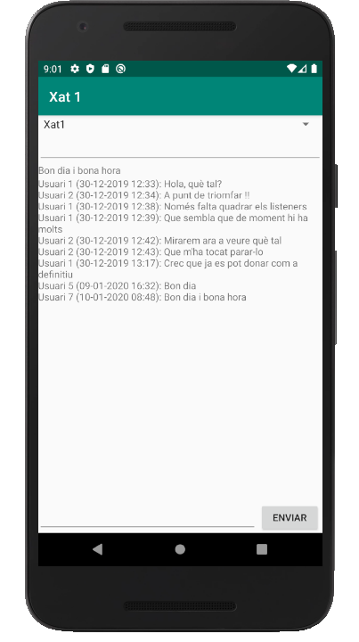
-->

Llicenciat sota la  [Llicència Creative Commons Reconeixement NoComercial
SenseObraDerivada 4.0](http://creativecommons.org/licenses/by-nc-nd/4.0/)

