# 4.5 - Cloud Storage

Cloud Storage ens permet guardar fitxers còmodament: fotos, vídeos, audios,
...

Combinat amb Reltime Database o Cloud Firestore ens permet guardar les nostres
dedes de forma eficient, ja que podem guardar en les primeres les referències
als fitxers que pugem al Storage.

La utilització d'estoratge no és de gratis, per la qual cosa els exemples d'aquest apartat es faran sobre una base de dades externa (la mateixa que la de l'exercici 2) on sí que tindreu accés.

Necessitareu el fitxer de connexió d'aquesta base de dades al que teniu com un recurs en l'aula virtual: [**xat-ad-9f901-firebase-adminsdk-f1vja-b8957819d1.json**](https://aules.edu.gva.es/semipresencial/mod/folder/view.php?id=1847725)

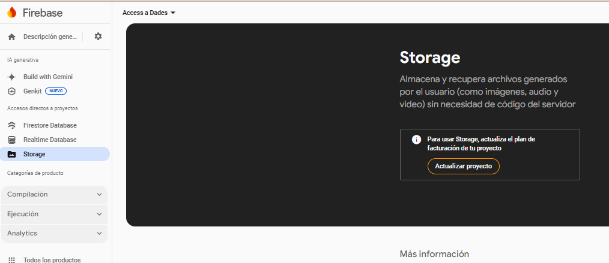

## 4.5.1 CS: Utilització des de l'entorn

L'entorn que ens ofereix Firebase per a gestionar Cloud Storage és molt
senzill i no té cap secret, ja que ens permetrà pujar els fitxers,
organitzant-los en subdirectoris, i també esborrar-los. En principi no
necessitem més.

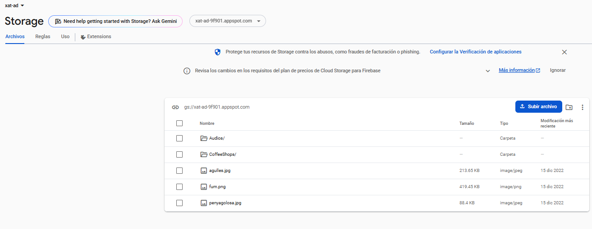

Si punxem en un fitxer podrem veure les seues característiques, i si el
seleccionem podrem esborrar-lo o obrir-lo en una altra finestra.

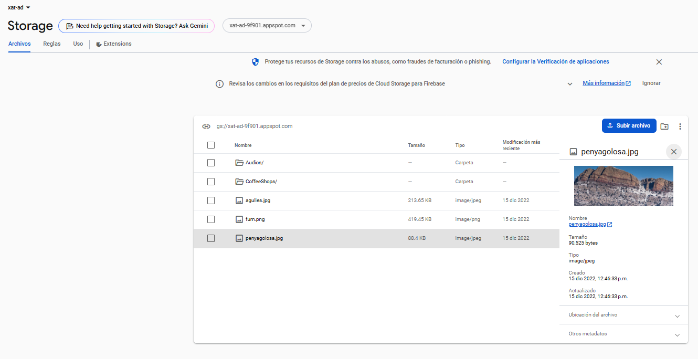

Aquest entorn, de tan senzill, fins i tot es queda un poc curt, ja que no ens
permetrà canviar el nom d'un fitxer, o moure'l a una carpeta, ...

Si vulguérem fer algun canvi d'aquestos, canviar el nom o canviar de carpeta,
ho hauríem de fer des d'un altre lloc, un altre navegador del Google Cloud
Storage (<https://console.cloud.google.com/storage/browser>):

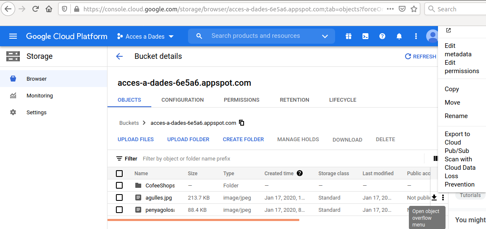

on es pot observar com en els 3 puntets de la dreta d'un fitxer ens apareixen
moltes opcions com copiar, menejar, renomenar, ...

Però nosaltres en principi tindrem prou amb la primera consola. Anem alerta de
col·locar les coses al lloc, i si no estan, esborrem i col·loquem al lloc
correcte.

Ja que estem en la consola, controlem els permisos (**Rules**) en la pestanya
corresponent de la consola:

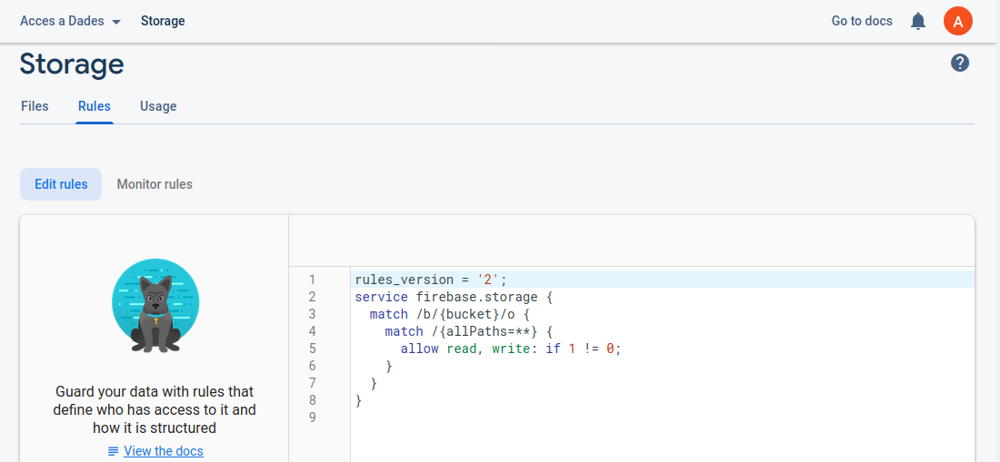

En aquesta imatge s'aprecia que no hi haurà permís per a llegir ni escriure
fora de la consola. Com que el que volem és accedir des de les aplicacions
d'IntelliJ i d'Android, substituirem el permís per aquest:
   
    
    allow read, write: if request.time < timestamp.date(2025, 6, 14);

amb una data en la qual no ens pillem els dits.

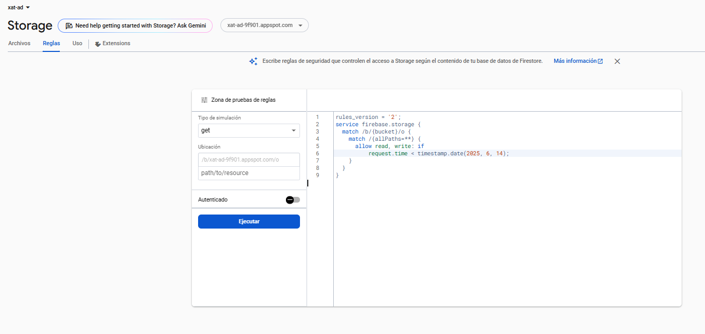

!!!note "Nota"
    Observeu com tant en la consola senzilla com en la del browser de GoogleCloud,
    ens posa una adreça, que en el meu cas és: **gs://xat-ad-9f901.appspot.com**. Es tracta de l'adreça del **bucket** (poal, contenidor) on estan col·locats els fitxers. Podem crear més **buckets**, però no ho complicarem. Haurem de tenir clara la referència a aquest bucket  per defecte.

## 4.5.2 CS: Utilització des de IntelliJ

**Exemple**{.azul}

Practicarem tot el que ve a continuació sobre un programa gràfic. Serà molt
més senzill que en els casos anteriors, ja que de moment només volem un lloc
on tenir el nom de la imatge que volem baixar, i un lloc on visualitzar la
imatge

Aquest és el seu esquelet. Guardeu-lo en un fitxer anomenat
**Exemple_8_5_1_FirebaseCS_AgafarImatge.kt** :

    
    
    import javax.swing.JFrame
    import java.awt.EventQueue
    import javax.swing.JTextField
    import javax.swing.JButton
    import javax.swing.JLabel
    import java.awt.BorderLayout
    import javax.swing.JPanel
    import java.awt.FlowLayout
    import java.io.FileInputStream
    import com.google.firebase.FirebaseOptions
    import com.google.auth.oauth2.GoogleCredentials
    import com.google.firebase.FirebaseApp
    import com.google.cloud.storage.Bucket
    import com.google.firebase.cloud.StorageClient
    import javax.imageio.ImageIO
    import java.nio.ByteBuffer
    import java.io.ByteArrayInputStream
    import javax.swing.ImageIcon

    class AgafarImatge_1 : JFrame() {
    	val nomIm = JTextField(25)
    	val boto = JButton("Agafar")
    
    	val foto = JLabel()
    	var bucket: Bucket? = null
    
    	init {
    		defaultCloseOperation = JFrame.EXIT_ON_CLOSE
    		setBounds(100, 100, 900, 600)
    		setLayout(BorderLayout())
    
    		val panell1 = JPanel(FlowLayout())
    		panell1.add(nomIm)
    		panell1.add(boto)
    		getContentPane().add(panell1, BorderLayout.NORTH)
    
    		getContentPane().add(foto, BorderLayout.CENTER)
    
    		boto.addActionListener { agafar() }
    
    
    	}
    
    	fun agafar() {
    		// Instruccions per agafar la imatge
     
    	}
    
    }
    
    fun main(args: Array<String>) {
    	EventQueue.invokeLater {
    		AgafarImatge_1().isVisible = true
    	}
    }

### 4.5.2.1 CS-IntelliJ: Connexió

**Configuració**{.azul}

No caldrà fer referència a la URL de l'aplicació Firebase, perquè quan
especifiquem el bucket, li posarem l'adreça i amb això és suficient.

Recordeu que ens vam baixar un fitxer **json** amb la clau privada que vam
guardar a l'arrel del projecte (i del qual és molt convenient guardar còpia).

    
    
    	val serviceAccount = FileInputStream("xat-ad-9f901-firebase-adminsdk-f1vja-b8957819d1.json")  
    
    	val options = FirebaseOptions.Builder()
    		.setCredentials(GoogleCredentials.fromStream(serviceAccount))
    		.build()
    
    	FirebaseApp.initializeApp(options)

**Referència al bucket de Cloud Storage**{.azul}

Ací haurem de fer una referència explícita al **bucket** que vam comentar en el punt
anterior, mentre que en Android ens el podrem saltar, ja que la referència
estarà implícitament. Ho farem a través de **StorageClient** , mentre que en
Android serà un altra classe.:

      bucket = StorageClient.getInstance().bucket("xat-ad-9f901.appspot.com")

!!!note "Nota"
    Podrém haver-ho definit diferent, especificant el bucket en el moment de
    definir les opcions. Aleshores, en el moment de crear el bucket no caldria
    passar-li el paràmetre.
    
    
            val serviceAccount = FileInputStream("xat-ad-9f901-firebase-adminsdk-f1vja-b8957819d1.json")
        
            val options = FirebaseOptions.Builder()
                .setCredentials(GoogleCredentials.fromStream(serviceAccount))
                .setStorageBucket("xat-ad-9f901.appspot.com")
                .build()
        
            FirebaseApp.initializeApp(options)
            
            bucket StorageClient.getInstance().bucket()

### 4.5.2.2 CS-IntelliJ: Accés a les dades

Farem accés als fitxers de Cloud Storage per a llegir-los, per a baixar-los.
Mencionarem el fet de guardar fitxers, però no l'utilitzarem tant.

Ho farem per mig del mètode **get()** del **bucket** , al qual li passarem el
nom del fitxer que volem llegir, i ens tornarà un **blob** (de cloud storage)
amb el seu contingut.

    
    
    val blob = bucket?.get(nomIm.getText())

Aquest **blob** podrem agafar-lo de dues maneres:

  * Baixant-lo a un fitxer temporal amb el mètode **downloadTo()**
  * Agafant-lo directament en memòria a un **ByteBuffer** de grandària suficient
  * Agafant-lo directament en memòria a un **ByteArray** amb el mètode **getContent()** i aleshores no cal especificar cap grandària (potser siga el més còmode)

De la primera manera ho faríem així, baixem el fitxer a un fitxer auxiliar, i
des d'alli el carreguem

    
    
            // Primera manera de llegir, amb un fitxer auxiliar
            val f = File("auxiliar")
            blob?.downloadTo(FileOutputStream(f))
            val image = ImageIO.read(f)
            foto.setIcon(ImageIcon(image))
    

De la segona manera ens muntem un reader (de Cloud Storage) per poder
carregar-ho en memòria a un ByteBuffer

    
    
    		//Segona manera de llegir: muntant un reader per a carregar a un ByteBuffer
    		val im = ByteBuffer.allocate(1024 * 1024)
    		blob?.reader()?.read(im)
    		val image = ImageIO.read(ByteArrayInputStream(im.array()))
    		foto.setIcon(ImageIcon(image))
    

La tercera manera, segurament és la més còmoda, amb el mètode **getContent()**
, que ens torna el **ByteArray**. P

    
    
            //Tercera manera de llegir: amb getContent per a carregar a un ByteArray
            val im = blob?.getContent()
            val image = ImageIO.read(im?.inputStream())
            foto.setIcon(ImageIcon(image))
    

Qualsevol de les tres maneres ens hauria de funcionar bé, col·locant juntament
amb la definició del blob en la funció que s'executa en apretar el botó,
**agafar()**. I aquest seria el resultat:

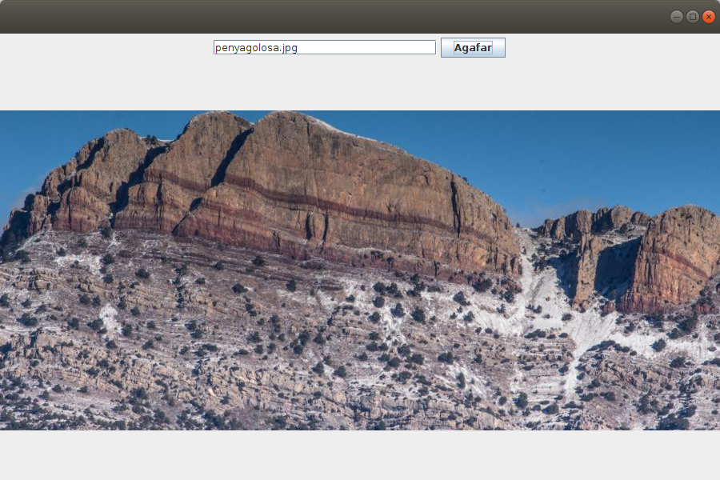

Altres mètodes del **bucket** que ens poden interessar són:

  * **get()** : agafa un fitxer, passant-li el nom i tornant un **blob**. És el que hem utiitzat.
  * **create()** : serveix per a pujar un fitxer al bucket; se li passen 3 paràmetres, el nom que tindrà el fitxer en el Clousd Storage, el contingut que se li pot passar en forma de ByteArray o de InputStream, i el tipus de fitxer (per exemple **"image/png"**)
  * **list()** : torna un conjunt de blobs en forma de **Page <Blob>**. De cada element blob podrem baixar-nos el contingut a un fitxer auxiliar, a un ByteBuffer, agafar el seu nom, ...

### 4.5.2.3 CS-IntelliJ: Tot l'exemple

Anem a ajuntar tot l'exemple que visualitza una imatge guardada en Cloud
Storage, modificant-lo un poc:

  * Ens guardarem els noms de les imatges en un **JComboBox**. I per a **visualitzar** la imatge, en compte d'un **JLabel** utilitzarem un **JButton** , així la imatge quedara centrada tan horitzontal com verticalment.
  * Per a provar la pujada d'imatges, proposarem un segon nom a la imatge, i un botó. Si s'apreta es guardarà la imatge amb el nom proposat (o canviat), aprofitant l'extensió del nom per a posar el tipus d'imatge

El guardarem amb un altre nom, en el fitxer Kotlin
**Exemple_8_5_2_FirebaseCS_AgafarImatge****.kt**

    
    
    import javax.swing.JFrame
    import java.awt.EventQueue
    import javax.swing.JComboBox
    import java.awt.BorderLayout
    import javax.swing.JPanel
    import java.awt.FlowLayout
    import java.io.FileInputStream
    import com.google.firebase.FirebaseOptions
    import com.google.auth.oauth2.GoogleCredentials
    import com.google.firebase.FirebaseApp
    import com.google.cloud.storage.Bucket
    import com.google.firebase.cloud.StorageClient
    import javax.imageio.ImageIO
    import java.nio.ByteBuffer
    import java.io.ByteArrayInputStream
    import javax.swing.ImageIcon
    import javax.swing.JButton
    
    class AgafarImatge_2 : JFrame() {
        val nomIm = JComboBox<String>()
        val nomIm2 = JTextField(15)
        val boto = JButton("Guardar còpia")
    
        val foto = JButton()
        var bucket: Bucket? = null
    
        var im = byteArrayOf()
    
        init {
            defaultCloseOperation = JFrame.EXIT_ON_CLOSE
            setBounds(100, 100, 900, 600)
            setLayout(BorderLayout())
    
            val panell1 = JPanel(FlowLayout())
            panell1.add(nomIm)
            getContentPane().add(panell1, BorderLayout.NORTH)
    
            getContentPane().add(foto, BorderLayout.CENTER)
    
            val panell2 = JPanel(FlowLayout())
            panell2.add(nomIm2)
            panell2.add(boto)
            contentPane.add(panell2,BorderLayout.SOUTH)
    
            val serviceAccount = FileInputStream("xat-ad-9f901-firebase-adminsdk-f1vja-b8957819d1.json")
    
            val options = FirebaseOptions.builder()
                .setCredentials(GoogleCredentials.fromStream(serviceAccount))
                .build()
    
            FirebaseApp.initializeApp(options)
    
            bucket = StorageClient.getInstance().bucket("xat-ad-9f901.appspot.com")
    
            val blobs = bucket?.list()
            for (b in blobs!!.iterateAll())
                nomIm.addItem(b.getName())
    
            nomIm.addActionListener { agafar() }
    
            boto.addActionListener { guardar() }
    
        }
    
        fun agafar() {
            // Instruccions per agafar la imatge
            val blob = bucket?.get(nomIm.getSelectedItem().toString())
    
            //Tercera manera de llegir: amb getContent per a carregar a un ByteArray
            im = blob!!.getContent()
            val image = ImageIO.read(im?.inputStream())
            foto.setIcon(ImageIcon(image))
    
            val nom = nomIm.getSelectedItem().toString().split(".")
            nomIm2.text = nom[0]+"2."+nom[1]
        }
    
        fun guardar(){
            bucket?.create(nomIm2.text,im,"image/"+nomIm2.text.split(".")[1])
        }
    
    }
    
    fun main(args: Array<String>) {
        EventQueue.invokeLater {
            AgafarImatge_2().isVisible = true
        }
    }

I aquest seria el resultat:

### 4.5.2.4 CS-IntelliJ: Exemple ampliat, combinant amb Cloud Firestore

<!-->
Anem a fer un altre exemple, que serà el de CoffeeShops_Fragments, ja fet en
el mòdul DI, i retocat en l'Annex d'Android, al qual vam incorporar una Base
de Dades SQLite amb les dades (inclosa la imatge del cafè), i a la qual
accedíem a través de la llibreria ROOM.
-->

Anem a fer un altre exemple. Des d'**IntelliJ** només ens plantegem accedir a Cloud Firestore i Cloud Storage per a agafar:

  * De Cloud Firestore els documents de la col·lecció on està entre altres coses el nom de la imatge
  * Amb aquest nom d'imatge anirem a Cloud Storage per a agafar-la

D'aquesta manera ens queda una pantalla molt senzilla, pràcticament com en
l'exemple anterior, és a dir amb un **JComboBox** amb el nom de les imatges,
que ara agafarem de Cloud Firestore, i un **JButton** per a mostrar la imatge.

Li posarem ara el nom de **Exemple_8_5_3_FirebaseCF-CS_CoffeeShops****.kt**.
El codi està simplificat al màxim, llevant tractament d'errors i opcions.
    
    
    import javax.swing.JFrame
    import java.awt.EventQueue
    import javax.swing.JComboBox
    import java.awt.BorderLayout
    import javax.swing.JPanel
    import java.awt.FlowLayout
    import java.io.FileInputStream
    import com.google.firebase.FirebaseOptions
    import com.google.auth.oauth2.GoogleCredentials
    import com.google.firebase.FirebaseApp
    import com.google.cloud.storage.Bucket
    import com.google.firebase.cloud.StorageClient
    import javax.imageio.ImageIO
    import java.nio.ByteBuffer
    import java.io.ByteArrayInputStream
    import javax.swing.ImageIcon
    import javax.swing.JButton
    import com.google.firebase.cloud.FirestoreClient
    import com.google.cloud.firestore.Firestore
    
    class CoffeeShops : JFrame() {
        val nomCafe = JComboBox<String>()
        val foto = JButton()
    
        var bucket: Bucket? = null
        var database: Firestore? = null
    
        init {
            defaultCloseOperation = JFrame.EXIT_ON_CLOSE
            setBounds(100, 100, 900, 600)
            setLayout(BorderLayout())
    
            val panell1 = JPanel(FlowLayout())
            panell1.add(nomCafe)
            getContentPane().add(panell1, BorderLayout.NORTH)
    
            getContentPane().add(foto, BorderLayout.CENTER)
    
            val serviceAccount = FileInputStream("xat-ad-9f901-firebase-adminsdk-f1vja-ee7dc206de.json")
    
            val options = FirebaseOptions.builder()
                .setCredentials(GoogleCredentials.fromStream(serviceAccount))
                .build()
    
            FirebaseApp.initializeApp(options)
    
            bucket = StorageClient.getInstance().bucket("xat-ad-9f901.appspot.com")
    
            database = FirestoreClient.getFirestore()
    
            // Exemple de listener de lectura contínua addSnapshotListener() sobre una col·lecció
            // Per a posar tota la llista de missatges. Sobre /Xats/XatProva/missatges
    
            database?.collection("CoffeeShops")?.orderBy("nom")?.addSnapshotListener { snapshots, e ->
                for (dc in snapshots!!.getDocumentChanges()) {
                    nomCafe.addItem(dc.getDocument().getString("nom"))
                }
            }
    
            nomCafe.addActionListener { agafar() }
    
        }
    
        fun agafar() {
            //Primer agafem el nom de la imatge mirant el document que té el nom com el triat
            //Després agafem la imatge amb eixe nom
            database?.collection("CoffeeShops")?.whereEqualTo("nom", nomCafe.getSelectedItem())!!
                .addSnapshotListener { snapshots, e ->
    
                    for (dc in snapshots!!.getDocumentChanges()) {
                        val blob = bucket?.get("CoffeeShops/" + dc.getDocument().getString("imatge"))
    
                        //Segona manera de llegir: muntant un reader per a carregar a un ByteBuffer
                        val im = ByteBuffer.allocate(1024 * 1024)
                        blob?.reader()?.read(im)
                        val image = ImageIO.read(ByteArrayInputStream(im.array()))
                        foto.setIcon(ImageIcon(image))
                    }
                }
        }
    
    }
    
    fun main(args: Array<String>) {
        EventQueue.invokeLater {
            CoffeeShops().isVisible = true
        }
    }

<!--

## 4.5.3 CS: Utilització des d'Android

Ens basarem en un exemple similar al d'**IntelliJ**. Primer només amb:

  * Un EditText per a introduir el nom de la imatge (**nom**)
  * Un botó per a fer l'acció en prémer-lo (**boto**)
  * Un ImageView per a visualitzarl a imatge (**imatge**)

Així, farem l'aplicació anomenada **Tema7_FirebaseCS** , i en ella posarem
aquest **activity_main.xml** :

    
    
    <?xml version="1.0" encoding="utf-8"?>  
    <androidx.constraintlayout.widget.ConstraintLayout xmlns:android="http://schemas.android.com/apk/res/android"  
        xmlns:app="http://schemas.android.com/apk/res-auto"  
        xmlns:tools="http://schemas.android.com/tools"  
        android:layout_width="match_parent"  
        android:layout_height="match_parent"  
        tools:context=".MainActivity">  
      
        <EditText  
            android:id="@+id/nom"  
            android:layout_width="300dp"  
            android:layout_height="50dp"  
            android:text="penyagolosa.jpg"  
            app:layout_constraintStart_toStartOf="parent"  
            app:layout_constraintTop_toTopOf="parent" />  
      
        <Button  
            android:id="@+id/boto"  
            android:layout_width="wrap_content"  
            android:layout_height="wrap_content"  
            android:text="Button"  
            app:layout_constraintEnd_toEndOf="parent"  
            app:layout_constraintHorizontal_bias="0.755"  
            app:layout_constraintStart_toEndOf="@+id/nom"  
            app:layout_constraintTop_toTopOf="parent" />  
      
        <ImageView  
            android:id="@+id/imatge"  
            android:layout_width="wrap_content"  
            android:layout_height="wrap_content"  
            app:layout_constraintEnd_toEndOf="parent"  
            app:layout_constraintStart_toStartOf="parent"  
            app:layout_constraintTop_toBottomOf="@+id/nom"  
            tools:srcCompat="@tools:sample/backgrounds/scenic" />  
      
    </androidx.constraintlayout.widget.ConstraintLayout>

### 5.3.1 CS-Android: Connexió

L'accés és extraordinàriament fàcil gràcies als assistents que ens proporciona
el propi Android Studio.

Al final de tot teniu un vídeo que repassa tots els passos per a poder
connectar des de la nostra aplicació d'Android. A continuació els repassem i
expliquem un a un. Són els que ens marca l'assistent, que haurem d'invocar
sobre el nostre projecte ja creat, i que es crida des de **Tools - > Firebase
-> Cloud Storage for Firebase  
**

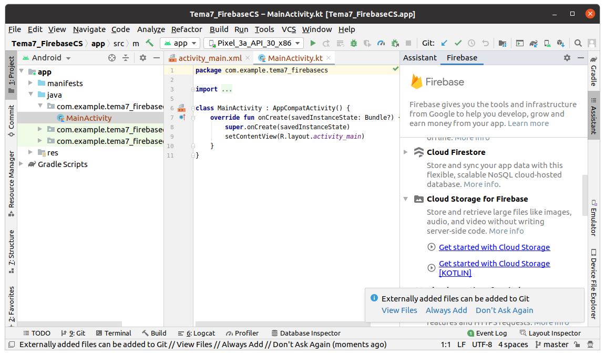

**Connectar l'aplicació a Firebase Cloud Firestore**{.azul}

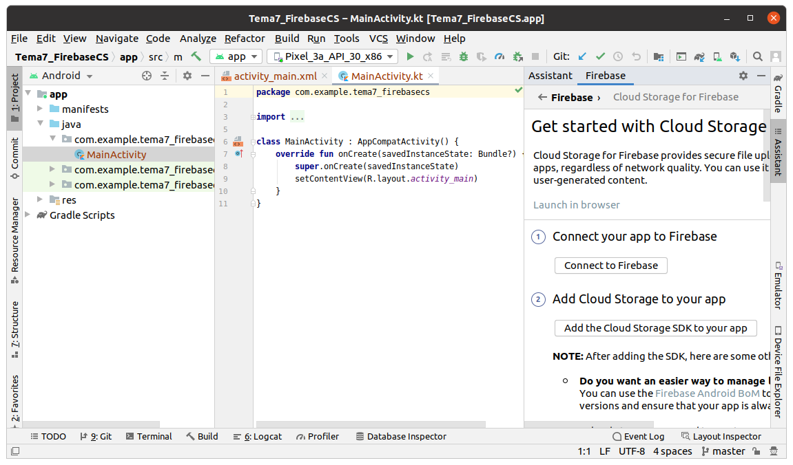

!!!note "NOTA IMPORTANT"
    Podria donar-se el cas, depenent de la versió d'Android Studio (i altres
    coses, com que el projecte tinga errors i/o avisos) que done un error en
    apretar el botó de Connect to Firebase. I és que sembla que és molt delicat
    aquest assistent, i si hi ha qualsevol warning o error no deixa continuar:

    

    Per a solucionar-lo, a banda de revisar si tenim algun error o avís,
    senzillament afegim al final del fitxer **gradle.properties:**
        
        
                android.suppressUnsupportedCompileSdk=32

En apretar el botó de**Connect to Firebase** , si no estàvem connectats amb el
compte de Google al Firebase se'ns obrirà finestra d'un navegador per a
connectar. Podria donar-se el cas que ens diguera que Android Studio vol
accedir a les dades de la Base de Dades. Òbviament ho haurem de permetre:

Una vegada autenticats en Firebase, des de l'entorn d'Android Studio ens
ofereix la possibilitat de crear una aplicació nova (una Base de Dades nova) o
utilitzar alguna de les que ja tenim. Utilitzarem la que ens ha servit de
prova fins el moment:

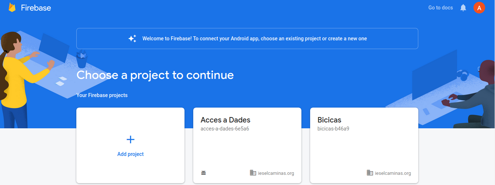

Quan haja connectat substituirà el botó **Connect to Firebase** , per una
etiqueta que dirà **connected** , en verd.

**Afegir els drivers a la nostra aplicació**{.azul}

En aquest segon pas, quan apretem el botó **Add the Cloud Storage SDK to your
app** , ens dirà els canvis que farà per a incorporar les coses necessàries
per a poder connectar.

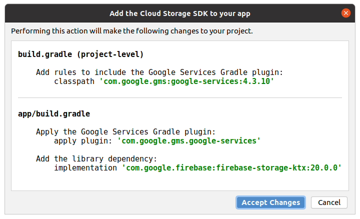

Com veieu es tracta d'incorporar les llibreries necessàries de Firebase.

Igual que abans, substituirà el botó **Add the Cloud Storage SDK to your app**
, per una etiqueta que dirà **Dependencies set up correctly** , en verd. És
una bona guia per saber en quin punt estem.

**Permetre l'accés als usuaris, si es precís canviant les regles d'accés a la
Base de Dades**{.azul}

Encara que ja havíem arreglat les regles per a permetre l'accés durant un
temps determinat, és convenient pegar-li una miradeta. Recordeu que és des de
la**consola de Firebase** , entrant al **Storage** , i anant a la pestanya
**Rules**

Observeu que en aquest exemple he posat que es pot connectar qualsevol fins al
30-12-2020. Inicialment dóna un mes, però si no voleu tenir problemes, ho
podeu allargar canviant la data.

**Inicialitzar Storage**{.azul}

És només una sentència per a inicialitzar la referència a Cloud Storage, i és
de tipus **StorageReference**.

Encara que tinguem un projecte en Kotlin, la sentència d'exemple estarà en
Java, però que en copiar-la la traduirà a Kotlin,i en definitiva quedarà així:

    
    
    val mStorageRef = FirebaseStorage.getInstance().reference

**Copiar les sentències per a baixar la imatge**{.azul}

També ens dóna dos exemples, de pujar i de baixar una imatge. Nosaltres anem a
aplicar en el nostre exemple la baixada d'imatges.

Ho veurem tot en el proper punt

### 5.3.2 CS-Android: Accés als fitxers

**Referència als fitxers**{.azul}

La referència al nostre bucket l'havíem completada en el punt anterior, però
la tornem a posar ací per més comoditat.

Per a fer referència als fitxers, podem fer-ho com a fills de l'anterior, o
directament a partir de FirebaseStorage:

    
    
    val mStorageRef = FirebaseStorage.getInstance().reference  
      
    val imgRef1 = mStorageRef.child(_nom_del_fitxer_1_)  
      
    val imgRef2 = FirebaseStorage.getInstance().reference.child(_nom_del_fitxer_2_)

**Baixar un fitxer**{.azul}

En Android, per les llibreries que estem utilitzant, serà un poc més llarg que
en Eclipse, però amb més "solidesa".

Sobre la referència del fitxer utilitzarem dos possibles mètodes:

  * **getFile()** , passant-li com a paràmetre un fitxer temporal on es guardarà el fitxer
  * **getBytes()** , pasant-li com a paràmetre la grandària màxima del buffer per a guardar el fitxer

També tenim la possibilitat de baixar-nos únicament la URL del fitxer, per si
no volem baixar-nos el fitxer:

  * **downloadUrl**

En qualsevol dels tres casos, haurem de muntar un **addOnSuccessListener()** ,
que es quedarà escoltant fins que el contingut del fitxer (o la seua URL)
estiga disponible. Amb aquesta lectura asíncrona previndrem errades per la
tardança en obtenir el resultat.

Així ens quedarà en el nostre exemple, que s'ha d'executar en apretar el botó.
Primer veiem com seria en el cas d'utilitzar un fitxer temporal:

    
    
            // Amb getFile()
            boto.setOnClickListener {
                val imgRef = mStorageRef.child(nom.text.toString())
                val localFile = File.createTempFile("images", "jpg")
                imgRef.getFile(localFile)
                        .addOnSuccessListener(OnSuccessListener<FileDownloadTask.TaskSnapshot?> {
                            // Successfully downloaded data to local file
                            val bm = BitmapFactory.decodeFile(localFile.getAbsolutePath())
                            imatge.setImageBitmap(bm)
                        }).addOnFailureListener(OnFailureListener {
                            // Handle failed download
                            // ...
                        })
            }

I així queda en el cas d'obtenir el fitxer per mig de **getBytes()**.
S'obtenen en un ByteArray, i en aquest exemple el passem a Bitmap per a
carregar la imatge en el ImageView:

    
    
            // Amb getBytes()
            boto.setOnClickListener {
                val imgRef = mStorageRef.child(nom.text.toString())
                imgRef.getBytes(500000)
                        .addOnSuccessListener(OnSuccessListener<ByteArray?> {
                            // Successfully downloaded data to local file
                            val bm = BitmapFactory.decodeByteArray(it, 0, it!!.size)
                            imatge.setImageBitmap(bm)
                        }).addOnFailureListener(OnFailureListener {
                            // Handle failed download
                            // ...
                        })
            }
    
    
      
      
    

**Pujar un fitxer**{.azul}

No ens ho plantegem en aquest exemple, però com abans tindrem més d'un mètode,
ara concretament 3:

  * **putFile()** , per a guardar un fitxer local (com podrien ser fotos del mòbil)
  * **putBytes()** , si les dades les tenim per exemple en un raw
  * **putStream()** , per a introduir des d'un InputStream

**Obtenir la llista de fitxers**{.azul}

Per a obtenir la llista de fitxers del bucket on estem apuntant podem
utilitzar **listAll()** i sobre ell muntar un
**addOnSuccessListener()****addOnSuccessListener()** , que ens assegurarà que
quan entrem és perquè s'ha aconseguit la llista i per tant està disponible. Ho
farem sobre la referència del **bucket**

    
    
    val mStorageRef = FirebaseStorage.getInstance().getReference()  
    mStorageRef.listAll().addOnSuccessListener {  
        ...  
    }  

### 5.3.3 CS-Android: Tot l'exemple

Igual que en el cas d'**IntelliJ** , anem a ajuntar tot l'exemple que
visualitza una imatge guardada en Cloud Storage, modificant-lo un poc: ens
guardarem els noms de les imatges en un **Spinner**.

Podeu fer-lo sobre el mateix projecte, per a no haver de fer el procés de
connexió una altra vegada. Però si preferiu fer-lo sobre un altre projecte li
podríeu posar el nom de **Tema7_Firebase_CS_2**

Substituirem el EditText i el Button per un **Spinner**. El activity_main.xml
ens quedarà:

    
    
    <?xml version="1.0" encoding="utf-8"?>  
    <androidx.constraintlayout.widget.ConstraintLayout xmlns:android="http://schemas.android.com/apk/res/android"  
        xmlns:app="http://schemas.android.com/apk/res-auto"  
        xmlns:tools="http://schemas.android.com/tools"  
        android:layout_width="match_parent"  
        android:layout_height="match_parent"  
        tools:context=".MainActivity">  
      
        <Spinner  
            android:id="@+id/nom"  
            android:layout_width="wrap_content"  
            android:layout_height="50dp"  
            app:layout_constraintStart_toStartOf="parent"  
            app:layout_constraintEnd_toEndOf="parent"  
            app:layout_constraintTop_toTopOf="parent" />  
      
        <ImageView  
            android:id="@+id/imatge"  
            android:layout_width="wrap_content"  
            android:layout_height="wrap_content"  
            app:layout_constraintEnd_toEndOf="parent"  
            app:layout_constraintStart_toStartOf="parent"  
            app:layout_constraintTop_toBottomOf="@+id/nom"  
            tools:srcCompat="@tools:sample/backgrounds/scenic" />  
      
    </androidx.constraintlayout.widget.ConstraintLayout>

Primer agafem la llista de noms de fitxers i la posem al Spinner.

Després en el Listener del Spinner agafem el contingut del fitxer. Estan
posades les dues maneres, amb **getFile()** i amb **getBytes()** , una d'elles
comentada

    
    
    import android.graphics.BitmapFactory  
    import android.os.Bundle  
    import android.view.View  
    import android.widget.AdapterView  
    import android.widget.ArrayAdapter  
    import androidx.appcompat.app.AppCompatActivity  
    import com.google.android.gms.tasks.OnFailureListener  
    import com.google.android.gms.tasks.OnSuccessListener  
    import com.google.firebase.storage.FileDownloadTask  
    import com.google.firebase.storage.FirebaseStorage  
    import kotlinx.android.synthetic.main.activity_main.*  
    import java.io.File  
      
      
    class MainActivity : AppCompatActivity() {  
        override fun onCreate(savedInstanceState: Bundle?) {  
            super.onCreate(savedInstanceState)  
            setContentView(R.layout.activity_main)  
      
            val mStorageRef = FirebaseStorage.getInstance().getReference()  
            mStorageRef.listAll().addOnSuccessListener {  
                val opcions = ArrayList<String>()  
                for (f in it.items) {  
                    opcions.add(f.name)  
                }  
                val adaptador = ArrayAdapter(this, android.R.layout.simple_spinner_item, opcions)  
                adaptador.setDropDownViewResource(android.R.layout.simple_spinner_dropdown_item)  
                nom.adapter = adaptador  
      
            }  
      
            // Amb getFile()  
            nom.onItemSelectedListener = object: AdapterView.OnItemSelectedListener {  
                override fun onItemSelected(arg0:AdapterView<*>, arg1: View, arg2:Int, arg3:Long) {  
                    val imgRef = mStorageRef.child(nom.selectedItem.toString())  
                    val localFile = File.createTempFile("images", "jpg")  
                    imgRef.getFile(localFile)  
                            .addOnSuccessListener(OnSuccessListener<FileDownloadTask.TaskSnapshot?> {  
                                // Successfully downloaded data to local file  
                                val bm = BitmapFactory.decodeFile(localFile.getAbsolutePath())  
                                imatge.setImageBitmap(bm)  
                            }).addOnFailureListener(OnFailureListener {  
                                // Handle failed download  
                                // ...  
                            })  
                }  
                override fun onNothingSelected(arg0:AdapterView<*>) {  
                    // TODO Auto-generated method stub  
                }  
            }  
      
            // Amb getBytes()  
    /*  
            nom.onItemSelectedListener = object: AdapterView.OnItemSelectedListener {  
                override fun onItemSelected(arg0:AdapterView<*>, arg1: View, arg2:Int, arg3:Long) {  
                    val imgRef = mStorageRef.child(nom.selectedItem.toString())  
                    val localFile = File.createTempFile("images", "jpg")  
                imgRef.getBytes(500000)  
                    .addOnSuccessListener(OnSuccessListener<ByteArray?> {  
                        // Successfully downloaded data to local file  
                        val bm = BitmapFactory.decodeByteArray(it, 0, it!!.size)  
                        imatge.setImageBitmap(bm)  
                    }).addOnFailureListener(OnFailureListener {  
                        // Handle failed download  
                        // ...  
                    })  
                }  
                override fun onNothingSelected(arg0:AdapterView<*>) {  
                    // TODO Auto-generated method stub  
                }  
            }  
    */  
      
        }  
    }

I aquest és el resultat:

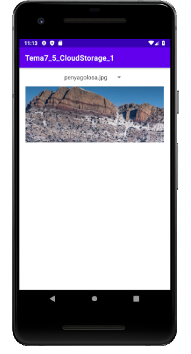

### 5.3.4 CS-Android: Exemple ampliat, combinant amb Cloud Firestore

Anem a fer ara un exemple complet, d'una cosa que serà molt més real que fins
ara: combinar **Cloud Firestore** amb **Cloud Storage** :

  * En Cloud Storage ens guardem les dades grans, com poden ser imatges, audios, vídeos, ...
  * En Cloud Firestore ens guardem totes les altres dades, i inclourem el nom de l'arxiu que hem guardat en Cloud Firestore

Per tant hem de combinar els accessos a les dues parts de Firebase, i haurem
de comptar sobretot amb que les dades, tant en un com en l'altre, s'agafen de
forma asíncrona, i per tant hem de cuidar de no utilitzar unes dades que
potser encara no estan disponibles.

El més correcte seria utilitzar **corrutines** , que juguen amb aquesta forma
paral·lela d'executar les coses.

Però per senzillesa començarem sense les corrutines, i senzillament haurem
d'estar segurs de que les dades estan ja disponibles quan les utilitzem.

Partirem del mateix exemple utilitzat en l'Annex d'Android,
**CoffeeShops_Fragment** , i ara adequarem les dades a l'estructura de
Firebase CloudFirestore, recordant que les imatges dels cafès estaran
guardades en Cloud Storage. Aquesta és l'estructura de les dades:

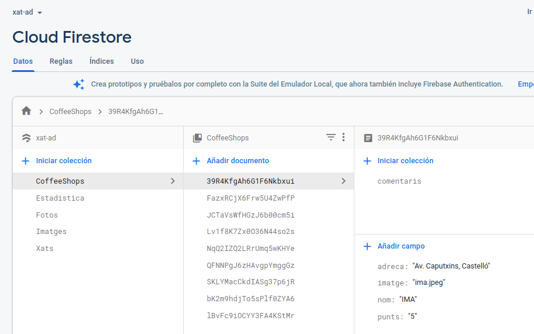 | 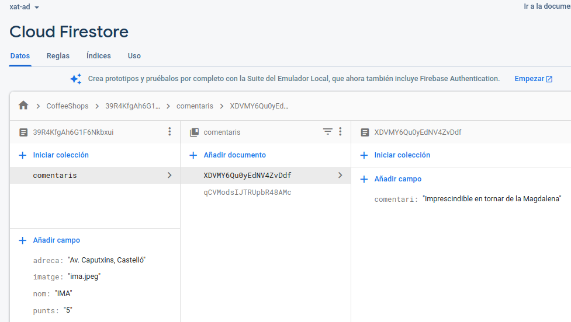  
---|---  
  
Com veiem tenim una col·lecció anomenada **CoffeeShops** amb un document per
cada cafè.

Dins del document del cafè tenim **nom** , **adreca** , **punts** i també el
nom de la imatge guardada Cloud Storage. També tenim una col·lecció dins del
document anomenada **comentaris** , i en cada document d'aquesta col·lecció de
moment només tenim una parella clau-valor: **comentari**

En la següent imatge es veuen els fitxers guardats en Cloud Storage. Per a que
estiga un poc més organitzat, les hem deixades en la carpeta **CoffeeShops** :

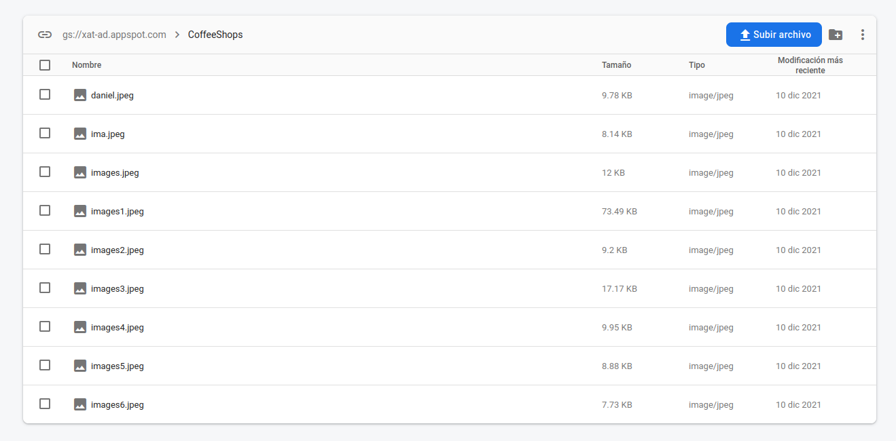

Com hem dit partirem de l'exemple ja fet **CoffeeShops_Fragments** , no de
**CoffeeShops_Fragments_ROOM** , perquè això ens obligaria a llevar moltes
coses. Fins i tot per a que no es quede el nom anterior, potser siga
convenient **començar de zero amb un projecte nou**.

Si és així:

  * Creeu un nou projecte anomenat **CoffeeShops_Fragments_FIREBASE**
  * Connecteu amb Cloud Firestore i Cloud Storage, utilitzant els assistents. Connectar l'aplicació només us farà falta en la primera ocasió, però incorporar llibreries, serà en cadascun dels casos.
  * Incorporeu la línia següent en el **build.gradle** de l'apliació, dins de **android** i dins de **defaultConfig** , per a que Cloud Firestore no done error: 

    
        multiDexEnabled true

  * També incorporarem en el **build.gradle** de l'aplicació les llibreries que ens permeten la navegació entre fragments. Han d'anar en la zona de **dependencies**

    
        implementation 'androidx.navigation:navigation-fragment-ktx:2.3.1'  
        implementation 'androidx.navigation:navigation-ui-ktx:2.3.1'  
    

  * Copieu el següent contingut al fitxer **strings.xml** , que està dins de **res - > values**. En ell s'estan definint cadenes que s'utilitzaran en diferents mòduls
  
    
        <resources>  
            <string name="app_name">CoffeeShops_Fragments_FIREBASE</string>  
            <string name="action_settings">Settings</string>  
            <!-- Strings used for fragments for navigation --/>  
            <string name="first_fragment_label">First Fragment</string>  
            <string name="second_fragment_label">Second Fragment</string>  
            <string name="next">Next</string>  
            <string name="previous">Previous</string>  
            <string name="reserve">Reserve</string>  
            <string name="hello_first_fragment">Hello first fragment</string>  
            <string name="hello_second_fragment">Hello second fragment. Arg: %1$s</string>  
        </resources>

  * També ens farà falta el fitxer del menú **menu_main.xml** , que ha d'estar en **res - > menu**
   
    
        <?xml version="1.0" encoding="utf-8"?>  
        <menu xmlns:android="http://schemas.android.com/apk/res/android"  
            xmlns:app="http://schemas.android.com/apk/res-auto"  
            xmlns:tools="http://schemas.android.com/tools"  
            tools:context=".MainActivity">  
            <item  
                android:id="@+id/action_settings"  
                android:orderInCategory="100"  
                android:title="@string/action_settings"  
                app:showAsAction="never" />  
        </menu>

  * I per últim copieu el següent contingut al fitxer **themes.xml** , que està en **res - > values -> themes**, i on es defineixen uns estils utilitzats:

    
    <resources xmlns:tools="http://schemas.android.com/tools">  
        <!-- Base application theme. --/>  
          
      
          
      
        <style name="Theme.CoffeeShops_Fragments_FIREBASE.AppBarOverlay" parent="ThemeOverlay.AppCompat.Dark.ActionBar" />  
      
        <style name="Theme.CoffeeShops_Fragments_FIREBASE.PopupOverlay" parent="ThemeOverlay.AppCompat.Light" />  
    </resources>

**Classe Coffee**{.azul}

Per l'estructura de les dades, en què tenim guardat nom, adreça, punts i
imatge (no ens fa falta per exemple el número de cafè ja que no ens fa falta
una clau principal, com era el cas de Bases de Dades a travès de Room), i en
concordància amb els components definits en l'aplicació anterior de
**CoffeeShops_Fragments** , podem definir la classe **Coffee** d'aquesta
manera:

    
    
    import java.io.Serializable  
      
    data class Coffee (val title: String?, val subtitle: String?,  
                       val points: Int?, var image: ByteArray? ): Serializable

  * La raó de definir totes les propietats com a **val** excepte la imatge que serà **var** és perquè la imatge la modificarem amb posterioritat
  * Ho definim com a Serializable per a poder passar tot l'objecte del primer fragment al segon, així si s'ha de visualitzar una altra vegada la imatge, ja la tenim disponible. Si només s'ha de visualitzar el nom del cafè, a banda dels seus comentaris, no faria falta passar tot l'objecte, només el nom.

El **layout** associat serà **item_coffee.xml** , amb aquest aspecte:

    
    
    <?xml version="1.0" encoding="utf-8"?>  
    <androidx.cardview.widget.CardView  
        xmlns:card_view="http://schemas.android.com/apk/res-auto"  
        xmlns:android="http://schemas.android.com/apk/res/android"  
        android:id="@+id/card1"  
        android:layout_marginBottom="16dp"  
        android:layout_marginRight="16dp"  
        android:layout_marginLeft="16dp"  
        android:layout_width="match_parent"  
        android:layout_height="450dp"  
        card_view:cardCornerRadius="8dp"  
        card_view:cardElevation="8dp">  
      
            <LinearLayout  
                android:layout_width="match_parent"  
                android:layout_height="match_parent"  
                android:layout_marginTop="200dp"  
                android:layout_marginLeft="16dp"  
                android:orientation="vertical">  
      
                    <TextView  
                        android:id="@+id/textView"  
                        android:layout_width="wrap_content"  
                        android:layout_height="wrap_content"  
                        android:layout_marginTop="16dp"  
                        android:textSize="25sp"  
                        android:textStyle="bold"/>  
      
                    <FrameLayout  
                        android:layout_width="match_parent"  
                        android:layout_height="wrap_content"  
                        android:layout_marginTop="8dp">  
      
                            <RatingBar  
                                android:id="@+id/ratingBar"  
                                android:layout_width="wrap_content"  
                                android:layout_height="wrap_content"  
                                android:max="5"  
                                android:numStars="5"  
                                android:scaleX="0.5"  
                                android:scaleY="0.5"  
                                android:transformPivotX="0dp"  
                                android:transformPivotY="0dp" />  
      
                            <TextView  
                                android:id="@+id/textView2"  
                                android:layout_width="wrap_content"  
                                android:layout_height="match_parent"  
                                android:layout_marginLeft="130dp"  
                                android:text="0" />  
                    </FrameLayout>  
      
                    <TextView  
                        android:id="@+id/textView1"  
                        android:layout_width="wrap_content"  
                        android:layout_height="wrap_content"  
                        android:layout_marginTop="16dp"  
                        android:textSize="18sp"  
                        android:layout_marginBottom="16dp"/>  
      
                    <View  
                        android:id="@+id/divider"  
                        android:layout_width="match_parent"  
                        android:layout_height="1dp"  
                        android:layout_marginRight="16dp"  
                        android:background="?android:attr/listDivider" />  
      
                    <Button  
                        android:id="@+id/BtnReserve"  
                        android:layout_width="wrap_content"  
                        android:layout_height="wrap_content"  
                        android:text="@string/reserve"  
                        android:textSize="18sp"  
                        android:layout_marginTop="16dp"  
                        style="?android:attr/buttonBarButtonStyle" />  
      
            </LinearLayout>  
      
            <ImageView  
                android:id="@+id/img1"  
                android:layout_width="match_parent"  
                android:layout_height="200dp"  
                android:scaleType="centerCrop" />  
      
    </androidx.cardview.widget.CardView>

El seu adapter, **CoffeeAdapter** , quedaria així:

    
    
    import android.graphics.BitmapFactory  
    import android.view.LayoutInflater  
    import android.view.View  
    import android.view.ViewGroup  
    import android.widget.ImageView  
    import android.widget.RatingBar  
    import android.widget.TextView  
    import androidx.recyclerview.widget.RecyclerView  
      
    class CoffeeAdapter(private val items: ArrayList<Coffee>) : RecyclerView.Adapter<CoffeeAdapter.CoffeeViewHolder>() {  
      
        lateinit var onClick: (View) -> Unit  
      
        class CoffeeViewHolder(itemView: View) : RecyclerView.ViewHolder(itemView) {  
            private val image: ImageView  
            private val text: TextView  
            private val text1: TextView  
            private val barstars: RatingBar  
            private val points: TextView  
      
            init {  
      
                image = itemView.findViewById(R.id.img1)  
                text = itemView.findViewById(R.id.textView)  
                text1 = itemView.findViewById(R.id.textView1)  
                points = itemView.findViewById(R.id.textView2)  
                barstars = itemView.findViewById(R.id.ratingBar)  
            }  
      
            fun bindCards(t: Coffee, onClick: (View) -> Unit) {  
                //image.setImageResource(t.image)  
                val img = t.image  
                if (img != null) {  
                    val imgBmp = BitmapFactory.decodeByteArray(img, 0, img.size)  
                    image.setImageBitmap(imgBmp)  
                }  
                text.text = t.title  
                text1.text = t.subtitle  
                if (t.points!=null) {  
                    barstars.rating = t.points.toFloat()  
                    points.text=t.points.toString()  
                }  
                barstars.onRatingBarChangeListener = RatingBar.OnRatingBarChangeListener { ratingBar: RatingBar, fl: Float, b: Boolean ->  
                        points.text = fl.toString()  
                    }  
                itemView.setOnClickListener{ onClick(itemView) }  
            }  
        }  
      
        override fun onCreateViewHolder(viewGroup: ViewGroup, viewType: Int): CoffeeViewHolder {  
            val itemView = LayoutInflater.from(viewGroup.context).inflate(R.layout.item_coffee, viewGroup, false)  
            return CoffeeViewHolder(  
                itemView  
            )  
        }  
      
        override fun onBindViewHolder(viewHolder: CoffeeViewHolder, pos: Int) {  
            val item = items[pos]  
            viewHolder.bindCards(item, onClick)  
        }  
      
        override fun getItemCount(): Int {  
            return items.size  
        }  
      
        override fun getItemViewType(position: Int): Int {  
            return position  
        }  
    }

**Classe Comment**{.azul}

El comentari de moment el tenim molt senzill. Segurament estaria bé gaurdar
més coses, com la data del comentari i l'autor (a banda de valoracions al
comentari). Seria tan senzill com fer aquesta classe més completa.

Però de moment només guardem el propi comentari, per tant la classe
**Comment** queda així de senzilla:

    
    
    data class Comment (val comm: String?)

El **layout** associat serà **item_comment.xml** , amb aquest aspecte:

    
    
    <?xml version="1.0" encoding="utf-8"?>  
    <androidx.cardview.widget.CardView xmlns:android="http://schemas.android.com/apk/res/android"  
        xmlns:app="http://schemas.android.com/apk/res-auto"  
        android:layout_width="match_parent"  
        android:layout_height="100dp"  
        app:cardElevation="6dp"  
        app:cardCornerRadius="8dp"  
        android:layout_margin="6dp">  
      
        <LinearLayout  
            android:layout_width="match_parent"  
            android:layout_height="wrap_content"  
            android:orientation="vertical">  
      
            <TextView  
                android:id="@+id/cita"  
                android:layout_width="wrap_content"  
                android:layout_height="wrap_content"  
                android:layout_margin="5dp"  
                android:text="TextView" />  
      
        </LinearLayout>  
    </androidx.cardview.widget.CardView>

I el seu adapter, **CommentsAdapter** , així:

    
    
    import android.view.LayoutInflater  
    import android.view.View  
    import android.view.ViewGroup  
    import android.widget.TextView  
    import androidx.recyclerview.widget.RecyclerView  
      
    class CommentsAdapter(private val items: ArrayList<Comment>) : RecyclerView.Adapter<CommentsAdapter.CoffeeViewHolder>() {  
      
        class CoffeeViewHolder(itemView: View) : RecyclerView.ViewHolder(itemView) {  
      
            private val texto: TextView  
      
            init {  
                texto = itemView.findViewById(R.id.cita)  
            }  
      
            fun bindComment(c: Comment) {  
                texto.text = c.comm  
            }  
        }  
      
        override fun onCreateViewHolder(viewGroup: ViewGroup, viewType: Int): CoffeeViewHolder {  
            val itemView = LayoutInflater.from(viewGroup.context).inflate(R.layout.item_comment, viewGroup, false)  
            return CoffeeViewHolder(  
                itemView  
            )  
        }  
      
        override fun onBindViewHolder(viewHolder: CoffeeViewHolder, pos: Int) {  
            val item = items[pos]  
            viewHolder.bindComment(item)  
        }  
      
        override fun getItemCount(): Int {  
            return items.size  
        }  
    }

**FirstFragment**{.azul}

En aquesta aplicació de fragments, ballàvem entre 2 fragments. En el primer
veiem les dades dels cafès: nom, adreça, puntuació i imatge. Els comentaris
els deixàvem per al segon fragment.

El seu layout és **fragment_first.xml** , i té aquest aspecte:

    
    
    <?xml version="1.0" encoding="utf-8"?>  
    <androidx.constraintlayout.widget.ConstraintLayout xmlns:android="http://schemas.android.com/apk/res/android"  
        xmlns:app="http://schemas.android.com/apk/res-auto"  
        xmlns:tools="http://schemas.android.com/tools"  
        android:layout_width="match_parent"  
        android:layout_height="match_parent"  
        tools:context=".FirstFragment">  
      
        <androidx.recyclerview.widget.RecyclerView  
            android:id="@+id/recView"  
            android:layout_marginTop="5dp"  
            android:layout_width="match_parent"  
            android:layout_height="match_parent"  
            app:layout_constraintEnd_toEndOf="parent"  
            app:layout_constraintStart_toStartOf="parent"  
            app:layout_constraintTop_toTopOf="parent" />  
    </androidx.constraintlayout.widget.ConstraintLayout>

I el programa corresponent al primer fragment, **FirstFragment** , és on tenim
més feina:

  * Ens connectem a **CloudFirestore** per a agafar tots els documents de la col·lecció **CoffeeShops** per mig d'un **addSnapshotListener** , que buscarà tots els documents de la col·lecció (línia 39)
  * Construïm l'objecte **Coffee** , però sense haver agafat encara la imatge (per això havíem definit la propietat com a var), perquè com haurem de buscar-la a Cloud Storage, en el moment de construir l'objecte no la tindríem. Per tant de moment no tenim res en la propietat **image** de l'objecte (línies 47 a 50)
  * L'objecte **Coffee** l'afegim a l'ArrayList<Coffee> anomenat **items**(línia 47)
  * En un altre ArrayList<String> anomenat **itemsDocs** ens guardarem el nom del document. Això és per fer més senzilla la recerca del document amb posterioritat (quan busquem els seus comentaris) (línia 51)
  * Llancem la recerca de la imatge en Cloud Storage (línia 58). Observeu que en el moment d'agafar la referència, en el nom de la imatge hem incorporat la carpeta **CoffeeShops** (línia 56)
  * Quan estiga disponible l'assignarem al **item** corresponent (línia 61)
  * Ens hem d'assegurar que quan anem a crear l'adaptador CoffeeAdaptor, tots els items estiguen creats. Per això en muntem un **addOnSuccessListener** també sobre la col·lecció. Firebase ens assegura que s'activarà **després** del **addOnSnapshotListener** , per tant és una bona manera d'assegurar-nos que ja estan creats tots els items (faltarà per omplir les imatges, però els items amb els objectes Coffee ja estaran creats) (línia 72 i següents)
  * En el **onClick** de l'adaptador, cridarem al segon fragment, passant 2 paràmetres per mig del **bundle** (línia 83): 
    * L'objecte **Coffee** del qual volem els comentaris. Podríem passar només el nom del cafè, però d'aquesta manera si per exemple es vol visualitzar la imatge, es pot fer. És per a poder passar tot l'objecte **Coffee** que declarem la classe com a **Serializable**
    * Passem també el nom del document corresponent a aquest cafè, per a poder llegir la seua col·lecció de comentaris més fàcilment (línia 81)
    
    
            package com.example.coffeeshops_fragments_firebase
            
            import android.os.Bundle
            import android.view.LayoutInflater
            import android.view.View
            import android.view.ViewGroup
            import androidx.core.os.bundleOf
            import androidx.fragment.app.Fragment
            import androidx.navigation.fragment.findNavController
            import androidx.recyclerview.widget.LinearLayoutManager
            import androidx.recyclerview.widget.RecyclerView
            import com.google.android.gms.tasks.OnFailureListener
            import com.google.android.gms.tasks.OnSuccessListener
            import com.google.firebase.firestore.DocumentChange
            import com.google.firebase.firestore.FirebaseFirestore
            import com.google.firebase.storage.FirebaseStorage
            import com.google.firebase.storage.StorageReference
            
            /**
            * A simple [Fragment] subclass as the default destination in the navigation.
            */
            class FirstFragment : Fragment() {
            
                private var items: ArrayList<Coffee> = ArrayList()
                private var itemsDocs: ArrayList<String> = ArrayList()
            
                override fun onCreateView(
                    inflater: LayoutInflater, container: ViewGroup?,
                    savedInstanceState: Bundle?
                ): View? {
            
                    val root = inflater.inflate(R.layout.fragment_first, container, false)
                    val db: FirebaseFirestore = FirebaseFirestore.getInstance()
            
                    if (items.size==0) {  // per a no executar-lo una altra vegada quan tornem del SecondFragment
                        val storageRef: StorageReference;
                        storageRef = FirebaseStorage.getInstance().getReference();
            
                        db.collection("CoffeeShops").addSnapshotListener { snapshots, e ->
                            for (dc in snapshots!!.documentChanges) {
                                when (dc.type) {
                                    DocumentChange.Type.ADDED -> {
                                        var p = 0
                                        if (dc.document.getString("punts")!="")
                                            p = dc.document.get("punts").toString().toInt()
            
                                        items!!.add(Coffee(dc.document.getString("nom").toString(),
                                            dc.document.getString("adreca").toString(),
                                            p, null
                                        ))
                                        itemsDocs.add(dc.document.id)
                                        val item = items[items.size-1]
                                        val nomImatge = dc.document.getString("imatge")
            
                                        if (nomImatge != null) {
                                            val imatgeRef = storageRef.child("CoffeeShops/" + nomImatge)
                                            val ONE_MEGABYTE = (1024 * 1024).toLong()
                                            imatgeRef.getBytes(ONE_MEGABYTE)
                                                    .addOnSuccessListener(OnSuccessListener<ByteArray> {
                                                        // Data for "images/island.jpg" is returns, use this as needed
                                                        item.image=it
                                                    }).addOnFailureListener(OnFailureListener {
                                                        // Handle any errors
                                                    })
                                        }
                                    }
                                }
                            }
                        }
                    }
            
                    db.collection("CoffeeShops").get().addOnSuccessListener {
                        val recView: RecyclerView = root.findViewById(R.id.recView)
                        recView.setHasFixedSize(true)
                        val adaptador = CoffeeAdapter(items)
                        recView.adapter = adaptador
                        recView.layoutManager = LinearLayoutManager(context, LinearLayoutManager.VERTICAL, false)
            
                        adaptador.onClick = {
                            val c = items[recView.getChildAdapterPosition(it)]
                            val d = itemsDocs[recView.getChildAdapterPosition(it)]
                            val bundle = bundleOf("coffee" to c,"doc" to d)
                            findNavController().navigate(R.id.action_FirstFragment_to_SecondFragment, bundle)
                        }
                    }
                    return root
                }
            
                override fun onViewCreated(view: View, savedInstanceState: Bundle?) {
                    super.onViewCreated(view, savedInstanceState)
            
                    }
            }

De moment marcarà un error en la línia 83, perquè no està definida la
navegació (la incorporarem al final)

**Second Fragment**{.azul}

L'utilitzem per a visualitzar els comentaris del cafè seleccionat (sobre qui
es fa un click).

El layout associat és **fragment_second.xml** , i té aquest aspecte:

    
    
    <?xml version="1.0" encoding="utf-8"?>  
    <androidx.constraintlayout.widget.ConstraintLayout xmlns:android="http://schemas.android.com/apk/res/android"  
        xmlns:app="http://schemas.android.com/apk/res-auto"  
        xmlns:tools="http://schemas.android.com/tools"  
        android:layout_width="match_parent"  
        android:layout_height="match_parent"  
        tools:context=".SecondFragment">  
      
        <TextView  
            android:id="@+id/textview_second"  
            android:layout_width="0dp"  
            android:layout_height="wrap_content"  
            android:layout_marginTop="56dp"  
            android:gravity="center"  
            android:text="Segundo Fragment"  
            android:textSize="20sp"  
            android:textStyle="bold"  
            app:layout_constraintEnd_toEndOf="parent"  
            app:layout_constraintStart_toStartOf="parent"  
            app:layout_constraintTop_toTopOf="parent" />  
      
        <androidx.recyclerview.widget.RecyclerView  
            android:id="@+id/recyclerview_coment"  
            android:layout_width="0dp"  
            android:layout_height="wrap_content"  
            android:layout_marginStart="16dp"  
            android:layout_marginEnd="16dp"  
            app:layout_constraintBottom_toBottomOf="parent"  
            app:layout_constraintEnd_toEndOf="parent"  
            app:layout_constraintHorizontal_bias="0.0"  
            app:layout_constraintStart_toStartOf="parent"  
            app:layout_constraintTop_toBottomOf="@+id/textview_second"  
            app:layout_constraintVertical_bias="0.158" />  
      
    </androidx.constraintlayout.widget.ConstraintLayout>

A aquest fragment, **SecondFragment** , recordem que li passem 2 paràmetres:

  * L'objecte **Coffee** del qual volem els comentaris.****
  * El nom del document corresponent a aquest cafè

El funcionament és el següent:

  * Agafem els paràmetres passats en **coffee** i **nameDoc** (línies 30 i 31)
  * Sobre la col·lecció **comentaris** del document (per això ha estat còmode passar-li el nom del document) muntem un **addSnapshotListener** , per a obtindre tots els documents de la col·lecció (línia 33)
  * És de ressaltar que com tal i com ho fem, no podem assegurar l'ordre en què vindran aquestos documents, i per tant quin serà l'ordre dels comentaris. El més lògic seria ordenar-los cronològicament. Per a això podríem afegir al document del comentari un camp amb la data-hora. Aleshores afegiríem a aquesta sentència de la línia 33 una clàusula d'ordenació; **orderBy("date")** , si s'anomenara **date** aquest camp amb la data
  * Anem afegint els comentaris a un **ArrayList <Comment>** anomenat **Comments**
  * En el moment de crear l'adaptador dels comentaris hem d'estar segurs que ja tenim disponibles tots els comentaris en **Comments**. Amb aquesta finalitat muntem un **addOnSuccessListener** també sobre la col·lecció **c****omentaris**. Firebase ens assegura que aquest es produirà després del **addSnapshotListener** i per tant ja tindrem l'ArrayList ple (línia 45)

I aquest és el **SecondFragment** :

    
    
    package com.example.coffeeshops_fragments_firebase
    
    import android.os.Bundle
    import android.view.LayoutInflater
    import android.view.View
    import android.view.ViewGroup
    import android.widget.TextView
    import androidx.fragment.app.Fragment
    import androidx.recyclerview.widget.GridLayoutManager
    import androidx.recyclerview.widget.RecyclerView
    import com.google.firebase.firestore.DocumentChange
    import com.google.firebase.firestore.FirebaseFirestore
    
    /**
     * A simple [Fragment] subclass as the second destination in the navigation.
     */
    class SecondFragment : Fragment() {
    
        private var Comments = arrayListOf<Comment>()
    
        override fun onCreateView(
            inflater: LayoutInflater, container: ViewGroup?,
            savedInstanceState: Bundle?
        ): View? {
            // Inflate the layout for this fragment
            val db: FirebaseFirestore = FirebaseFirestore.getInstance()
    
            val root = inflater.inflate(R.layout.fragment_second, container, false)
            val texto: TextView =  root.findViewById(R.id.textview_second)
            val coffee = arguments?.get("coffee") as Coffee
            val nameDoc = arguments?.get("doc") as String
            texto.text = coffee.title
            db.collection("CoffeeShops").document(nameDoc).collection("comentaris").addSnapshotListener { snapshots, e ->
                for (dc in snapshots!!.documentChanges) {
                    when (dc.type) {
                        DocumentChange.Type.ADDED -> {
                            Comments.add(Comment(dc.document.getString("comentari")))
                        }
                    }
                }
            }
    
            val recView: RecyclerView = root.findViewById(R.id.recyclerview_coment)
            recView.setHasFixedSize(true)
            db.collection("CoffeeShops").document(nameDoc).collection("comentari").
                    get().addOnSuccessListener {
                val adaptador = CommentsAdapter(Comments)
    
                recView.adapter = adaptador
                recView.layoutManager = GridLayoutManager(context, 2)
    
            }
            val adaptador = CommentsAdapter(Comments)
    
            recView.adapter = adaptador
            recView.layoutManager = GridLayoutManager(context, 2)
    
            return root
        }
    
        override fun onViewCreated(view: View, savedInstanceState: Bundle?) {
            super.onViewCreated(view, savedInstanceState)
    
          /*  view.findViewById<Button>(R.id.button_second).setOnClickListener {
               findNavController().navigate(R.id.action_SecondFragment_to_FirstFragment)
            }*/
        }
    }

**Main Activity i navegació**{.azul}

El MainActivity no ofereix cap dificultat:

    
    
    import android.os.Bundle  
    import androidx.appcompat.app.AppCompatActivity  
    import android.view.Menu  
    import android.view.MenuItem  
      
    class MainActivity : AppCompatActivity() {  
      
        override fun onCreate(savedInstanceState: Bundle?) {  
            super.onCreate(savedInstanceState)  
            setContentView(R.layout.activity_main)  
            }  
      
        override fun onCreateOptionsMenu(menu: Menu): Boolean {  
            // Inflate the menu; this adds items to the action bar if it is present.  
            menuInflater.inflate(R.menu.menu_main, menu)  
            return true  
        }  
      
        override fun onOptionsItemSelected(item: MenuItem): Boolean {  
            // Handle action bar item clicks here. The action bar will  
            // automatically handle clicks on the Home/Up button, so long  
            // as you specify a parent activity in AndroidManifest.xml.  
            return when (item.itemId) {  
                R.id.action_settings -> true  
                else -> super.onOptionsItemSelected(item)  
            }  
        }  
    }

Maracrà uns errors, perquè redefinirem **activity_main.xml** amb alguns
elements que falten

I en el seu layout, **activity_main.xml** , només hem d'observar que en ell
inclourem un altre layout en la penúltima línia, el **content_main** :

    
    
    <?xml version="1.0" encoding="utf-8"?>  
    <androidx.coordinatorlayout.widget.CoordinatorLayout xmlns:android="http://schemas.android.com/apk/res/android"  
        xmlns:app="http://schemas.android.com/apk/res-auto"  
        xmlns:tools="http://schemas.android.com/tools"  
        android:layout_width="match_parent"  
        android:layout_height="match_parent"  
        tools:context=".MainActivity">  
      
        <com.google.android.material.appbar.AppBarLayout  
            android:layout_width="match_parent"  
            android:layout_height="wrap_content"  
            android:theme="@style/Theme.CoffeeShops_Fragments_FIREBASE.AppBarOverlay">  
      
            <androidx.appcompat.widget.Toolbar  
                android:id="@+id/toolbar"  
                android:layout_width="match_parent"  
                android:layout_height="?attr/actionBarSize"  
                android:background="?attr/colorPrimary"  
                app:popupTheme="@style/Theme.CoffeeShops_Fragments_FIREBASE.PopupOverlay" />  
      
        </com.google.android.material.appbar.AppBarLayout>  
      
        <include layout="@layout/content_main" />  
      
    </androidx.coordinatorlayout.widget.CoordinatorLayout>

Marcarà error en la penúltima fila, perquè ens falta definir el
**content_main.xml**

En el mencionat **content_main.xml** només assenyalem que utilitzarem el
**navigation/nav_graph****:**

    
    
    <?xml version="1.0" encoding="utf-8"?>  
    <androidx.constraintlayout.widget.ConstraintLayout xmlns:android="http://schemas.android.com/apk/res/android"  
        xmlns:app="http://schemas.android.com/apk/res-auto"  
        android:layout_width="match_parent"  
        android:layout_height="match_parent"  
        app:layout_behavior="@string/appbar_scrolling_view_behavior">  
      
        <fragment  
            android:id="@+id/nav_host_fragment"  
            android:name="androidx.navigation.fragment.NavHostFragment"  
            android:layout_width="0dp"  
            android:layout_height="0dp"  
            app:defaultNavHost="true"  
            app:layout_constraintBottom_toBottomOf="parent"  
            app:layout_constraintLeft_toLeftOf="parent"  
            app:layout_constraintRight_toRightOf="parent"  
            app:layout_constraintTop_toTopOf="parent"  
            app:navGraph="@navigation/nav_graph" />  
    </androidx.constraintlayout.widget.ConstraintLayout>

I és en el **nav_graph.xml** on es dissenya la manera de navegar. S'ha de
crear sobre **res - > New -> Android Resource File**, amb el nom especificat
(no cal posar .xml) i cuidant que siga en recurs de tipus **Navigation**

I aquest ha de ser el seu contingut

    
    
    <?xml version="1.0" encoding="utf-8"?>  
    <navigation xmlns:android="http://schemas.android.com/apk/res/android"  
        xmlns:app="http://schemas.android.com/apk/res-auto"  
        xmlns:tools="http://schemas.android.com/tools"  
        android:id="@+id/nav_graph"  
        app:startDestination="@id/FirstFragment">  
      
        <fragment  
            android:id="@+id/FirstFragment"  
            android:name="com.example.coffeeshops_fragments_firebase.FirstFragment"  
            android:label="@string/first_fragment_label"  
            tools:layout="@layout/fragment_first">  
      
            <action  
                android:id="@+id/action_FirstFragment_to_SecondFragment"  
                app:destination="@id/SecondFragment" />  
        </fragment>  
        <fragment  
            android:id="@+id/SecondFragment"  
            android:name="com.example.coffeeshops_fragments_firebase.SecondFragment"  
            android:label="@string/second_fragment_label"  
            tools:layout="@layout/fragment_second">  
      
            <action  
                android:id="@+id/action_SecondFragment_to_FirstFragment"  
                app:destination="@id/FirstFragment" />  
        </fragment>  
    </navigation>

En el moment de crear aquest fitxer, haurien de desaparèixer tots els errors

****

Si tot ha anat bé, es veurà com en executar, ràpidament apareixen les caixes
de cada cafeteria, però potser encara no aparega la imatge. A poc a poc aniran
apareixent. I si s'apreta a alguna cafeteria,anirem a veure els comentaris en
el segon fragment

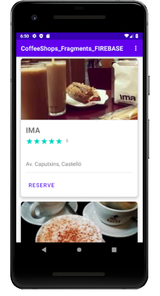 | 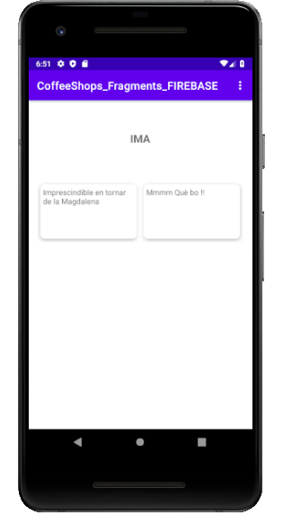  
---|---  
-->

Llicenciat sota la  [Llicència Creative Commons Reconeixement NoComercial
SenseObraDerivada 4.0](http://creativecommons.org/licenses/by-nc-nd/4.0/)

