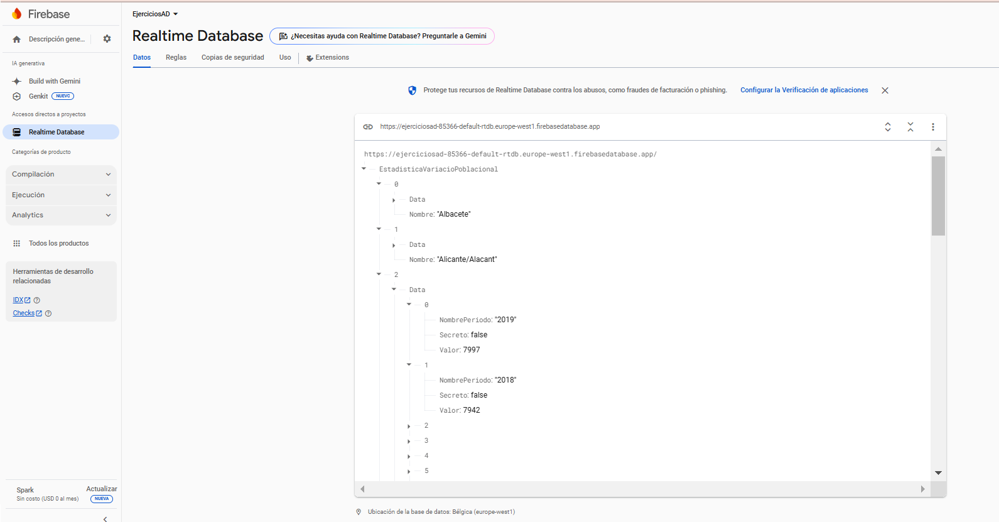
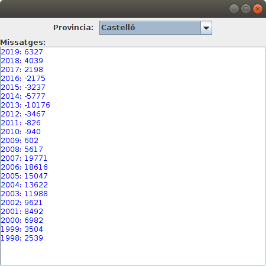
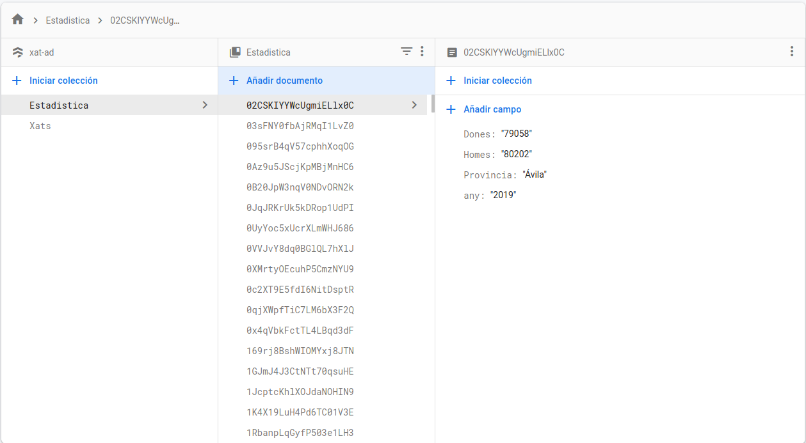
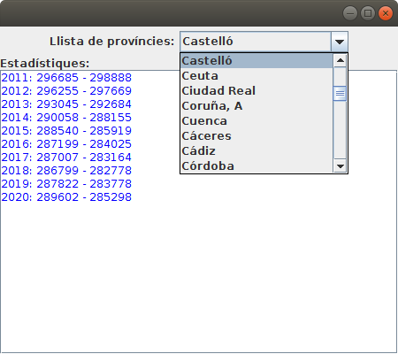
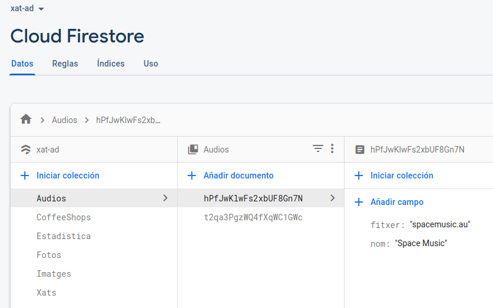
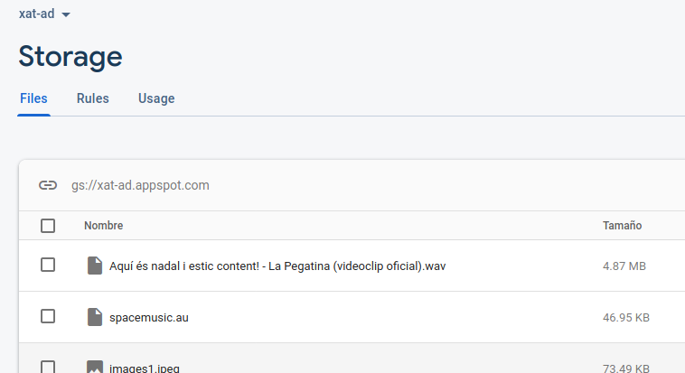

# :pencil2: Exercicis

## Exercici 1 (Realtime Database)

Farem una aplicació per a agafar unes dades corresponents a unes estadístiques
guardades en **Realtime Database** de **Firebase** , concretament en la
següent aplicació:

  * Compte de Google: **ad.ieselcaminas@gmail.com**
  * Contrasenya: **ieselcaminas_ad**
  * Aplicació: **xat-ad**

La informació a la qual volem accedir està en el array
**EstadisticaVariacioPoblacional** amb les províncies, i en cada província
tenim el nom (**Nombre**) i en un array anomenat **Data** tenim diferents anys
amb el número d'any i el valor de la variació de la població:

Podeu utilitzar el "esquelet" que hi ha a continuació. En ell tenim:

  * Un JCombobox per a triar la província
  * Un JTextArea, per a mostrar les dades de la província triada

Haureu d'incorporar el fitxer json on està la configuració i la clau privada
de la connexió. El fitxer s'anomena **xat-ad-9f901-firebase-adminsdk-f1vja-
ee7dc206de.json** , i el teniu com un recurs en l'aula virtual. La URL d'accés
a aquesta Base de Dades és: **<https://xat-ad-9f901-default-rtdb.europe-
west1.firebasedatabase.app>**

L'aplicació ha de agafar les províncies (observeu que estan en una llista) i
guardar-les en un JComboBox, per a poder triar-les. Quan es trie una
província, s'haurà de mostrar en el JTextArea la informació corresponent a la
província, agafant tots els anys de l'array **Data** (observeu que també és
una llista) i mostrar l'any i el valor de la variació poblacional
(respectivament **NombrePeriodo** i **Valor**). No cal agafar tota la
EstadisticaVariacioPoblacional. Podeu anar directament a un element de
l'array. Per exemple **EstadisticaVariacioPoblacional/0/Data** fa referència a
les dades de la primera província

A continuació teniu l'esquelet del programa que podeu utilitzar, que el podeu
guardar en el fitxer Kotlin **T8Ex1_EstadisticaRD.kt**:

    
    
    import javax.swing.JFrame
    import javax.swing.JLabel
    import javax.swing.JComboBox
    import javax.swing.JTextArea
    import java.awt.BorderLayout
    import javax.swing.JPanel
    import java.awt.FlowLayout
    import java.awt.Color
    import javax.swing.JScrollPane
    import java.io.FileInputStream
    import com.google.firebase.FirebaseOptions
    import com.google.auth.oauth2.GoogleCredentials
    import com.google.firebase.FirebaseApp
    import com.google.firebase.database.*
    import java.awt.EventQueue
    
    
    class EstadisticaRD : JFrame() {
    
        val etProv = JLabel("Provincia: ")
        val provincia = JComboBox<String>()
    
        val etiqueta = JLabel("Missatges:")
        val area = JTextArea()
        
        init {
            defaultCloseOperation = JFrame.EXIT_ON_CLOSE
            setBounds(100, 100, 450, 450)
            setLayout(BorderLayout())
    
            val panell1 = JPanel(FlowLayout())
            panell1.add(etProv)
            panell1.add(provincia)
            getContentPane().add(panell1, BorderLayout.NORTH)
    
            val panell2 = JPanel(BorderLayout())
            panell2.add(etiqueta, BorderLayout.NORTH)
            area.setForeground(Color.blue)
            area.setEditable(false)
            val scroll = JScrollPane(area)
            panell2.add(scroll, BorderLayout.CENTER)
            getContentPane().add(panell2, BorderLayout.CENTER)
    
            setVisible(true)
    
            val serviceAccount = FileInputStream("xat-ad-9f901-firebase-adminsdk-f1vja-ee7dc206de.json")
    
            val options = FirebaseOptions.builder()
                .setCredentials(GoogleCredentials.fromStream(serviceAccount))
                .setDatabaseUrl("https://xat-ad-9f901-default-rtdb.europe-west1.firebasedatabase.app").build()
    
            FirebaseApp.initializeApp(options)
    
            // Posar tota la llista de províncies al JComboBox anomenat provincia
    
            provincia.addActionListener() {
                // Posar la informació de tots els anys en el JTextArea anomenat area
    
            }
        }
    }
    
    fun main(args: Array<String>) {
        EventQueue.invokeLater {
            EstadisticaRD().isVisible = true
        }
    }
<!--
Aplicació en Android

  * Creeu-vos una nova aplicació d'Android anomenada **T7Ex1_EstadisticaRD**.
  * Incorporeu en ella: 
    * Un **Spinner** per a triar la província
    * Un **TextView** , per a mostrar les estadístiques de la província
  * Connecteu a la Base de Dades Firebase abans esmentada

L'aplicació ha de agafar les províncies (observeu que estan en una llista) i
guardar-les en el Spinner, per a poder triar-les. Quan es trie una província,
s'haurà de mostrar en el TextView la informació corresponent a la província,
agafant tots els anys de l'array **Data** (observeu que també és una llista) i
mostrar l'any i el valor de la variació poblacional (respectivament
**NombrePeriodo** i **Valor**). No cal agafar tota la
EstadisticaVariacioPoblacional. Podeu anar directament a un element de
l'array. Per exemple EstadisticaVariacioPoblacional/0/Data fa referència a les
dades de la primera província

A continuació teniu un exemple de activity_main.xml que us podria servir:

    
    
    <?xml version="1.0" encoding="utf-8"?>  
    <androidx.constraintlayout.widget.ConstraintLayout xmlns:android="http://schemas.android.com/apk/res/android"  
        xmlns:app="http://schemas.android.com/apk/res-auto"  
        xmlns:tools="http://schemas.android.com/tools"  
        android:layout_width="match_parent"  
        android:layout_height="match_parent"  
        tools:context=".MainActivity">  
      
        <Spinner  
            android:id="@+id/combo"  
            android:layout_width="0dp"  
            android:layout_height="wrap_content"  
            app:layout_constraintEnd_toEndOf="parent"  
            app:layout_constraintStart_toStartOf="parent"  
            app:layout_constraintTop_toTopOf="parent" />  
      
        <TextView  
            android:id="@+id/area"  
            android:layout_width="0dp"  
            android:layout_height="0dp"  
            android:scrollbars="vertical"  
            android:text=""  
            app:layout_constraintBottom_toBottomOf="parent"  
            app:layout_constraintEnd_toEndOf="parent"  
            app:layout_constraintHorizontal_bias="1.0"  
            app:layout_constraintStart_toStartOf="parent"  
            app:layout_constraintTop_toBottomOf="@+id/combo"  
            app:layout_constraintVertical_bias="0.0" />  
      
    </androidx.constraintlayout.widget.ConstraintLayout>

I a continuació l'esquelet del programa per si el voleu utilitzar ja que estan
les recomacions-indicacions:

    
    
    import androidx.appcompat.app.AppCompatActivity  
    import android.os.Bundle  
    import android.util.Log  
    import android.view.View  
    import android.widget.AdapterView  
    import android.widget.ArrayAdapter  
    import androidx.core.view.size  
    import com.google.firebase.database.*  
    import kotlinx.android.synthetic.main.activity_main.*  
      
    class MainActivity : AppCompatActivity() {  
        override fun onCreate(savedInstanceState: Bundle?) {  
            super.onCreate(savedInstanceState)  
            setContentView(R.layout.activity_main)  
            val pantPrincipal = this  // per a utilitzar-lo en el ArrayAdapter del Spinner  
      
            // Inicialització de la referència i altres variables  
      
            // Lectura de totes les províncies per a posar-les després al Spinner  
            // Es recomana llegir els fills de la llista, per tant addChildEventListener  
      
            // Inicialització del Spinner, amb un ArrayAdapter passant-li un ArrayList amb les províncies  
            // es recomana fer-ho dins d'un addListenerForSingleValueEvent sobre la mateixa referència  
            // per assegurar-nos que l'ArrayList ja té les províncies  
      
            // Instruccions per a posar en el TextView les dades de la provincia seleccionada  
            // Dins del onItemSelectedListener del Spinner també es recomana llegir els fills de la llista,  
            // per tant una altra vegada addChildEventListener  
        }  
    }

Com posa en les indicacions, podem tenir la complicació de que quan construïm
el Spinner, encara no estiguen les dades llegides. Ho podem solucionar afegint
un altre listener, el **addListenerForSingleValueEvent** , que segur que
s'executarà després del **addChildEventListener**
-->

## Exercici 2 (Cloud Firestore)

Farem un exercici paregut a l'anterior, però ara les dades estaran guardades
en **Cloud Firestore.**

Es tractaran d'unes estadístiques lleugerament diferents, i sobretot,
organitzades de forma diferent, més a l'estil de Cloud Firestore.

Les dades de connexió són les mateixes que en l'exercici anterior:

  * Compte de Google: **ad.ieselcaminas@gmail.com**
  * Contrasenya: **ieselcaminas_ad**
  * Aplicació: **xat-ad**

Però ara ens connectem a Cloud Firestore, i tindrem totes les dades en la
col·lecció **Estadistica**. Tindrem un document per cada província i any, amb
la població de dones i homes. Per tant, com que hi ha 52 províncies i 10 anys
d'estadístiques, tindrem un total de 520 documents.

Com es veu en la imatge, en cada document es guarda: la província, l'any, el
número de dones i el número d'homes.

Podeu utilitzar el "esquelet" que hi ha a continuació. En ell tenim:

  * Un JCombobox per a triar la província
  * Un JTextArea, per a mostrar les dades de la província triada

Haureu d'incorporar el fitxer json on està la configuració i la clau privada
de la connexió. El fitxer s'anomena **xat-ad-firebase-adminsdk-
my2d0-8c69944b34.json** , i el teniu com un recurs en l'aula virtual.

  * L'aplicació ha de agafar les províncies per a guardar-les en un JComboBox i poder triar-les, **però tenint en compte que eixiran repetides** (concretament 10 vegades cada província). Podeu afegir-les a un**Mutable Set** per a evitar que estiguen repetides, ja que un set es defineix com un conjunt no ordenat de valors que no es poden repetir. Així, si afegim un valor que ja estava, senzillament no el repetirà. Després només haureu d'ordenar aquest set.
  * Quan es trie una província, s'haurà de mostrar en el JTextArea la informació corresponent a la província, agafant tots els documents d'aquesta província, i millor ordenar-los per l'any. S'haurà de mostrar aquest any, i el número de dones i d'homes (respectivament **any** , **Dones** i **Homes**)

Aquest seria l'aspecte:

I aquest seria l'esquelet, que podeu guardar amb el nom
**T8Ex2_EstadisticaCF.kt** :

    
    
    import javax.swing.JFrame
    import javax.swing.JLabel
    import javax.swing.JComboBox
    import javax.swing.JTextArea
    import java.awt.BorderLayout
    import java.awt.FlowLayout
    import javax.swing.JPanel
    import java.awt.Color
    import javax.swing.JScrollPane
    import java.io.FileInputStream
    import com.google.firebase.FirebaseOptions
    import com.google.auth.oauth2.GoogleCredentials
    import com.google.firebase.FirebaseApp
    import com.google.firebase.cloud.FirestoreClient
    import java.awt.EventQueue
    
    class EstadisticaCF : JFrame() {
    
        val etCombo = JLabel("Llista de províncies:")
        val comboProv = JComboBox<String>()
    
        val etiqueta = JLabel("Estadístiques:")
        val area = JTextArea()
    
        // en iniciar posem un contenidor per als elements anteriors
        init {
            defaultCloseOperation = JFrame.EXIT_ON_CLOSE
            setBounds(100, 100, 450, 400)
            setLayout(BorderLayout())
            // contenidor per als elements
    
            val panell1 = JPanel(FlowLayout())
            panell1.add(etCombo)
            panell1.add(comboProv)
            getContentPane().add(panell1, BorderLayout.NORTH)
    
            val panell2 = JPanel(BorderLayout())
            panell2.add(etiqueta, BorderLayout.NORTH)
            area.setForeground(Color.blue)
            area.setEditable(false)
            val scroll = JScrollPane(area)
            panell2.add(scroll, BorderLayout.CENTER)
            getContentPane().add(panell2, BorderLayout.CENTER)
    
            setVisible(true)
    
            val serviceAccount = FileInputStream("xat-ad-9f901-firebase-adminsdk-f1vja-ee7dc206de.json")
    
            val options = FirebaseOptions.builder()
                .setCredentials(GoogleCredentials.fromStream(serviceAccount))
                .build()
    
            FirebaseApp.initializeApp(options)
    
            val db = FirestoreClient.getFirestore()
    
            // Instruccions per a omplir el JComboBox amb les províncies
    
    
            // Instruccions per agafar la informació de tots els anys de la província triada
            comboProv.addActionListener() {
    
            }
        }
    }
    
    fun main(args: Array<String>) {
            EventQueue.invokeLater {
                EstadisticaCF().isVisible = true
            }
    }
<!--
Aplicació en Android

  * Creeu-vos una nova aplicació d'Android anomenada **T7Ex2_EstadisticaCF**.
  * Incorporeu en ella: 
    * Un **Spinner** per a triar la província
    * Un **TextView** , per a mostrar les estadístiques de la província
  * Connecteu a la Base de Dades Firebase abans esmentada
  * Incorporeu la següent línia en el **build-gradle** de l'aplicació, per a que no us done error:  

    
        **multiDexEnabled true**

L'aplicació ha de:

  * Primer ha d'agafar les províncies per a guardar-les en el Spinner i poder triar-les, **però tenint en compte que eixiran repetides** (concretament 10 vegades cada província). Podeu afegir-les a un **set** per a evitar que estiguen repetides, ja que un set es defineix com un conjunt no ordenat de valors que no es poden repetir. Així, si afegim un valor que ja estava, senzillament no el repetirà. Després només haureu d'ordenar aquest set.
  * Quan es trie una província, s'haurà de mostrar en el TextView la informació corresponent a la província, agafant tots els documents d'aquesta província, i millor ordenar-los per l'any. S'haurà de mostrar aquest any, i el número de dones i d'homes (respectivament **any** , **Dones** i **Homes**)

A continuació teniu un exemple de activity_main.xml que us podria servir:

    
    
    <?xml version="1.0" encoding="utf-8"?>  
    <androidx.constraintlayout.widget.ConstraintLayout xmlns:android="http://schemas.android.com/apk/res/android"  
        xmlns:app="http://schemas.android.com/apk/res-auto"  
        xmlns:tools="http://schemas.android.com/tools"  
        android:layout_width="match_parent"  
        android:layout_height="match_parent"  
        tools:context=".MainActivity">  
      
        <Spinner  
            android:id="@+id/combo"  
            android:layout_width="0dp"  
            android:layout_height="wrap_content"  
            app:layout_constraintEnd_toEndOf="parent"  
            app:layout_constraintStart_toStartOf="parent"  
            app:layout_constraintTop_toTopOf="parent" />  
      
        <TextView  
            android:id="@+id/area"  
            android:layout_width="0dp"  
            android:layout_height="0dp"  
            android:scrollbars="vertical"  
            android:text=""  
            app:layout_constraintBottom_toBottomOf="parent"  
            app:layout_constraintEnd_toEndOf="parent"  
            app:layout_constraintHorizontal_bias="1.0"  
            app:layout_constraintStart_toStartOf="parent"  
            app:layout_constraintTop_toBottomOf="@+id/combo"  
            app:layout_constraintVertical_bias="0.0" />  
      
    </androidx.constraintlayout.widget.ConstraintLayout>

I aquest seria l'esquelet del programa principal amb els suggeriments:

    
    
    import android.os.Bundle  
    import android.view.View  
    import android.widget.AdapterView  
    import android.widget.ArrayAdapter  
    import androidx.appcompat.app.AppCompatActivity  
    import com.google.firebase.firestore.FirebaseFirestore  
    import kotlinx.android.synthetic.main.activity_main.*  
      
      
    class MainActivity : AppCompatActivity() {  
        override fun onCreate(savedInstanceState: Bundle?) {  
            super.onCreate(savedInstanceState)  
            setContentView(R.layout.activity_main)  
      
            val pantPrincipal = this  // per a utilitzar-lo en el ArrayAdapter del spinner  
      
            // Inicialització de la referència i altres variables  
            val db = FirebaseFirestore.getInstance()  
            val colRef = db.collection("Estadistica")  
      
            // Lectura de totes les províncies per a posar-les després al Spinner  
            // S'hauran de llegir tots els documents de la col·lecció, per tant addSnapshotListener  
            // sobre la col·lecció  
      
            // Inicialització del Spinner, amb un ArrayAdapter passant-li un HashSet ordenat amb les províncies  
            // es recomana fer-ho dins d'un addOnSuccessListener sobre la mateixa col·lecció  
            // per assegurar-nos que el HashSet ja té les províncies  
      
            // Instruccions per a posar en el TextView les dades de la provincia seleccionada  
            // Dins del onItemSelectedListener del Spinner també s'hauran de llegir els documents de la col·lecció  
            // que són de la província triada, per tant una altra vegada addSnapshotListener  
        }  
    }
-->
<!--
## Exercici 3 (Cloud Firestore - Cloud Storage) (voluntari)

Aquest exercici serà per a combinar guardar dades en Cloud Firestore amb
fitxers guardats en Cloud Storage.

En compte de guardar imatges, ara guardarem **audios**. No podrem reproduir
tots els tipus d'audio, però tots els audios que estiguen guardats es podran
reproduir.

Les dades de connexió són les mateixes que en exercicis anteriors:

  * Compte de Google: **ad.ieselcaminas@gmail.com**
  * Contrasenya: **ieselcaminas_ad**
  * Aplicació: **xat-ad**

L'estructura de dades és molt semblant a l'exemple en què guardàvem imatges

  * En Cloud Firestore guardem en una col·lecció anomenada **Audios** una sèrie de documents, i en cadascun tindrem el nom de l'audio i el nom del fitxer
  * En Cloud Storage guardem els fitxer d'audio

 |   
---|---  
  
Podeu fer l'exercici tant en IntelliJ com en Android. En Android utilitzarem
el component **MediaPlayer**. Aquest controlador també està disponible
utilitzant les llibreries de **JavaFX** , però açò suposaria haver
d'instal·lar plugins a IntelliJ, i no valdrà la pena. Utilitzarem un altre
component que ja ve instal·lat, encara que limitat, ja que no en permetrà
reproduir els fitxers .**mp3** , però sí els formats més senzills com **.wav**
i **.au**

Aplicació en IntelliJ

El component que utilitzarem és **AudioSystem** , situada en
**javax.sound.sampled**. Només l'hem d'inicialitzar un **clip** a partir de
AudioSystem, i per una altra banda un AudioInputStream. Posteriorment obrirem
el clip amb el AudioInputStream. Després només faltarà posar en marxa l'audio
i parar-lo:

  * Per a inicialitzar **val audioInputStream = AudioSystem.getAudioInputStream(_InputStream_)** i **val clip = AudioSystem.getClip()****.** Haurem d'aconseguir l'InputStream bé a través del ByteBuffer o del fitxer temporal del nostre fitxer una vegada el tinguem baixat
  * Després obrirem el clip amb: **clip.open(audioInputStream)**
  * Per a posar en marxa (play) **clip.start()**
  * Per a parar (stop) **clip.stop()**

En definitiva, quedarà així:

    
    
    ...
        val clip = AudioSystem.getClip()
    ...
                val audioInputStream = AudioSystem.getAudioInputStream(inputStream)
    
                clip.close()   // ha d'estar tancat abans de tornar a obrir-lo
                clip.open(audioInputStream)
    ...
                clip.stat()
    ...
                clip.stop()
    ...

Us heu de muntar un **JComboBox** per a visualitzar la llista de audios, un
botó per a posar en marxa l'audio seleccionat i un botó per a parar-lo

Recordeu que amb el controlador utilitzat **no** es poden reproduir els
fitxers **mp3**.

Aplicació en Android

El component que utilitzarem és **MediaPlayer**. Només l'hem d'inicialitzar i
després posar en marxa l'audio i parar-lo:

  * Per a inicialitzar**val clip: MediaPlayer? = MediaPlayer.create(_context_ ,_fitxer de so_)**
  * Per a posar en marxa (play) **clip.start()**
  * Per a parar (stop) **clip.stop()**

Si volem tornar a posar en marxa un audio que havíem parat el so, millor
situar-lo a principi amb **clip.seek(0)**

Us heu de muntar un **Spinner** per a visualitzar la llista de audios, un botó
per a posar en marxa l'audio seleccionat i un botó per a parar-lo.

Potser en aquest cas **no** es puguen reproduir els fitxers **.au**

-->

<!--
## Exercici 4 (Realtime Database) (voluntari)

Farem una aplicació en **IntelliJ** i/o **Android** per a fer partides del
Mastermind compartides. El joc consisteix a endevinar un número de 4 xifres no
repetides. Quan es fa una tirada, l'aplicació contestarà quants xifres hi ha
encertades i en el lloc corresponent, i quantes xifres encertades però fora
del lloc.

Per exemple: Suposem que el número a endevinar és el 7481. A mida que anem
fent tirades hem d'anar endevinant quin és el número:

  * 1234 0 2 (que indica que no hi ha cap xifra al seu lloc, i que hi ha 2 encertades fora del lloc)
  * 5678 0 2
  * 1256 0 1
  * 3487 2 1  

  * 7482 3 0
  * 7481 4 0

Els usuaris connectats a l'aplicació (amb un nom d'usuari, millor si és breu,
per exemple 3 caràcters, a l'estil de J01, J02, ...) han de poder fer jugades,
i l'aplicació ha de mostrar primer el nom del jugador, la tirada i el
resultat.

Per més simplicitat, només es guardarà una partida, però quan finalitze s'ha
de poder començar una altra (esborrant les tirades de la partida anterior).
Les dades que guardarem de la partida són:

**Mastermind** (serà la clau on ho guardarem tot)****

  * Número secret a endevinar: **numSecret** (string)
  * Partida en marxa o bé ja finalitzada: **finalitzada** (boolean)
  * Llista de tirades: **tirades**. De cadascuna: 
    * Jugador que l'ha feta: **nom** (string)
    * Jugada feta: **tirada** (string)
    * Encertades col·locades: **colocades** (integer)
    * Encertades no col·locades: **desordenades** (integer)

Tindrem els mateixos elements que en l'exemple del xat:

  * Una etiqueta per a indicar nom de jugador
  * Un JTextField o EditText per a introduir el nom del jugador. Aquestes dues coses han d'anar dalt de tot, en la mateixa línia.
  * Un JTextArea o TextView, per a anar mostrant les tirades de la partida
  * Un altre JTextField o EditText per a introduir la nova tirada.
  * Un botó d'Enviar. Aquestes dues coses han d'anar baix de tot, en la mateixa línia.
  * Per últim també tindrem un botó que inicialment està ocult per a començar una nova partida. Quan es visualitza tapa el JTextField o EditText de la nova tirada i el botó d'enviar, amb la qual cosa no es poden fer més intents

Inicialment s'ha de comprovar si la partida està en marxa. Si no ho està (o si
no hi ha cap partida perquè és la primera vegada que s'executa):

  * S'ha de generar un nou número secret i guardar-lo
  * S'ha de marcar com a partida no finalitzada

Si ja està en marxa, senzillament s'ha d'agafar el número secret i s'han de
visualitzar les tirades existents, i esperar per si es fa una tirada.

Quan es fa una tirada:

  * S'ha de guardar el jugador, la tirada, el número de encertades col·locades i el número d'encertades no col·locades.
  * Si s'ha encertat el número, s'ha de marcar com a finalitzada la partida, i s'ha de visualitzar el botó per a generar una nova partida

Les dades de connexió són les mateixes que l'exercici anterior:

  * Compte de Google: **ieselcaminas.ad@gmail.com**
  * Contrasenya: **ad_ieselcaminas**
  * Aplicació: **xat-ad**

Us passe els mètodes **genera()** , que genera un número aleatori de 4 xifres
no repetides, i **comprova(String,String)** que torna les xifres encertades
col·locades i encertades no col·locades:

    
    
    	fun genera(): String {
    		val i0 = (Math.random() * 10).toInt()
    		var i1 = (Math.random() * 10).toInt()
    		while (i1 == i0)
    			i1 = (Math.random() * 10).toInt()
    		var i2 = (Math.random() * 10).toInt()
    		while (i2 == i0 || i2 == i1)
    			i2 = (Math.random() * 10).toInt()
    		var i3 = (Math.random() * 10).toInt()
    		while (i3 == i0 || i3 == i1 || i3 == i2)
    			i3 = (Math.random() * 10).toInt()
    		return (i0.toString() + i1.toString() + i2.toString() + i3.toString())
    	}
    
    	fun comprova(num: String, sec: String): IntArray {
    		var pos = 0
    		var nopos = 0
    		for (i in 0..3)
    			for (j in 0..3)
    				if (num[i] == sec[j])
    					if (i == j) pos++
    					else nopos++
    		return intArrayOf(pos, nopos)
    	}

Aplicació en IntelliJ

L'aplicació s'ha de guardar en el fitxer **T7Ex4_Mastermind_RD.kt** , i aquest
seria l'esquelet:

    
    
    package exercicis
    
    import com.google.auth.oauth2.GoogleCredentials
    import com.google.firebase.FirebaseApp
    import com.google.firebase.FirebaseOptions
    import com.google.firebase.database.*
    import java.awt.*
    import java.io.FileInputStream
    import javax.swing.*
    
    class Tirada(var nom: String, var tirada: String, var colocades: Int, var desordenades: Int)
    
    class T7Ex4_Mastermind_RD : JFrame() {
    
        val etJugador = JLabel("Nom Jugador: ")
        val jugador = JTextField(15)
    
        val etiqueta = JLabel("Tirades:")
        val area = JTextArea()
    
        val etIntroduccioTirada = JLabel("Introdueix tirada:")
        val enviar = JButton("Enviar")
        val tirada = JTextField(15)
    
        val botoPartidaNova = JButton("PARTIDA NOVA")
    
        var numSecret = ""
    
        // en iniciar posem un contenidor per als elements anteriors
        init {
            defaultCloseOperation = JFrame.EXIT_ON_CLOSE
            setBounds(100, 100, 450, 300)
            setLayout(BorderLayout())
    
            // contenidor per als elements
            //Hi haurà títol. Panell de dalt: últim missatge. Panell de baix: per a introduir missatge. Panell central: tot el xat
    
            val panell1 = JPanel(FlowLayout())
            panell1.add(etJugador)
            panell1.add(jugador)
            getContentPane().add(panell1, BorderLayout.NORTH)
    
            val panell2 = JPanel(BorderLayout())
            panell2.add(etiqueta, BorderLayout.NORTH)
            area.setForeground(Color.BLUE)
            area.isEditable=false
            val scroll = JScrollPane(area)
            panell2.add(scroll, BorderLayout.CENTER)
            getContentPane().add(panell2, BorderLayout.CENTER)
    
            val panell3 = JPanel(FlowLayout())
            panell3.add(etIntroduccioTirada)
            panell3.add(tirada)
            panell3.add(enviar)
            getContentPane().add(panell3, BorderLayout.SOUTH)
            botoPartidaNova.isVisible=false
            panell3.add(botoPartidaNova)
    
            setVisible(true)
            enviar.addActionListener { enviar() }
    
            botoPartidaNova.addActionListener { partidaNova() }
    
            val serviceAccount = FileInputStream("xat-ad-firebase-adminsdk-my2d0-8c69944b34.json")
    
            val options = FirebaseOptions.builder()
                .setCredentials(GoogleCredentials.fromStream(serviceAccount))
                .setDatabaseUrl("https://xat-ad.firebaseio.com/").build()
    
            FirebaseApp.initializeApp(options)
    
            title="MASTERMIND"
    
            // Exemple de listener de lectura única addListenerForSingleValue()
            // Per a AGAFAR SI ESTÀ LA PARTIDA EN MARXA I EL NÚMERO SECRET
            val mastermind = FirebaseDatabase.getInstance().getReference("Mastermind")
    
            mastermind.addListenerForSingleValueEvent(object : ValueEventListener {
                override
                fun onDataChange(dataSnapshot: DataSnapshot) {
                    println("Entrem")
                    if (dataSnapshot.child("finalitzada").getValue(Boolean::class.java)){
                        //partidaNova()
                        println("Patida nova")
                    }
                    else {
                        numSecret = dataSnapshot.child("numSecret").getValue(String::class.java)
                    }
                }
    
                override
                fun onCancelled(error: DatabaseError) {
                }
            })
    
    
        }
    
        fun partidaNova(){
    
        }
    
    
        fun enviar(){
    
         }
    
        fun genera(): String {
            val i0 = (Math.random() * 10).toInt()
            var i1 = (Math.random() * 10).toInt()
            while (i1 == i0)
                i1 = (Math.random() * 10).toInt()
            var i2 = (Math.random() * 10).toInt()
            while (i2 == i0 || i2 == i1)
                i2 = (Math.random() * 10).toInt()
            var i3 = (Math.random() * 10).toInt()
            while (i3 == i0 || i3 == i1 || i3 == i2)
                i3 = (Math.random() * 10).toInt()
            return (i0.toString() + i1.toString() + i2.toString() + i3.toString())
        }
    
        fun comprova(num: String, sec: String): IntArray {
            var pos = 0
            var nopos = 0
            for (i in 0..3)
                for (j in 0..3)
                    if (num[i] == sec[j])
                        if (i == j) pos++
                        else nopos++
            return intArrayOf(pos, nopos)
        }
    
    }
    
    
    
    fun main(args: Array<String>) {
        EventQueue.invokeLater {
            T7Ex4_Mastermind_RD().isVisible = true
        }
    }

Aplicació en Android

Crea un projecte anomenat **T7Ex4_Mastermind_RD**

Aquest seria el **activity_main.xml** amb els elements comentats abans:

    
    
    **<?xml version="1.0" encoding="utf-8"?>  
    <RelativeLayout xmlns:android="http://schemas.android.com/apk/res/android"  
        xmlns:tools="http://schemas.android.com/tools"  
        android:id="@+id/activity_main"  
        android:layout_width="match_parent"  
        android:layout_height="match_parent">**  
      
    ** <TextView  
            android:layout_width="wrap_content"  
            android:layout_height="wrap_content"  
            android:text="Nom del jugador (preferiblement 3 caràcters):"  
            android:id="@+id/eti"  
            android:layout_alignParentTop="true"  
            android:layout_alignParentLeft="true"  
            android:layout_alignParentStart="true"  
            android:layout_above="@+id/textView" />**  
    ** <EditText  
            android:layout_width="match_parent"  
            android:layout_height="wrap_content"  
            android:id="@+id/jugador"  
            android:layout_alignParentRight="true"  
            android:layout_toRightOf="@+id/eti"  
            android:layout_alignParentTop="true" />**  
      
    ** <TextView  
            android:id="@+id/textView"  
            android:layout_width="match_parent"  
            android:layout_height="wrap_content"  
            android:layout_above="@+id/tirada"  
            android:layout_below="@+id/jugador"  
            android:layout_alignParentEnd="true"  
            android:layout_alignParentRight="true"  
            android:scrollbars="vertical"  
            android:text="" />**  
    ** <EditText  
            android:layout_width="wrap_content"  
            android:layout_height="wrap_content"  
            android:id="@+id/tirada"  
            android:layout_alignParentLeft="true"  
            android:layout_alignParentStart="true"  
            android:layout_alignParentBottom="true"  
            android:layout_toLeftOf="@+id/boto"  
            android:layout_toStartOf="@+id/boto" />**  
      
    ** <Button  
            android:layout_width="wrap_content"  
            android:layout_height="wrap_content"  
            android:text="Enviar"  
            android:id="@+id/boto"  
            android:layout_alignParentRight="true"  
            android:layout_alignParentEnd="true"  
            android:layout_alignParentBottom="true"  
            android:layout_below="@+id/textView" />**  
    ** <Button  
            android:layout_width="wrap_content"  
            android:layout_height="wrap_content"  
            android:text="NOVA PARTIDA"  
            android:id="@+id/botoNova"  
            android:layout_alignParentRight="true"  
            android:layout_alignParentEnd="true"  
            android:layout_alignParentBottom="true"  
            android:layout_below="@+id/textView"  
            android:layout_alignParentLeft="true"  
            android:layout_alignParentStart="true"  
            android:visibility="invisible"/>**  
      
    **< /RelativeLayout>**

-->

Llicenciat sota la  [Llicència Creative Commons Reconeixement NoComercial
SenseObraDerivada 4.0](http://creativecommons.org/licenses/by-nc-nd/4.0/)

